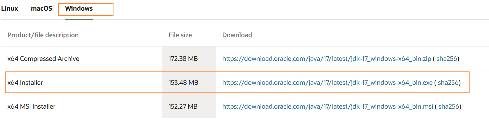

## JDK安装

[Java 软件 | Oracle 中国](https://www.oracle.com/cn/java/)

[Jdk17 下载 | Oracle 中国](https://www.oracle.com/cn/java/technologies/downloads/#jdk17-windows)

## Idea安装

[Download IntelliJ IDEA – The Leading Java and Kotlin IDE (jetbrains.com)](https://www.jetbrains.com/idea/download/?section=windows)

官网下载默认使用30天，之后要么用30天无限激活插件去刷新使用天数，要么使用密钥登录

建议某宝的几块钱的key，能随时最新版，什么无限破解包全都是刷新30天激活的

## 搜索引擎

学计算机偶尔用百度搜，但不止是百度，换谷歌（科学上网）或者必应搜索引擎

> 百度搜的容易出CSDN的文章，CSDN充满了复制粘贴，一个错，到处错

