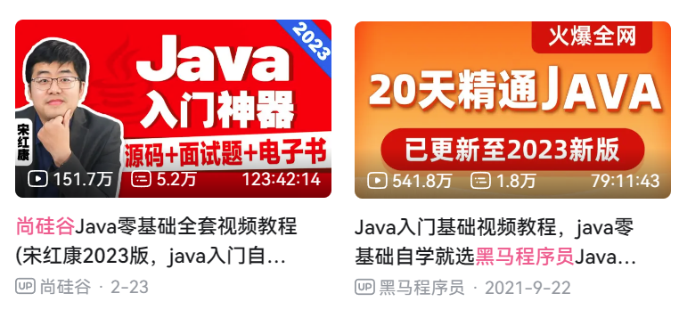
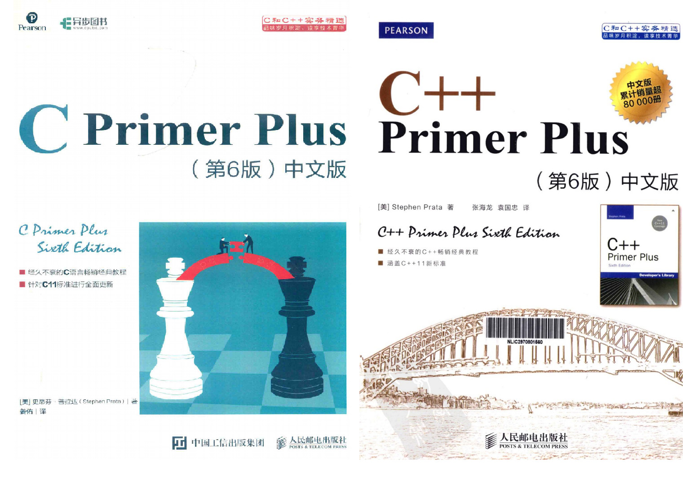
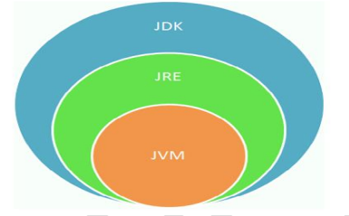

声明：Java体系笔记整合自B站尚硅谷、黑马、偶尔穿插点个人理解与一些专业书籍
如侵删

> 别问我怎么学完的，整套体系学那么多遍要么是狼灭要么是笨逼，没错，我是后者（骄傲(‾◡◝)）

[尚硅谷的个人空间_哔哩哔哩_bilibili](https://space.bilibili.com/302417610?spm_id_from=333.337.0.0)
[黑马程序员的个人空间_哔哩哔哩_bilibili](https://space.bilibili.com/37974444?spm_id_from=333.337.search-card.all.click)

推荐还是看尚硅谷体系的，很细很全
黑马的有点偏向速成，小小的也很可爱(●'◡'●)

我插一句，看教程类的视频，不要开弹幕，没有意义，打卡也没有意义，只会影响你的专注度
只有你做项目的时候，比如谷粒商城类似的项目，跟着做报错了，去翻翻弹幕列表里有没有解决方法

==万丈高楼平地起，基础一定要牢==!!! 加油`(ง •_•)ง`

> 读万卷书，不如行万里路
> 行万里路，不如阅人无数
> ==阅人无数，不如名师指路==
> 	-- 宋红康

”只要在一个行业里，努力积累十年，那你至少能成为这个行业的一名专家“

---
> 以下仅限个人观点
> 建议所有代码，直接在Idea里面写 
> 说实在话，打我学第一门语言C开始，所有的语言，都让我们从记事本里开始敲
> 我到现在都没感受到，意义何在。初学者敲个`public static void main(String[] args)`都费劲
> 还不如编辑器中的 `psvm` ，见的多了自然就会敲了
> 尚硅谷的视频里说”前期我们先使用文本开发工具，培养代码感，利于公司笔、面试“
> emmmm，不可能学完Java就笔试面试啊，现在人均SpringBoot了。。。没啥意义，还不如准备笔试的时候再练，反正你现在练了，等你学到SpringBoot最快也要两个月啊
> 你说为了让初学者明白Java代码是如何编译成字节码，再如何被识别成机器码这个流程
> 说实话，初学者只能知道有这个东西的模糊概念，等学到以后的Jvm，或者类加载机制自然就明白了

## 计算机语言排行榜

<iframe src="https://www.tiobe.com/tiobe-index/" allow="fullscreen" allowfullscreen="" style="height:100%;width:100%; aspect-ratio: 16 / 9; "></iframe>

## 常见的编程语言

### C 语言：万物之源

- 诞生于 1972 年，由 AT&T 公司旗下贝尔实验室创建完成，用于构建Unix 操作系统。
- 偏向计算机底层操作（操作系统、网络、硬件驱动等）。
- 优势：几乎所有现代编程语言都脱胎于 C
- 劣势：相当陡的学习曲线；不支持面向对象编程

### C++语言：难学的语言

- 诞生于 1983 年，作为 C 语言的增强方案、升级版本。C++是 C 语言的超集，C 语言的大部分知识也适用于 C++。
- 用途：windows 或 MacOS UI、office 全家桶、主流的浏览器、Oracle、MySQL、著名的游戏引擎（如星际争霸、魔兽世界）等
- 优势：很多公司都用 C++ 开发核心架构，如 Google、腾讯、百度、阿里云等；面向对象性
- 劣势：体系极为庞大，这是世界目前来说最复杂也是最难的编程语言。• C#语言：背靠大树的语言
- 诞生于 2000 年，一款强大而灵活的编程语言。靠着微软这棵大树，是多年来 windows 平台的一门主流编程语言。
- 用途：windows 桌面应用开发、Windows Azure、游戏开发

### PHP 语言：最好的语言？

- 诞生于 1994 年，一款服务器端脚本语言。最初表示个人主页（Personal Home Page）
- PHP 语法和 C 类似，有很多的模板和框架，简单易懂，也许你可以在短短几天做出 web app。它主要用于 web 端，快速建站网络开发
- 劣势：学习门槛太低；其代码运行速度低于大部分编程语言党争对手

### Python：易学的语言
- 诞生于 1991 年，一种面向对象的语言，虽然运行效率不高，但是开发效率非常高。
- Python 被称为胶水语言，哪里都可以用。
### JavaScript 语言：前端为王
- 诞生于 1995 年，网景公司开发完成。
- JavaScript 是 JavaScript 是目前所有主流浏览器上唯一支持的脚本语言。在前端开发中，占有不可替代的地位。
### Java 语言：需求旺盛
- 创建于 1995 年，Java 是一种面向对象、基于类的编程语言。
- Java 可能是目前运用最广的项目语言。代码稳定性超过 C 和 C++，生产力远超 C 和 C++。有 JVM 在，可以轻松地跨平台。
- 具有强大的开源开发工具，大量的开源共享库。
- Java 拥有世界上数量最多的程序员，最不缺人。
### Go 语言：夹缝中生存
- Go 语言现在很受关注，它是取代 C 和 C++ 的另一门有潜力的语言。
- C 语言太原始了，C++ 太复杂了，Java 太高级了，所以Go 语言就在这个夹缝中出现了。
- Go 语言已成为云计算领域事实上的标准语言，尤其是在Docker/Kubernetes 等项目中。
- Go 语言语法特别简单，你有了 C 和 C++ 的基础，学习 Go 的学习成本基本为零。
- Go 社区从 Java 社区移植了各种优秀的框架或库。

除了go语言被我计划在2024年下半年学，以上都我学过/(ㄒoㄒ)/~~ ，应该吐槽几句吧

C和C++不谈，当年的入门语言，找不到好的教程，也不会找教程，刚得到自己的电脑，除了打游戏，就只会开关机😔
抱着《C Primer Plus》和《C++ Primer Plus》啃，实体书，那是真砖头，全部对照代码手敲
那是真难忘的时光，后来找不到好的qt教程，我嫌太麻烦就没往下学了，当时注意力被前端吸引走了，毕竟所见即所得嘛~

Java真的学的人太多了，如果你不是本科学历，不太建议入行了，很难卷的啦，很难的啦！

Python感觉属于被培训班吹火的，人工智能没研究生学历别卷

Go是一个趋势，所以被我打上了日程，可惜我很喜欢Kotlin，但它目前在国内只是写Android...

### 总结

> 程序设计语言有很多种，每种语言都是为了实现某个特定的目的而发明的。
> 没有“最好”的语言，只有在特定场景下相对来说，最适合的语言而已。
> 如果你掌握了一种编程语言，也会更容易上手其它的编程语言。关键是学习如何使用

## Java的历史

**起步阶段：**
1991 年，Sun 公司的工程师小组想要设计一种语言，应用在电视机、电话、闹钟、烤面包机等家用电器的控制和通信。由于这些设备的处理能力和内存都很有限，并且不同的厂商会选择不同的中央处理器(CPU)，因此这种语言的关键是代码短小、紧凑且与平台无关（即不能与任何特定的体系结构捆绑在一起）。
Gosling 团队率先创造了这个语言，并命名为“Oak"（起名的原因是因为他非常喜欢自己办公室外的橡树)。后因智能化家电的市场需求没有预期的高，Sun公司放弃了该项计划随着 20 世纪 90 年代互联网的发展，Sun 公司发现该语言在互联网上应用的前景，于是改造了 Oak，于 1995 年 5 月以 Java 的名称正式发布。（Java 是印度尼西亚爪哇岛的英文名称，因盛产咖啡而闻名。）

**发展阶段：**

[Java 软件 | Oracle 中国](https://www.oracle.com/cn/java/)
Java 1.0 1996.01.23           Sun 公司发布了 Java 的第一个开发工具包
Java 1.1 1997.02.19             JavaOne 会议召开，创当时全球同类会议规模之最。
Java 1.2 1998.12.08           Java 拆分成：J2SE（标准版）、J2EE（企业版）、J2ME（小型版）
Java 1.3  2000.05.08
Java1.4   2004.02.06
Java 5.0 2004.09.30            版本号从 1.4 直接更新至 5.0；平台更名为JavaSE、JavaEE、JavaME
Java 6.0 2006.12.11  
						==2009.04.20 Oracle 公司收购 SUN，交易价格 74 亿美元。==
Java 7.0 2011.07.02
Java 8.0 2014.03.18           ==此版本是继 Java 5.0 以来变化最大的版本==。是长期支持版本（LTS）
Java 9.0 2017.09.22           此版本开始，每半年更新一次；Java 9.0 开始不再支持 windows 32 位系统
Java 10.0 2018.03.21
Java 11.0    2018.09.25              JDK 安装包取消独立 JRE 安装包，是长期支持版本（LTS）
Java17.0     2021.09 发布 Java 17.0         版本号也称为 21.9，是长期支持版本。
Java19.0 2022.09 发布 Java19.0，版本号也称为 22.9。
Java20.0  2023.03.21           JDK 20中的版本要么是尚未完全成熟的孵化器功能，要么是各种功能的预览版，包括虚拟线程和结构化并发。
预计Java 21的长期支持(LTS)版本将于2023年9月发布  

本笔记记录于2023-09-08

詹姆斯·高斯林(James Gosling)先生以“Java 技术之父”而闻名于世。他是 Java 技术的创始人，他亲手设计了 Java 语言，并开发了 Java 编译器和 Java 虚拟机，使 Java成为了世界上最流行的开发语言。

James Gosling 于 1984 年加入 Sun 公司，并一直服务于 Sun 公司，直至 2010 年前后，Sun 被 Oracle 并购而加入 Oracle，担任客户端软件集团的首席技术官; 2010 年 4月从 Oracle 离职。

SUN 与 Oracle
SUN 是一家极具创新能力的公司，2001 年 “9.11”以前，SUN 公司市值超过 1000 亿美元。 但是没能利用 Java 构建一个强有力、可变现的生态系统，没打好 Java 这张牌。此后，互联网泡沫破裂，硬件需求大幅减少，它的市值在一个月之内跌幅超过 90%。SUN 公司的成长用了 20年，而衰落只用了 1 年！

Oracle 与 Google

Google 和 Oracle 的侵权事件：
2010 年 8 月，Oracle 起诉 Google 的 Android 系统侵权，要求赔偿 26 亿美元。
- Oracle 认为 Google 的代码中使用了 Java 的 37 个 API，并且认为Google 是故意为之，因为这样做的好处是可以让更多的 Java 程序员更容易接受 Android 的代码。
- Oracle 认为 Android 中有 9 行代码直接抄袭了 Java 的实现。这 9 行牛气哄哄的代码都出自一人之手，他就是 Java 大牛------Joshua Bloch。
2018 年 3 月，美国联邦巡回上诉法院裁决，谷歌侵犯了甲骨文的版权，支付高达 88 亿美元的赔偿金。
2021 年 4 月，美国最高法院给出了最终裁决：谷歌胜诉，其代码属于“合理使用”的范畴。为期十多年的软件行业“第一版权案”落幕

### Java 技术体系平台

#### Java SE(Java Standard Edition)标准版
- 支持面向桌面级应用（如 Windows 下的应用程序）的 Java 平台，即定位个人计算机的应用开发。
- 包括用户界面接口 AWT 及 Swing，网络功能与国际化、图像处理能力以及输入输出支持等。
- 此版本以前称为 J2SE
#### Java EE(Java Enterprise Edition)企业版

- 为开发企业环境下的应用程序提供的一套解决方案，即定位在服务器端的Web 应用开发。
- JavaEE 是 JavaSE 的扩展，增加了用于服务器开发的类库。如：Servlet 能够延伸服务器的功能，通过请求-响应的模式来处理客户端的请求；JSP 是一种可以将 Java 程序代码内嵌在网页内的技术。
- 版本以前称为 J2EE
#### Java ME(Java Micro Edition)小型版
- 支持 Java 程序运行在移动终端（手机、机顶盒）上的平台，即定位在消费性电子产品的应用开发
- JavaME 是 JavaSE 的内伸，精简了 JavaSE 的核心类库，同时也提供自己的扩展类。增加了适合微小装置的类库：`javax.microedition.io.*`等。
- 此版本以前称为 J2ME

### 什么是 JDK、JRE

JDK (Java Development Kit)：是 Java 程序开发工具包，包含 JRE 和开发人员使用的工具。
JRE (Java Runtime Environment) ：是 Java 程序的运行时环境，包含 JVM 和运行时所需要的核心类

> 注意：用记事本写代码不要使用`Notepad++`，这个是个台独分子写的软件，经常在源代码里面插入一些逆天发言，Notepad++作者发推称，如果用户不同意其政治观点，Notepad++将在用户源代码中添加随机字符。真要用编辑器，还是用vscode吧，宇宙级最好用的编辑器，小而轻便，配上对应的插件无敌，而且也是前端的首选，也可以使用Sublime Text，我入门编程使用的编辑器，导致如今我喜欢的代码配色风格还是Sublime Text风格

