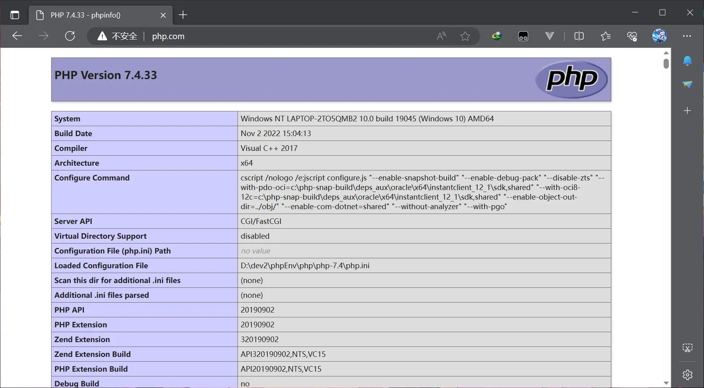

## 起步

### php环境配置

[下载 - phpEnv-专业优雅强大的php集成环境](https://www.phpenv.cn/download.html)

随便建个网站

例如 `php.com`

开启服务  -->  访问新建的域名




### php与html 的关系

```php
	<h2> <span style="color:red">hello dance</span></h2>  
	<h2>  
	<?php  
	echo '<span style="color:red">hello dance</span>';  
	?>  
	</h2>
```

::: info
1. html中所有元素必须以标签形式出现
2. php做为元素嵌入到html中也要使用标签
3. php与html混编时,必须使用**双标签**
4. html代码中嵌入php代码,则扩展必须改为'php'
5. html中的php代码,由服务器安装的php解析器执行
6. php执行结果,最终以文本形式嵌入到html中,成为html一部分
7. 嵌入到html中的php执行结果, 和普通html代码一样可以被浏览器识别、解析
8. php代码对前端浏览器来说是不可见的，是安全的
:::

### 变量

[PHP: 基础 - Manual](https://www.php.net/manual/zh/language.variables.basics.php)


```php
$username = '猪老师';

echo $username . '<br>';

//  查看值和类型
var_dump($username);
echo '<br>';

//  变量更新
$username = '牛老师';
echo $username . '<hr>';
```


### 函数

[PHP: 用户自定义函数 - Manual](https://www.php.net/manual/zh/functions.user-defined.php)

```php
	// 声明与js是一样,但是可以限定参数与返回值的类型,和TypeScript类似
	function getUsername(string $username): string
	{
	    return 'Hello, ' . $username;
	}
	echo getUsername('zs') . '<br>';
```

```php
	function getTotal(float $price, int $num = 1): float  
	{  
	return $price * $num;  
	}
	echo '总金额: ' . getTotal(68.5, 5) . ' 元 <br>';
```

#### 模板字面量

在js中有**模板字面量**的概念，可以使用插值表达式，变量，函数
例如：

```js
`
 hello ${username}
`
```

php的"模板字面量"

php中也有类似的模板，不过有两个限制
	1. 必须用双引号声明
	2. 只解析变量

```php
// 声明一个匿名函数/函数表达式
$getTotal = function (float $price, int $num = 1): float {
    return $price * $num;
};
// 不能直接 echo "总金额: $getTotal(68.5, 5) 元 <br>"; 
// 应该告诉模板,这是一个变量,要一个界定标准
echo "总金额:  {$getTotal(68.5, 10)}  元 <br>"; 
$total = $getTotal(68.5, 10);
echo "总金额:  {$total}  元 <br>";//总金额: 685 元
```

#### 剩余参数

js的ES6中有剩余参数...reset，还有reduce函数
php中也存在

```php
$sum = function (...$args) {
    return array_reduce($args, function ($acc, $cur) {
        return $acc + $cur;
    }, 0);
};

echo $sum(3, 4, 5, 6, 7);
```

#### 返回值

> 在js中, 外部 变量自动穿透到内部: 闭包
> 在php回调方法中,使用外部变量: 用use进行声明

```php
$arr = [33, 2, 54, 7, 12, 23, 9];
function getItems(array $arr, $value): array
{

    return array_filter($arr, function ($item) use ($value) {
        return $item > $value;
    });
}

print_r(getItems($arr, 20));
```


### 总结
::: info
1. 变量不用声明,直接用  
2. 使用双号号声明字符串模板中可嵌入变量  
3. 函数先声明,再调用  
4. 函数参数不足: 默认值  
5. 函数参数过多: 剩余参数...rest  
6. 函数默认单值返回,返回多值请用数组或对象
:::
## 查看与保存结果

### echo
```php
echo '<h3 style="color:red">php</h3>';
echo 'hello,' . [1, 2, 3] . '<br> ';
// implode — 用字符串连接数组元素  遗留写法（从 PHP 7.4.0 起废弃，从 PHP 8.0.0 中移除）：
//https://www.php.net/manual/zh/function.implode
echo 'hello,' . implode([1,2,3]) . '<br>';
```

### var_dump

```js
// 值,类型,支持多个变量查询
var_dump(10, 'php', [1, 2, 3], true);
// 不能用在生产环境/项目上线交付, 用在开发调试
```

### 格式化打印

#### 数组格式化

```php
$arr = ['red', 'green', 'blue'];
// var_dump($arr);
// 只关心值
// print_r($arr);
// echo '<br>';
// print_r($arr),不应该直接打印,而是应该返回一个字符串
// 传入第二个参数true,就不会打印输出,而是结果返回

```

#### print_r

不带true参数的会话,不应该直接打印,而是应该返回一个字符串
传入第二个参数true,就不会打印输出,而是返回

```php
echo '<pre>' . print_r($arr) . '</pre>'; // 1
echo '<pre>' . print_r($arr, true) . '</pre>';

// Array
// (
//    [0] = > red
//    [1] = > green
//    [2] = > blue
// )   
```

C语言,中有一个printf(模板,模板中的变量)
%s: string, %d: int, %f: float

```php
printf('<pre>%s</pre>', print_r($arr, true));
printf('品名: %s, 单价: %.2f 元, 数量: %d 部<br>', '手机', 5000, 3);
// Array
// (
//    [0] = > red
//    [1] = > green
//    [2] = > blue
// )   
// 品名:手机,单价:5000.00元,数量:3部
```

##### 应用场景-数据库连接

```php
$params = ['mysql', 'localhost', 'testphp', '3306', 'utf8'];
$dsn = vsprintf('%s:host=%s;dbname=%s;port=%s;charset=%s', $params);
$username = 'root';
$password = 'root';
echo $dsn;

$pdo = new PDO($dsn, $username, $password);
if ($pdo) echo '<h3>连接成功</h3>';

// mysql:host=localhost;dbname=testphp;port=3306;charset=utf8
// 连接成功
```

## 值传递和引用传递

### 值传递

```php
$userName = '张三';

// ! 1. 值传递
$myName = $userName;
$myName = '李四';
echo $myName . "<br>";
printf('$userName = %s | $myName = %s  <br>', $userName, $myName);
echo $myName === $userName ?  '相等' : '不相等', '<hr>';
```

::: details

李四

$userName = 张三| $myName = 李四

不相等

:::

### 引用传递

::: tip

其实引用就是给原变量起个别名,并没有创建新变量

:::

```php
$yourname = &$userName;
$yourname = '张三';
printf('$userName = %s | $yourname = %s  <br>', $userName, $yourname);
echo $yourname === $userName ?  '相等' : '不相等', '<hr>';
```

::: details

$userName = 张三 | $yourname = 张三

相等

:::


