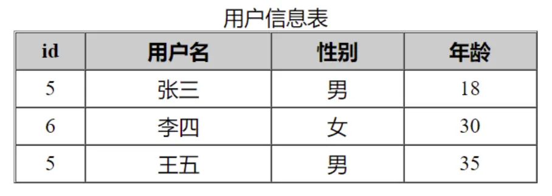

# 流程控制与数组遍历

## 数据类型

### 基本类型  不可再分

```php
// int / float
$age = 30;
$price = 99.66;

// string 
$username = 'admin';

// boolean
$isDel = true;

```

### 复合类型  数组，对象

```php
// 数组
$arr = [30, 99.66, 'admin', true, function () {
}, [1, 2, 3]];
// 对象 js对象基于原型   php对象基于类
$obj = new class(123456){
    public $salary;
    public function __construct($salary){
        $this->salary = $salary;
    }

    // 访问器
    public function __get($name){
        return $this->salary;
    }
};
echo gettype($obj);
echo '工资是: ', $obj->salary;
```

### 特殊类型  null，资源

1. null
2. 没赋值
3. `unset()`删除了一个变量

```php
$x = 123;
unset($x);
if (is_null($x)) echo 'NULL';
```

```php
$f = fopen('readme.md', 'r');  // 读取一个文件
echo gettype($f);
```


### 回调类型  callback

php用字符串传递函数, 所以可以用任何方式来引用或传递函数,当成值/数据类型
回调的表现形式, 不仅仅"函数, 对象方法, 类方法"

[PHP: call_user_func - Manual](https://www.php.net/manual/zh/function.call-user-func)

```php
function hello(string $name): string
{
    return 'Hello ' . $name;
}

echo hello('DanceCold'), '<br>';
// 回调的方式来调用函数, 同步
echo call_user_func('hello', 'DanceCold');
```

函数做为对象方法

```php
class Demo1
{
    public function hello(string $name): string
    {
        return 'Hello ' . $name;
    }
}


// 'hello是对象方法,用对象访问
echo call_user_func([(new Demo1), 'hello'], 'DanceCold');
```

类方法

```php
class Demo2
{
    public static function hello(string $name): string
    {
        return 'Hello ' . $name;
    }
}
echo call_user_func(['Demo2', 'hello'], 'DanceCold');
```

## 流程控制
### 单分支

```php
$age = 15;
if ($age >= 18) {
    echo '恭喜, 已成年,可以观看<br>';
}
```

### 双分支

```php
// 分支只有一行代码,可以不写大括号
$age = 38;
if ($age >= 18)
    echo '恭喜, 已成年,可以观看<br>';
else
    // 默认分支
    echo '未成年, 请在家长陪同下观看<br>';
```


### 多分支

```php
$age = 44;
if ($age >= 18 && $age < 30)
    echo "{$age}岁, 彩礼， 能按揭吗? <br>";
else if ($age >= 30 && $age < 45)
    echo "{$age}岁, 应该成个家了 <br>";
else if ($age >= 45)
    echo "{$age}岁, 房贷快还完了 <br>";
// 未成年， < 18, 默认分支
else
    echo "{$age}岁, 放学了， 我送你回家 <br>";
```


### 多分支的语法糖：switch

```php
$age = 15;
switch (true) {
    case $age >= 18 && $age < 30:
        echo "{$age}岁, 彩礼， 能按揭吗? <br>";
        break;
    case $age >= 30 && $age < 45:
        echo "{$age}岁, 应该成个家了 <br>";
        break;
    case $age >= 45:
        echo "{$age}岁, 房贷快还完了 <br>";
        break;
    default:
        echo "{$age}岁, 放学了， 我送你回家 <br>";
}
```

### 循环

循环的本质是分支

```php
$colors = ['red', 'green', 'blue'];
// 1. 初始化循环变量,这里用索引当循环变量, $i=0;指向第一个数组元素
 $i = 0;
// 2. 循环条件
 if ($i < count($colors)) {
     echo $colors[$i] . '<br>';
 }
// 3. 更新循环条件
 $i = $i + 1;
 if ($i < count($colors)) {
     echo $colors[$i] . '<br>';
 }
 $i = $i + 1;
 if ($i < count($colors)) {
     echo $colors[$i] . '<br>';
 }
 echo '<hr>';
```

#### while

```php
// *  while() 来简化以上的分支过程
$list  = '<ul style="border:1px solid;background: lightcyan">';

$i = 0;
while ($i < count($colors)) {
    $list .= "<li>$colors[$i]</li>";
    // 更新条件
    $i = $i + 1;
}

$list .= '</ul>';

echo $list;
```

#### do-while

```php
$list  = '<ul style="border:1px solid;background: lightgreen">';

$i = 0;
do {
    $list .= "<li>$colors[$i]</li>";
    // 更新条件
    $i = $i + 1;
} while ($i < count($colors));

$list .= '</ul>';

echo $list;
```

#### for

```php
$list  = '<ul style="border:1px solid;background: violet">';
for ($i = 0; $i < count($colors); $i++) {
    $list .= "<li>{$colors[$i]}</li>";
}
$list .= '</ul>';
echo $list;
```

#### break;continue

```php
$list  = '<ul style="border:1px solid;background: pink">';
for ($i = 0; $i < count($colors); $i++) {
    // 只输出前二个
    // if ($i > 1) break;
    // 跳过第2个,只输出第1个和第3个
    if ($i === 1) continue;
    $list .= "<li>{$colors[$i]}</li>";
}
$list .= '</ul>';
echo $list;
```


## 数组声明与遍历

### 数组声明
#### 索引数组

键名是从0开始的递增的整数

```php
 $colors = [0 => 'red', 1 => 'green', 2 => 'blue'];
 printf('<pre>%s</pre>', print_r($colors, true));
```

#### 关联数组

键名是字符串

```php
 $user = ['id' => 5, 'name' => 'Jane', 'score' => 90];
 printf('<pre>%s</pre>', print_r($user, true));
 echo $user['name'];
```
::: tip
索引数组实际上关联数组的一个子集,只不过用了数字型的字符串
:::
### 数组遍历

```php
$users = [
    0 => ['id' => 5, 'name' => '张三', 'gender' => 0, 'age' => 18],
    1 => ['id' => 6, 'name' => '李四', 'gender' => 1, 'age' => 30],
    2 => ['id' => 5, 'name' => '王五', 'gender' => 0, 'age' => 35],
];

// foreach
// foreach (数组  as 键名=>值) {...} , 键名是可选的 
$table = '<table border="1" width="400" cellspacing="0" cellpadding="3" align="center">';
$table .= '<caption>用户信息表</caption>';
$table .= '<thead bgcolor="#ccc"><tr><th>id</th><th>用户名</th><th>性别</th><th>年龄</th></tr></thead>';
$table .= '<tbody align="center">';

// 遍历这个二维数组
foreach ($users as  $user) {
    // $user 还是一个数组

    $table .= '<tr>';
    $table .= '<td>' . $user['id'] . '</td>';
    $table .= '<td>' . $user['name'] . '</td>';
    // 1->true, 0->false 
    $table .= '<td>' . ($user['gender'] ? '女' : '男') . '</td>';
    $table .= '<td>' . $user['age'] . '</td>';

    $table .= '</tr>';
}
$table .= '</tbody></table>';

echo $table;
```



#### 二维数组模拟数据表查询结果集-php与原生混编

```php
	echo "<tr>";
	echo "<td>{$stu['id']}</td>";
	echo "<td>{$stu['name']}</td>";
	echo "<td>{$stu['course']}</td>";
	echo "<td>{$stu['score']}</td>";
	echo "</tr>
	
// 写模板, 可以解析内部变量
	echo <<< STU
	    <tr>
	        <td>{$stu['id']}</td>
	        <td>{$stu['name']}</td>
	        <td>{$stu['course']}</td>
	        <td>{$stu['score']}</td>
	    </tr>
	STU;
```


```php
	<?php
	// 用二维数组来模拟数据表查询结果集
	$stus = [
	    ['id' => 1, 'name' => '刘备', 'course' => 'js', 'score' => 83],
	    ['id' => 2, 'name' => '关羽', 'course' => 'php', 'score' => 75],
	    ['id' => 3, 'name' => '张飞', 'course' => 'js', 'score' => 52],
	    ['id' => 4, 'name' => '孙权', 'course' => 'php', 'score' => 88],
	    ['id' => 5, 'name' => '周瑜', 'course' => 'js', 'score' => 65],
	    ['id' => 6, 'name' => '孔明', 'course' => 'php', 'score' => 53],
	    ['id' => 7, 'name' => '赵云', 'course' => 'js', 'score' => 63],
	    ['id' => 8, 'name' => '马超', 'course' => 'js', 'score' => 77],
	    ['id' => 9, 'name' => '姜维', 'course' => 'php', 'score' => 93],
	    ['id' => 10, 'name' => '黄忠', 'course' => 'js', 'score' => 81],
	]
	?>
	
	<!DOCTYPE html>
	<html lang="zh-CN">
	
	<head>
	    <meta charset="UTF-8">
	    <meta http-equiv="X-UA-Compatible" content="IE=edge">
	    <meta name="viewport" content="width=device-width, initial-scale=1.0">
	    <title>php与html原生混编</title>
	    <style>
	        table {
	            border-collapse: collapse;
	            width: 360px;
	            text-align: center;
	        }
	
	        table th,
	        table td {
	            border: 1px solid #000;
	            padding: 5px;
	        }
	
	        table caption {
	            font-size: 1.3em;
	        }
	
	        table thead {
	            background-color: lightcyan;
	        }
	
	        .active {
	            color: red;
	        }
	    </style>
	</head>
	
	<body>
	
	<table>
	    <caption>学生成绩表</caption>
	    <thead>
	    <tr>
	        <th>ID</th>
	        <th>姓名</th>
	        <th>课程</th>
	        <th>成绩</th>
	    </tr>
	    </thead>
	
	    <tbody>
	    <!-- 这里显示的用户数据 -->
	    <?php
	    foreach ($stus as $stu) {
	        // 只查php
	        if ($stu['course'] === 'php') {
	            echo <<< STU
	                    <tr>
	                        <td>{$stu['id']}</td>
	                        <td>{$stu['name']}</td>
	                        <td class="active">{$stu['course']}</td>
	                        <td>{$stu['score']}</td>
	                    </tr>
	                STU;
	        }
	    }
	    ?>
	    </tbody>
	</table>
	
	</body>
	
	</html>

```


#### 流程控制的模板语法/替代语法

php模板语法的目标: html与php代码分离

```php
    <?php foreach ($stus as $stu) : ?>
        <!-- "{" => 冒号加php结束标记 -->
        <!-- 当前已离开了php环境,处于html中  -->
        <!-- 使用短标签进行简化: 只打印一个变量  -->
        <!-- <tr>
                    <td><?php echo $stu['id'] ?></td>
                    <td><?php echo $stu['name'] ?></td>
                    <td><?= $stu['course'] ?></td>
                    <td><?= $stu['score'] ?></td>
                </tr> -->

        <!-- 只输出成绩大于70分  -->
        <!-- <?php if ($stu['score'] > 70) : ?>
                    <tr>
                        <td><?php echo $stu['id'] ?></td>
                        <td><?php echo $stu['name'] ?></td>
                        <td><?= $stu['course'] ?></td>
                        <td class="active"><?= $stu['score'] ?></td>
                    </tr>
                <?php endif ?> -->

        <!-- 输出全部,并将不及格成绩描红 -->
        <tr>
            <td><?php echo $stu['id'] ?></td>
            <td><?php echo $stu['name'] ?></td>
            <td><?= $stu['course'] ?></td>
            <?php $active = $stu['score'] < 60 ? "active" : '' ?>
            <td class=<?= $active ?>><?= $stu['score'] ?></td>
        </tr>

    <?php endforeach ?>
```
