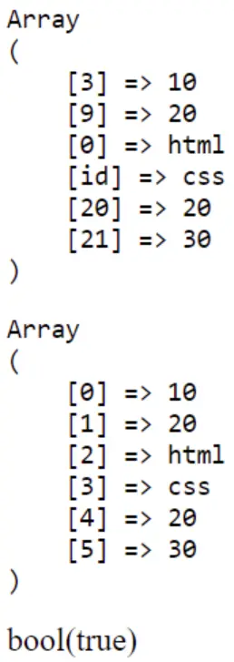
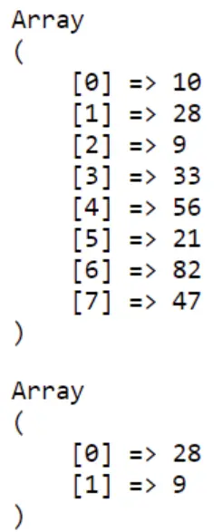
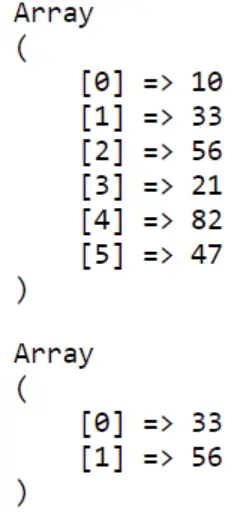
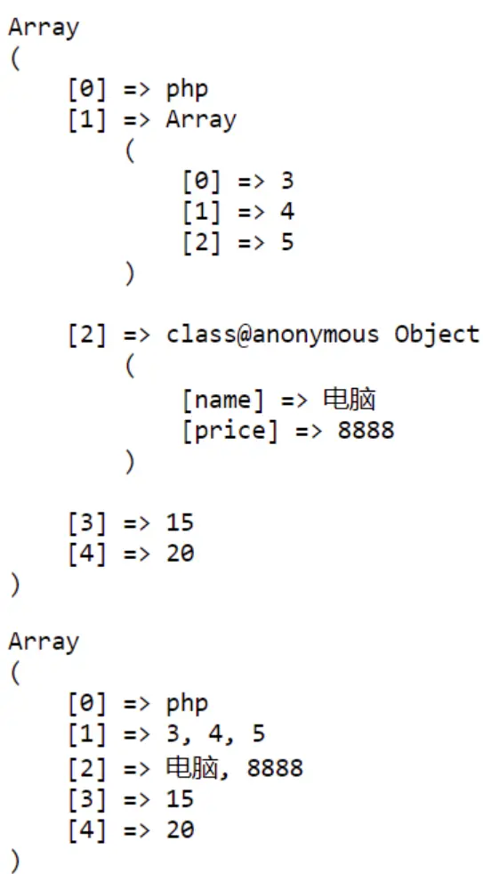

#php
## 数组的遍历

### 指针遍历

```php
$stu = ['id' => 1, 'name' => 'Jack', 'course' => 'php', 'score' => 90];
printf('[%s]=>%s<br>', key($stu), current($stu)); // [id]=>1
next($stu);
printf('[%s]=>%s<br>', key($stu), current($stu)); // [name]=>Jack
next($stu);
printf('[%s]=>%s<br>', key($stu), current($stu)); //[course]=>php
next($stu);
printf('[%s]=>%s<br>', key($stu), current($stu)); //[score]=>90
// 前移
prev($stu);
printf('[%s]=>%s<br>', key($stu), current($stu));//[course]=>php
// 复位, 第一个
reset($stu);
printf('[%s]=>%s<br>', key($stu), current($stu));//[id]=>1
// 最后
end($stu);
printf('[%s]=>%s<br>', key($stu), current($stu));//[score]=>90
```

### 自动遍历

```php
 if (count($stu) > 0) {
     while (true) {
         printf('[%s]=>%s<br>', key($stu), current($stu));
         if (next($stu)) continue;
         else break;
     }
 } else {
     echo '空数组';
 }

```

### foreach遍历

```php
 foreach ($stu as $key => $value) {
     printf('[%s]=>%s<br>', $key, $value);
 }
```

### 解构遍历

```php
list($id,  $name) = [10, 'Tony'];
// list 不是函数，因为函数不能放在等号左边， 不能用在“左值” 
printf('$id = %s, $name = %s<br>', $id, $name);
```

### 关联数组

```php
list('id' => $id, 'name' => $name) = ['id' => 10, 'name' => 'Tony'];  
printf('$id = %s, $name = %s<br>', $id, $name);
```

```php
// 解构通常用来遍历二维或以上的数组
$users = [
    ['id' => 10, 'name' => 'Tony'],
    ['id' => 11, 'name' => 'John'],
    ['id' => 12, 'name' => 'Jerry'],
];
// foreach
foreach ($users as list('id' => $id, 'name' => $name)) {
    printf('$id = %s, $name = %s<br>', $id, $name);
}
```

## 数组函数

```php
$arr = [3 => 10, 9 => 20, 0 => 'html', 'id' => 'css', 20 => 20, 30];
 printf('<pre>%s</pre>', print_r($arr, true));
// array_values —— 返回数组中所有的值
 printf('<pre>%s</pre>', print_r(array_values($arr), true));
// in_array —— 检查数组中是否存在某个值
 var_dump(in_array('html', $arr));
```



### 获取键

```php
 $key = array_search('20', $arr);
```

### 数组去重

```php
 printf(
     '<pre>%s</pre>',
     print_r(array_unique($arr), true)
 );

```


array_sum        数组求和
array_product  返回数组中所有乘积


## 栈与队列

```php
$stack = [];
array_push($stack, 10);
array_push($stack, 20, 30);
echo array_pop($stack);
// 仅限头部增删
array_unshift($stack, 10);
echo array_shift($stack);
```


```php
// 2. 队： 尾部添加， 头部删除
$queue = [];
// 入队
array_push($queue, 10, 20, 30);
echo array_shift($queue);
printf('<pre>%s</pre>', print_r($queue, true));
```


## 排序
### 升序

`sort($arr)`   
`asort($arr)`

### 降序

`rsort($arr);`

### 键

```php
$arr = ['e' => 10, 'a' => 30, 'p' => 50];
// ksort($arr);
krsort($arr);
printf('降序:<pre>%s</pre>', print_r($arr, true));

```

### 打乱

```php
$blue = range(1, 16); // [1,2,3,4,5,6....... 16]
shuffle($blue);
printf('<pre>%s</pre>', print_r($blue, true));
```

## 查询与替换

`array_splice`

```php
 $stu = ['id' => 101, 'name' => '无忌', 'age' => 20, 'course' => 'php', 'grade' => 80];
 printf('<pre>%s</pre>', print_r($stu, true));
// 前2个
 $res = array_slice($stu, 0, 2);
 printf('<pre>%s</pre>', print_r($res, true));
// 后2个
 $res = array_slice($stu, -2, 2);
 $res = array_slice($stu, -2);
 printf('<pre>%s</pre>', print_r($res, true));
```


### 删除

```php
 $res = array_splice($arr, 1, 2);
 printf('<pre>%s</pre>', print_r($res, true));
 printf('<pre>%s</pre>', print_r($arr, true));

```



### 更新

```php
// 更新： 第2个位置删除2个，使用新的数据来替换掉它
 $res = array_splice($arr, 1, 2, ['hello', 'world']);
 printf('<pre>%s</pre>', print_r($res, true));
 printf('<pre>%s</pre>', print_r($arr, true));
```




### 添加

```php
// 添加: 第2个位置删除0个，传入的新数据会追加到当前位置的后面
$res = array_splice($arr, 1, 0, ['hello', 'world']);
printf('<pre>%s</pre>', print_r($res, true));
printf('<pre>%s</pre>', print_r($arr, true));
```


## 数组回调函数

### 过滤器

`array_filter`   使用回调函数过滤数组的元素

```php
$arr = [
    150,
    'php',
    true,
    [4, 5, 6],
    (new class
    {
    }),
    [],
    null,
    false,
    '',
    0,
    '0'
];
// 仅返回数组中可转为true的元素集合
$res = array_filter($arr, function ($item) {
    if ($item) {
        return is_scalar($item);// 测试数据是否是一个标量
    }
});
 printf('<pre>%s</pre>', print_r($res, true));

//  Array
//  (
//      [0] => 150
//      [1] => php
//      [2] => 1
//  )
```

### map

`get_object_vars` 获取指定对象的属性

```php
$arr = ['php', [3, 4, 5], (new class
{
    public $name = '电脑';
    public $price = 8888;
}), 15, 20];
 printf('<pre>%s</pre>', print_r($arr, true));
$res = array_map(function ($item) {
    switch (gettype($item)) {
        case 'array':
            $item = join(', ', $item);
            break;
        case 'object':
            $item =  join(', ', get_object_vars($item));
    }
    return $item;
}, $arr);
printf('<pre>%s</pre>', print_r($res, true));
```


### 归并

```php
$arr = [10, 20, 30, 40, 50];
$res = array_reduce($arr, function ($acc, $cur) {
    echo $acc, ', ', $cur, '<br>';
    return $acc + $cur;
}, 0);

echo $res . '<hr>';
//  0, 10  
//  10, 20  
//  30, 30  
//  60, 40  
//  100, 50  
//  150

```


### array_walk

使用用户自定义函数对数组中的每个元素做回调处理

```php
$user = ['id' => 10, 'name' => 'admin', 'email' => 'admin@php.cn'];
array_walk($user, function ($value, $key, $color) {
    printf('[%s]=><span style="color:%s">%s</span>', $key, $color, $value);
}, 'blue');
```


