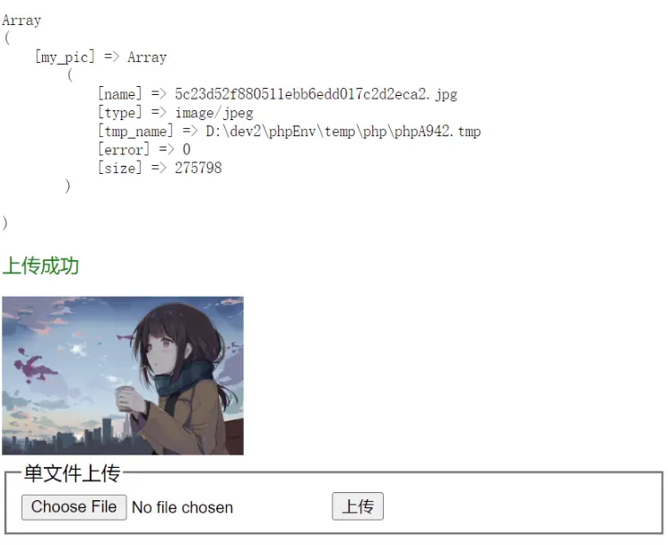

## 文件上传

`$_FILES`: PHP超全局变量数量, 保存着上传文件的全部信息

1. `$_FILES`: 二维数组,每个元素对应一个上传的文件
2. name: 原始文件名
3. type: 文件类型, mime类型
4. tmp_name: 临时目录
5. error: 错误代码
6. size: 文件大小(字节表示 byte)


允许上传文件的表单特征
1. method="POST"
2. enctype="multipart/form-data"

```html
 <form action="" method="POST" enctype="multipart/form-data">
        <fieldset>
            <legend>单文件上传</legend>
            <!-- 浏览器中限制上传文件的大小,写到一个隐藏域中,并写到type=file之前  -->
            <input type="hidden" name="MAX_FILE_SIZE" value="300000">
            <input type="file" name="my_pic">
            <button>上传</button>
        </fieldset>
    </form>
```
::: details
```php
if (isset($_FILES['my_pic'])) {
    $name = $_FILES['my_pic']['name'];
    $tmpName = $_FILES['my_pic']['tmp_name'];
    $error = $_FILES['my_pic']['error'];

    if ($error > 0) {
        $tips = '<span style="color:red">上传失败:</span>';
        switch ($error) {
            case 1:
                $tips .= '上传的文件超过了 php.ini 中 upload_max_filesize 选项限制的值';
                break;
            case 2:
                $tips .= '文件大小超过了上传表单中MAX_FILE_SIZE最大值';
                break;
            case 3:
                $tips .= '文件只有部分被上传';
                break;
            case 4:
                $tips .= '没有文件被上传';
                break;
            case 6:
                $tips .= '找不到临时目录';
                break;
            case 7:
                $tips .= '文件写入失败,请检查目录权限';
                break;
        }
        echo "<p>$tips</p>";
    } else {
        // 判断用户是不是通过合法的POST方式上传
        if (is_uploaded_file($tmpName)) {
            // 设置允许上传文件类型的白名单
            $allow = ['jpg', 'jpeg', 'png', 'gif'];
            // 获取文件扩展名
            $ext =  pathinfo($name)['extension'];
            if (in_array($ext, $allow)) {
                // 二个条件都满足了
                // 1. post方式上传的 2. 文件类型是合法的

                // 目标目录
                $path = 'uploads/';
                // 自定义目标文件名
                $dest = $path . md5($name) . '.' . $ext;

                // 将文件从临时目录中移动到目标目录中并重命名
                if (move_uploaded_file($tmpName, $dest)) {
                    echo '<p style="color:green">上传成功</p>';
                    // 预览
                    echo "";
                } else {
                    echo '<p style="color:red">移动失败</p>';
                }
            } else {
                echo '<p style="color:red">文件类型错误</p>';
            }
        } else {
            echo '<p style="color:red">非法方式上传</p>';
        }
    }
}
```
:::



### 多文件上传一 —— 变量
::: details
```php
<!DOCTYPE html>
<html lang="zh-CN">

<?php
// $_FILES: PHP超全局变量数量, 保存着上传文件的全部信息
printf('<pre>%s</pre>', print_r($_FILES, true));

foreach ($_FILES as $file) {
    // $file中保存着每一个文件的信息
    if ($file['error'] === 0) {
        $destFile = 'uploads/' . $file['name'];
        move_uploaded_file($file['tmp_name'], $destFile);
        echo "";
    }
}
?>

<head>
    <meta charset="UTF-8">
    <meta http-equiv="X-UA-Compatible" content="IE=edge">
    <meta name="viewport" content="width=device-width, initial-scale=1.0">
    <title>多文件上传1</title>
</head>

<body>
    <form action="" method="POST" enctype="multipart/form-data">
        <fieldset>
            <legend>多文件上传:逐个上传</legend>
            <input type="file" name="my_pic1">
            <input type="file" name="my_pic2">
            <input type="file" name="my_pic3">
            <button>上传</button>
        </fieldset>
    </form>
</body>

</html>

```
:::
### 多文件上传二—— 数组

```html
<!-- 数组来表示每个要上传的表单域的名称  -->
<input type="file" name="my_pic[]">
<input type="file" name="my_pic[]">
<input type="file" name="my_pic[]">
<button>上传</button>
```

```php
if (isset($_FILES['my_pic'])) {
    // 这时只需要遍历 $_FILES['my_pic']['error'] 这个数组
    foreach ($_FILES['my_pic']['error'] as $key => $error) {
        if ($error === 0) {
            // 临时文件名
            $tmpName = $_FILES['my_pic']['tmp_name'][$key];
            // 原始文件名
            $name = $_FILES['my_pic']['name'][$key];
            // 目标文件名
            $destFile = 'uploads/' . $name;
            move_uploaded_file($tmpName, $destFile);
            echo "";
        }
    }
}
```


### 多文件上传：批量上传

```html
    <form action="" method="POST" enctype="multipart/form-data">
        <fieldset>
            <legend>多文件上传:批量上传</legend>
            <!-- multiple: 允许同时选择多个  -->
            <input type="file" name="my_pic[]" multiple>
            <button>上传</button>
        </fieldset>
    </form>
```

```php
	if (isset($_FILES['my_pic'])) {
	    // 这时只需要遍历 $_FILES['my_pic']['error'] 这个数组
	    foreach ($_FILES['my_pic']['error'] as $key => $error) {
	        if ($error === 0) {
	            // 临时文件名
	            $tmpName = $_FILES['my_pic']['tmp_name'][$key];
	            // 原始文件名
	            $name = $_FILES['my_pic']['name'][$key];
	            // 目标文件名
	            $destFile = 'uploads/' . $name;
	            move_uploaded_file($tmpName, $destFile);
	            echo "";
	        }
	    }
	}
```


