[一键生成CRUD - FastAdmin框架文档](https://doc.fastadmin.net/doc/crud.html)

## 一键生成crud 
- -t 指定表subject
- -u 1生成菜单
- -c  目录在subject/Subject

### 直接命令行


```sh
php think crud -t subject -u 1 -c subject/Subject
```

### 在线命令

在后台插件管理安装在线命令插件

> 备注：安装插件需要注册fastadmin账户


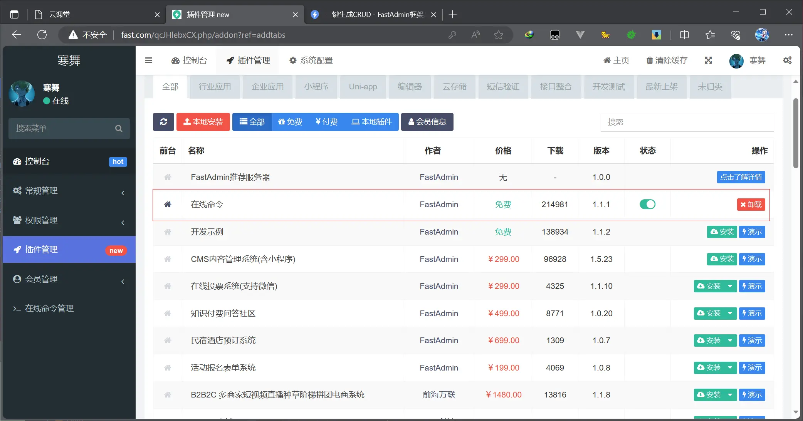

选择主表，定义控制器目录，点击生成命令行再点击立即执行

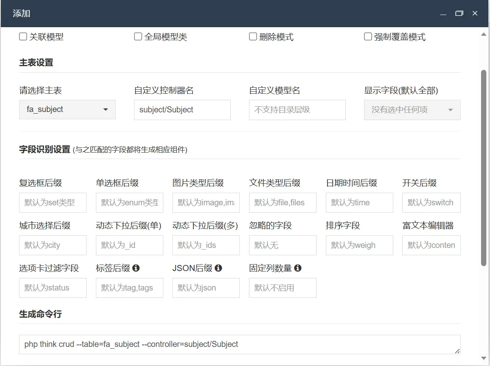


再次点击添加，一键生成菜单

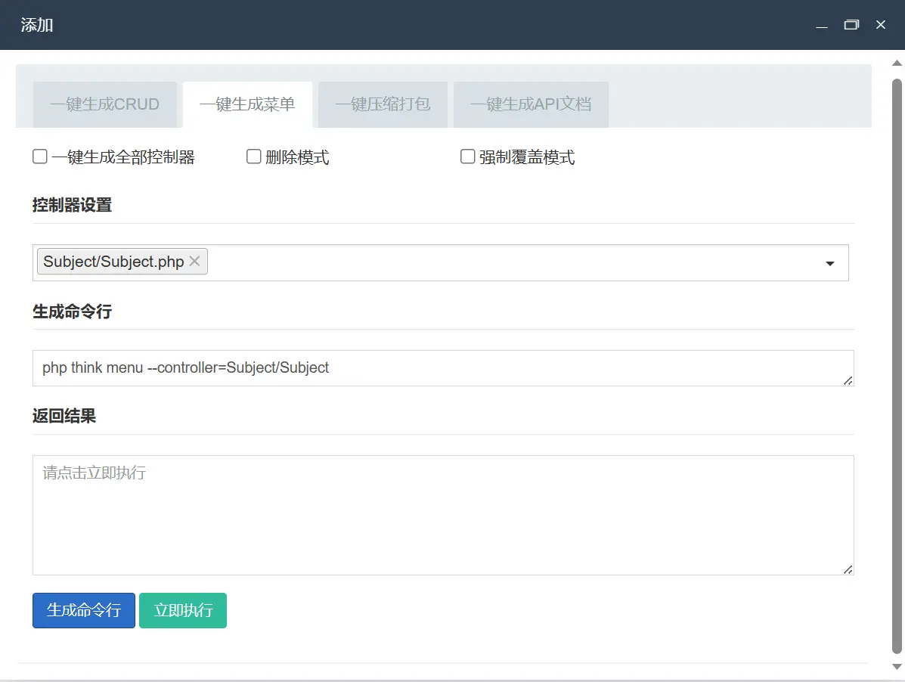


权限管理-->菜单规则-->选中subject编辑-->修改标题


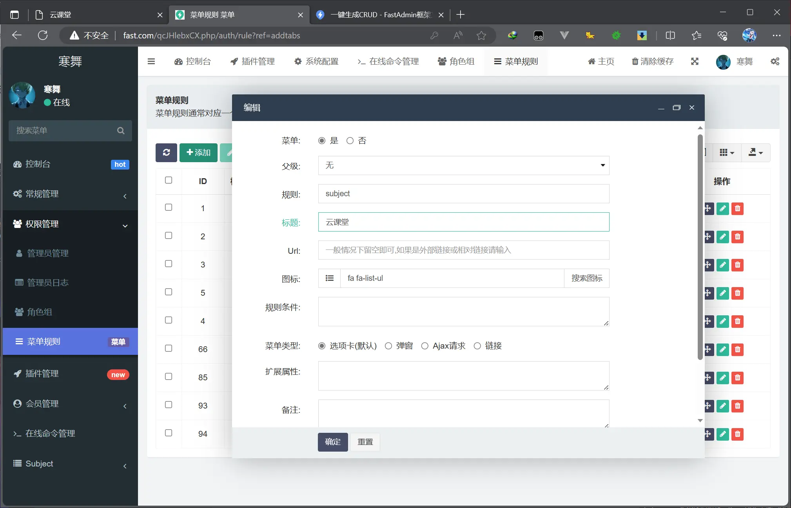


::: warning

通过在线命令创建的控制器，文件夹是大写开头，需要改成小写
windows不区分大小写，但是Linux会区分

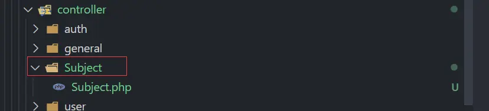

:::


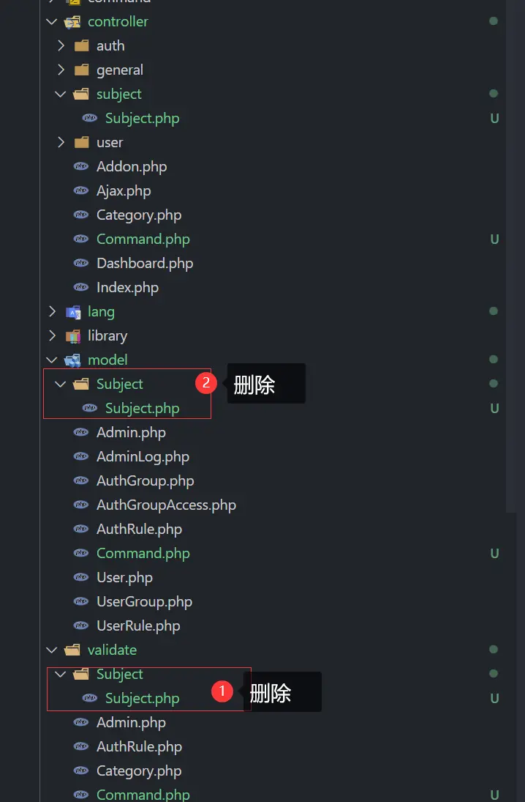


如果有提示你subject模型未找到，就手动指定模型

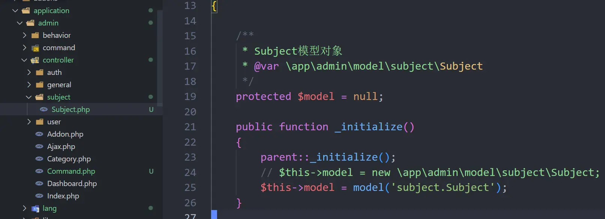

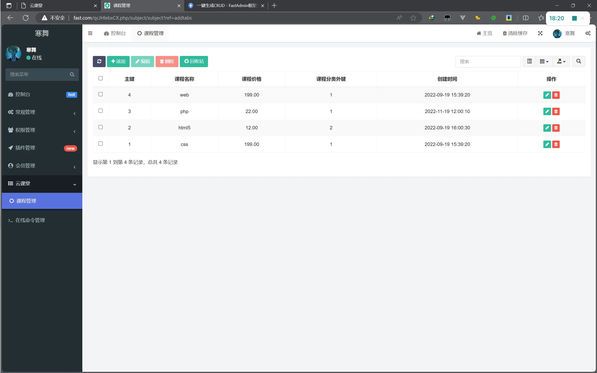


## 修改字段名

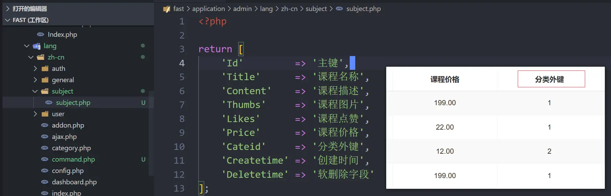


### 将课程分类的id值显示修改称显示分类名


### 修改表格排序

[列参数 - FastAdmin框架文档](https://doc.fastadmin.net/doc/191.html)

`public\assets\js\backend\subject\subject.js`

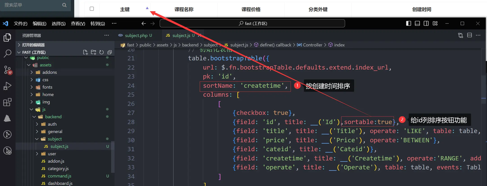

### 创建index方法

parent::index()无效，需要去其父类Backend中赋值index内容

`application\admin\controller\subject\Subject.php`

```php
    public function index()
    {
        //设置过滤方法
        $this->request->filter(['strip_tags', 'trim']);
        if (false === $this->request->isAjax()) {
            return $this->view->fetch();
        }
        //如果发送的来源是 Selectpage，则转发到 Selectpage
        if ($this->request->request('keyField')) {
            return $this->selectpage();
        }
        [$where, $sort, $order, $offset, $limit] = $this->buildparams();
        $list = $this->model
            ->where($where)
            ->order($sort, $order)
            ->paginate($limit);
        $result = ['total' => $list->total(), 'rows' => $list->items()];
        return json($result);
    }
```

我们在`application\common\model\subject\Subject.php`中第56行已经定义过category关联查询方法，所以在index()查询时添加关联查询

```php
   $list = $this->model
	    ->with(['category'])
        ->where($where)
        ->order($sort, $order)
        ->paginate($limit);
```


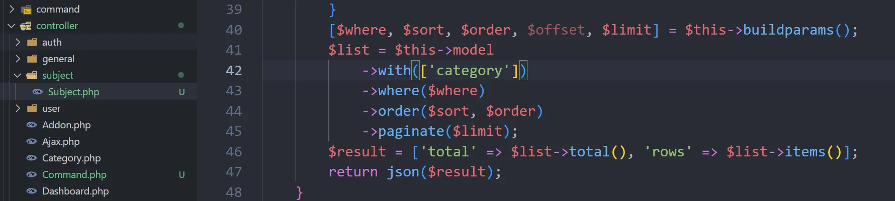

`public\assets\js\backend\subject\subject.js` 

```js
category.name
```


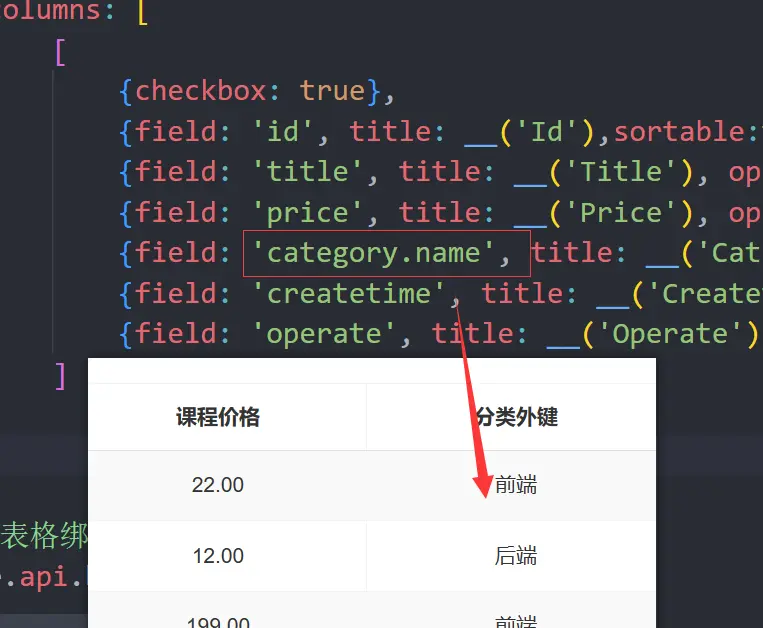


## 解决输入框搜索问题

在搜索框输入1

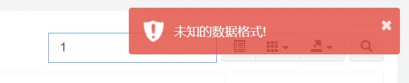

> sql报错：# SQLSTATE[23000]: Integrity constraint violation: 1052 Column 'id' in where clause is ambiguous

::: details 

这个SQL报错是因为在SQL查询中，`WHERE`子句中的列名`id`不明确。
在一个SQL查询中，当`WHERE`子句中引用的列名存在于多个表中，并且这些表之间存在列名冲突时，就会出现列名不明确的错误。这是因为数据库无法确定具体要引用哪一个表中的列。
为了解决这个问题，你需要在`WHERE`子句中明确指定该列来自哪个表。你可以通过在列名前添加表的别名（或完整的表名）来指明具体的列。
下面是一个示例的解决方法，假设存在表 `table1` 和 `table2`，它们都有一个名为 `id` 的列：

```sql
SELECT *
FROM table1
JOIN table2 ON table1.id = table2.id
WHERE table1.id = 1
```

在这个例子中，通过在`WHERE`子句中指定 `table1.id = 1`，我们明确指定了列 `id` 是来自于 `table1` 表。这样就解决了列名不明确的错误。

:::

### 给Subject添加字段

```php
    // 开启关联查询
    protected $relationSearch = true;
```

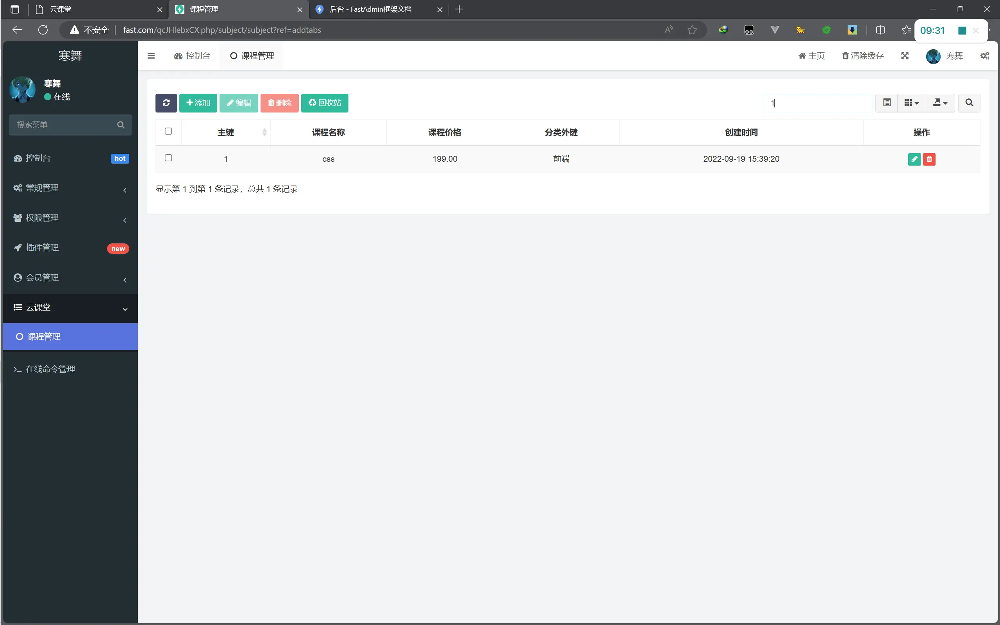


## 分类管理

### 手动创建菜单
你也可以继续通过可视化命令行形式创建，这边手动创建只是记录学习使用

`application\admin\controller\subject\Category.php`

```php
<?php

namespace app\admin\controller\subject;

use app\common\controller\Backend;


class Category extends Backend
{
    /**
     * Subject模型对象
     * @var \app\common\model\subject\Category
     */
    protected $model = null;


    public function __construct()
    {
        parent::__construct();
        // 加载模型
        $this->model = model('subject.Category');
    }
}

```

后台创建菜单

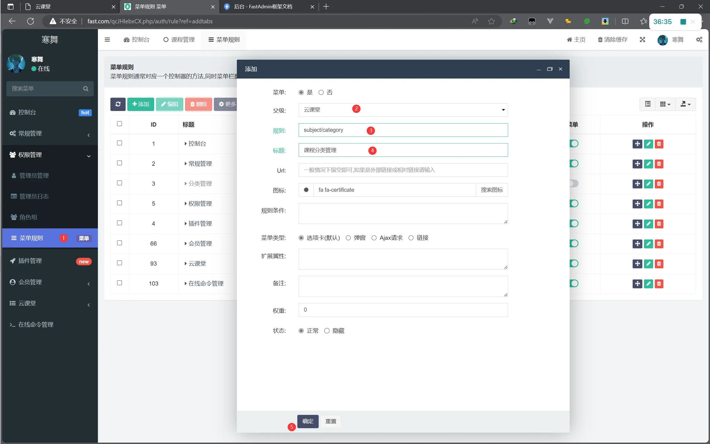


### index.html

将subject的index.html复制一份到category中


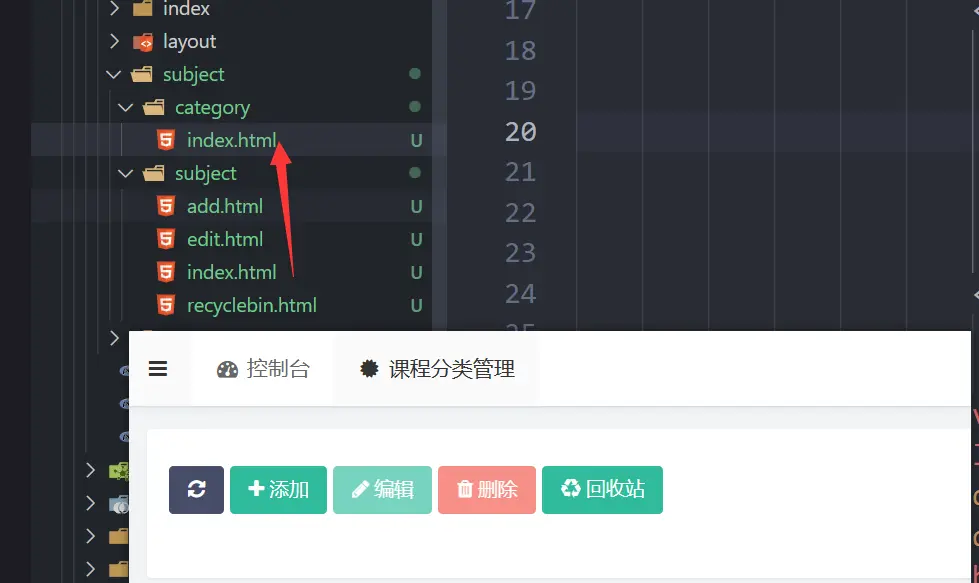


`application\admin\view\subject\category\index.html`

分类不需要回收站

删除`{:__('Recycle bin')`的a标签

可以将a标签都删除，使用build_toolbar方法添加按钮

```php
 {:build_toolbar(['refresh','add','edit','delete'])}
```

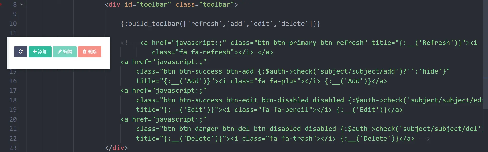

如果你是复制的subject的页面，需要在table标签的里面data值`check('subject/subject/edit')`改成`check('subject/category/edit')`

完整代码如下

```html
<div class="panel panel-default panel-intro">
    {:build_heading()}
    <div class="panel-body">
        <div id="myTabContent" class="tab-content">
            <div class="tab-pane fade active in" id="one">
                <div class="widget-body no-padding">
                    <div id="toolbar" class="toolbar">
                        <!-- 工具栏 -->
                        {:build_toolbar(['refresh','add','edit','delete'])}
                    </div>
                    <table id="table" class="table table-striped table-bordered table-hover table-nowrap"
                        data-operate-edit="{:$auth->check('subject/category/edit')}"
                        data-operate-del="{:$auth->check('subject/category/del')}" width="100%">
                    </table>
                </div>
            </div>
        </div>
    </div>
</div>
```


### 创建category.js文件

AMD(Asynchronous Module Definition）模块加载器的语法,通常与RequireJS库一起使用，定义一个模块并指定依赖项和回调函数

`public\assets\js\backend\subject\category.js`

```js
define(['jquery', 'bootstrap', 'backend', 'table', 'form'], function ($, undefined, Backend, Table, Form) {
    var Controller = {
        index:function(){
            alert("1111")
        }
    }
    return Controller;
})
```

- `define`是AMD模块加载器提供的函数，用于定义一个模块。
- `['jquery', 'bootstrap', 'backend', 'table', 'form']`是依赖项列表，表示该模块依赖于`jquery`、`bootstrap`、`backend`、`table`和`form`这些模块。这些模块的加载顺序是按照数组中定义的顺序加载的。
- `function ($, undefined, Backend, Table, Form) {}`是回调函数，当所有依赖项都加载完成后，该函数将被执行。在函数的参数中，`$`、`Backend`、`Table`和`Form`是依赖项的导出对象。通过回调函数，可以使用这些导出对象来执行一些操作或逻辑。
- 返回`Controller` 框架会去根据url去解析对应的方法，比如index页面解析index方法，add页面解析add方法


```js
define(['jquery', 'bootstrap', 'backend', 'table', 'form'], function ($, undefined, Backend, Table, Form) {
    var Controller = {
        index: function () {
            // 初始化表格参数配置
            Table.api.init({
                extend: {
                    index_url: 'subject/category/index' + location.search,
                    add_url: 'subject/category/add',
                    edit_url: 'subject/category/edit',
                    del_url: 'subject/category/del',
                    table: 'subject_category',
                }
            });
            var table = $("#table");
            // 初始化表格
            table.bootstrapTable({
                url: $.fn.bootstrapTable.defaults.extend.index_url,
                pk: 'id', // 主键
                sortName: 'weight', // 排序
                columns: [
                    [
                        { checkbox: true },// 复选框
                        // __('Id') 根据当前语言环境读取多语言Id对应的值  sortable是否开启排序按钮
                        { field: 'id', title: __('Id'), sortable: true },
                        { field: 'name', title: __('Name') },
                        { field: 'weight', title: __('Weight') },
                        { field: 'operate', title: __('Operate'), table: table, events: Table.api.events.operate, formatter: Table.api.formatter.operate }
                    ]
                ]
            });

            // 为表格绑定事件
            Table.api.bindevent(table);
        },
        add: function () {
            Controller.api.bindevent();
        },
        edit: function () {
            Controller.api.bindevent();
        },
        api: {
            bindevent: function () {
                Form.api.bindevent($("form[role=form]"));
            }
        }
    }
    return Controller;
});

```

在多语言中文下添加对应字段的中文

`application\admin\lang\zh-cn\subject\category.php`

```php
<?php
return [
    'Id'     =>  '主键',
    'Name'   =>  '课程分类名称',
    'Weight' =>  '权重'
];
```

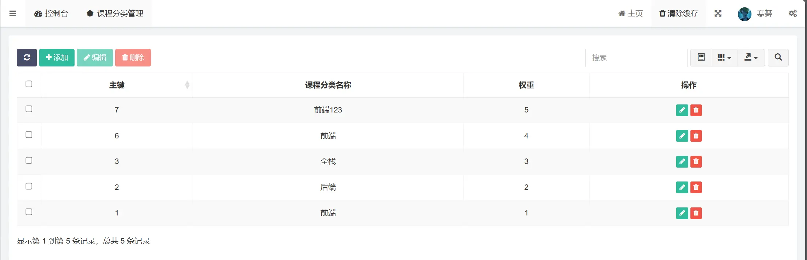


## 后台分配菜单权限

添加查看与编辑菜单

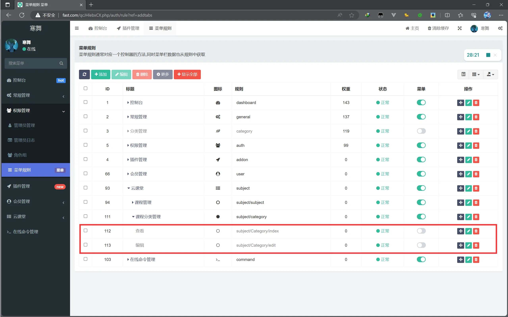

角色组中给二级角色查看权限

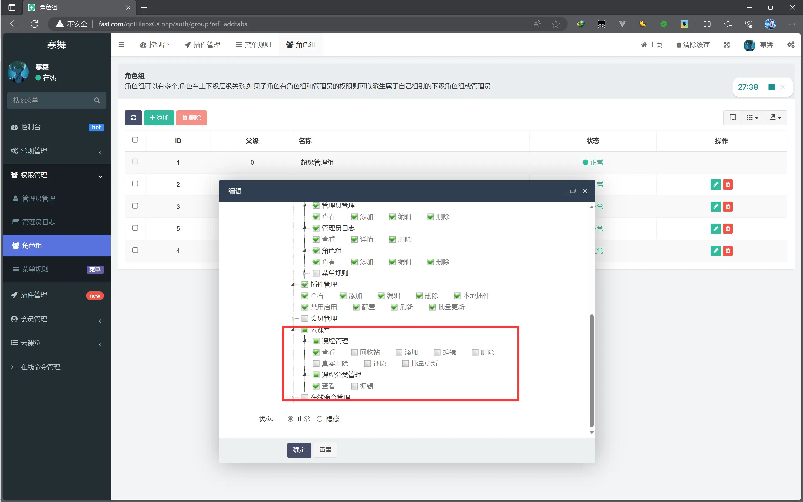


