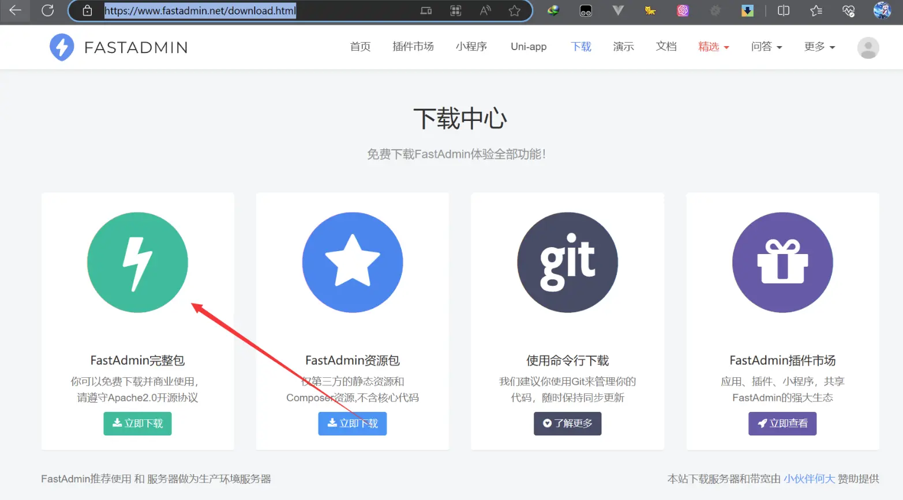
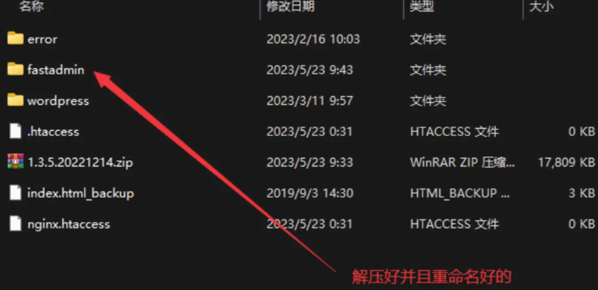
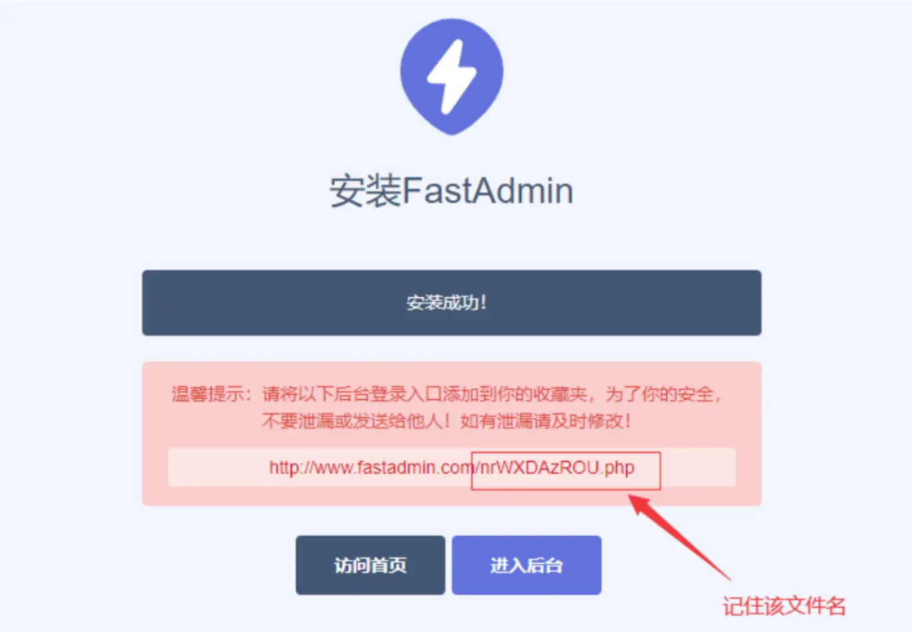
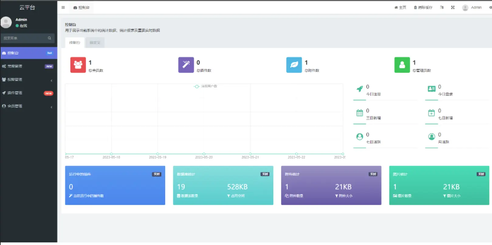
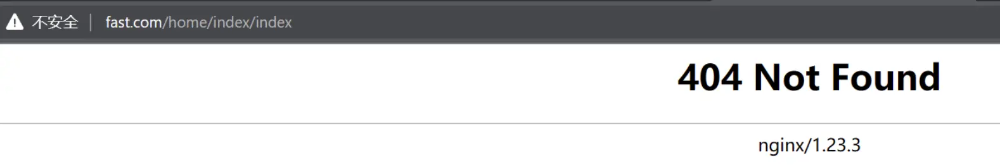
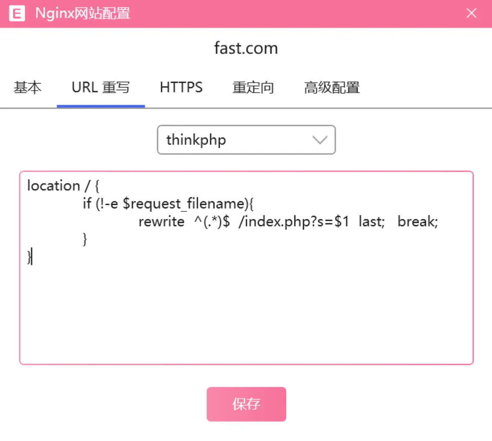
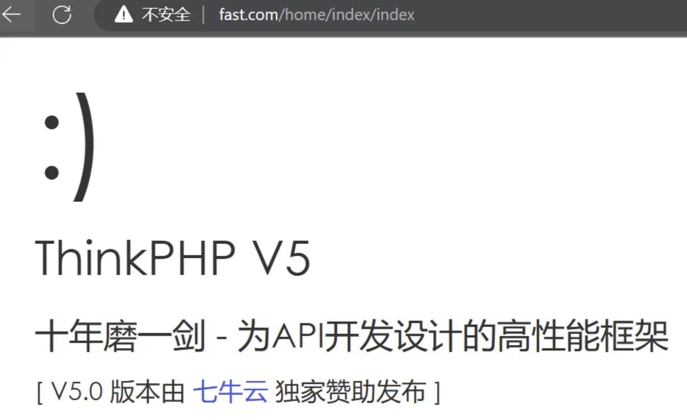

[介绍 - FastAdmin框架文档](https://doc.fastadmin.net/doc/construct.html#toc-4)

## 下载

[FastAdmin下载](https://www.fastadmin.net/download.html)



把下载好的FastAdmin移到`phpstudy`的`WWW`目录里面并且解压以及重命名，名称自定义，最好项目名来命名
使用phpEnv或phpStudy创建网站站点`fast.com` 绑定到fastadmin的public文件




打开浏览器输入刚才新建的域名会进入FastAdmin界面





点击进入后台，输入刚才管理员用户名和密码，验证码，然后点击登录就进入后台首页，到这里已经算安装好FastAdmin了


后台入口文件(public下文件名最长那个的php文件)重命名为erp.php或者容易记住的名称


## 快速生成模块

自动生成相应的模块，自动生成的模块目录包含了config、controller、model和view目录以及common.php公共文件

```
php think build --module home
```
默认无法访问,需要设置伪静态





如果是apache服务器的话
去`addons/.htaccess` 配置伪静态

```html  
<IfModule mod_rewrite.c>  
  Options +FollowSymlinks -Multiviews  RewriteEngine On  
  RewriteCond %{REQUEST_FILENAME} !-d  RewriteCond %{REQUEST_FILENAME} !-f  RewriteRule ^(.*)$ index.php?/$1 [QSA,PT,L]</IfModule>  
```


## 修改模块名为home

`application/config.php`

```php
'default_module' => 'home'
```

## 开启调试模式
```php
'app_debug' => Env::get('app.debug',true)
```
> 这是修改整个项目的默认配置，当环境变量值不存在时使用后面的值，不建议这样修改，参照下面修改变量


## .env.sample

环境变量配置文件

[框架 env 变量配置 - FastAdmin框架文档](https://doc.fastadmin.net/doc/2483.html)

框架在安装后不会自动启用`env`环境变量，如果需要启用 `env` 环境变量配置，可以手动复制一份`.env.sample`为`.env`，如果是在`Linux`环境下可以使用以下命令复制一份。

```shell
cp .env.sample .env
```

如果启用了 `env`，`.env` 文件中支持的配置就会覆盖掉框架中其他地方的配置，最终以 `.env`为准。

<mark style="background: #FF5582A6;"><span style="color:#fff">注意如果数据库名要与本地创建的一致</span></mark>

```env
[app]  
debug = true  
trace = false  
  
[database]  
hostname = 127.0.0.1  
database = fastadmin  
username = root  
password = root  
hostport = 3306  
prefix = fa_
```

## 快速生成控制器类

```php
php think make:controller home/Buisness
```
