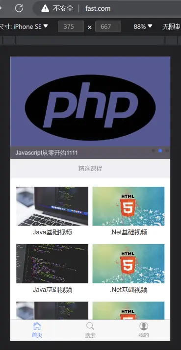
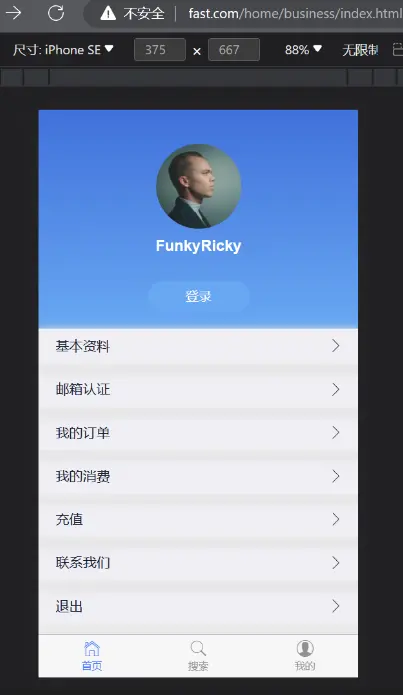
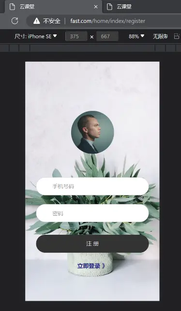
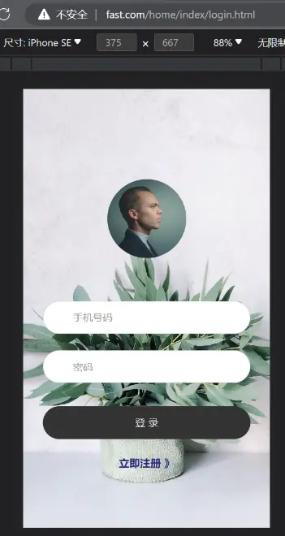

### 修改后台入口

public下面 有个英文字母很多的.php文件，直接重命名就可以了

### 控制器访问视图
默认访问 `view/index/index.html`


#### 第一种方法

```php
class Index
{
    public function index()
    {
        return view();
    }
}
```
#### 第二种方法

```php
use think\Controller;
class Index extends Controller
{
    public function index()
    {
        return $this->fetch();
    }

}

```


### 引入样式文件

放到`public/assets/home` 下
从素材文件index.html中将样式与body的内容抽离出来，并将其路径由`./assets` => `/assets/home`

```html
<link href="/assets/home/css/mui.min.css" rel="stylesheet" />
<link href="/assets/home/css/swiper-bundle.css" rel="stylesheet" >
<link href="/assets/home/css/reset.css" rel="stylesheet" />
<link href="/assets/home/css/index.css" rel="stylesheet" />


<div class="mui-content">
  <div class="swiper mySwiper">
    <div class="swiper-wrapper">
      <div class="swiper-slide">
        <a href="">
          
          <p class="mui-slider-title">Javascript从零开始</p>
        </a>
      </div>
      <div class="swiper-slide">
        <a href="">
          
          <p class="mui-slider-title">Javascript从零开始1111</p>
        </a>
      </div>
      <div class="swiper-slide">
        <a href="">
          
          <p class="mui-slider-title">Javascript从零开始222</p>
        </a>
      </div>
    </div>
    <div class="swiper-pagination" style="text-align: right"></div>
  </div>
</div>
<div class="mui-content">
  <h5 class="title">精选课程</h5>
  <ul class="mui-table-view mui-grid-view">
    <li class="mui-table-view-cell mui-media mui-col-xs-6">
      <a href="details.html">
        <div class="imgs">
          
        </div>
        <div class="mui-media-body">Java基础视频</div>
      </a>
    </li>
    <li class="mui-table-view-cell mui-media mui-col-xs-6">
      <a href="details.html">
        <div class="imgs">
          
        </div>
        <div class="mui-media-body">.Net基础视频</div>
      </a>
    </li>
    <li class="mui-table-view-cell mui-media mui-col-xs-6">
      <a href="details.html">
        <div class="imgs">
          
        </div>
        <div class="mui-media-body">Java基础视频</div>
      </a>
    </li>
    <li class="mui-table-view-cell mui-media mui-col-xs-6">
      <a href="details.html">
        <div class="imgs">
          
        </div>
        <div class="mui-media-body">.Net基础视频</div>
      </a>
    </li>
    <li class="mui-table-view-cell mui-media mui-col-xs-6">
      <a href="details.html">
        <div class="imgs">
          
        </div>
        <div class="mui-media-body">Java基础视频</div>
      </a>
    </li>
    <li class="mui-table-view-cell mui-media mui-col-xs-6">
      <a href="details.html">
        <div class="imgs">
          
        </div>
        <div class="mui-media-body">.Net基础视频</div>
      </a>
    </li>
    <li class="mui-table-view-cell mui-media mui-col-xs-6">
      <a href="details.html">
        <div class="imgs">
          
        </div>
        <div class="mui-media-body">Java基础视频</div>
      </a>
    </li>
    <li class="mui-table-view-cell mui-media mui-col-xs-6">
      <a href="details.html">
        <div class="imgs">
          
        </div>
        <div class="mui-media-body">.Net基础视频</div>
      </a>
    </li>
  </ul>
</div>
```

访问模块





### 模板布局

[模板布局 · ThinkPHP5.0完全开发手册 · 看云 (kancloud.cn)](https://www.kancloud.cn/manual/thinkphp5/125013)

`application/home/config.php`

开启模板布局
指定布局文件位置与名字

```json
  'template'  =>  [
    'layout_on'     =>  true,
    'layout_name'   =>  'layout/layout',
  ]
```

`home/view/layout/layout.html`

```html
<!DOCTYPE html>
<html lang="en">
<head>
    <!-- 引入公共样式 -->
    {include file='common/meta'/}

    <!-- 引入公共js文件 -->
    {include file='common/script'/}
</head>
<body>
    <!-- 输出其他页面的变量 -->
    {__CONTENT__}
</body>
</html>
```


`home/view/common/meta.html`

```html
<meta charset="UTF-8">
<meta name="viewport" content="width=device-width, initial-scale=1.0">
<title>云课堂</title>
<link href="/assets/home/css/mui.min.css" rel="stylesheet" />
<link href="/assets/home/css/swiper-bundle.css" rel="stylesheet">
<link href="/assets/home/css/reset.css" rel="stylesheet" />

```

`home/view/common/footer.html`

```html
<div class="footer">
    <nav class="footer-bar">
        <div class="tab-item  mui-active">
            <a href="{:url('/')}">
                <span class="mui-icon mui-icon-home"></span>
                <span class="mui-tab-label">首页</span>
            </a>
        </div>
        <div class="tab-item">
            <a href="search.html">
                <span class="mui-icon mui-icon-search"></span>
                <span class="mui-tab-label">搜索</span>
            </a>
        </div>
        <div class="tab-item">
            <a href="{:url('/home/business/index')}">
                <span class="mui-icon mui-icon-contact"></span>
                <span class="mui-tab-label">我的</span>
            </a>
        </div>
    </nav>
</div>
```

`home/view/common/script.html`

```html
<script src="/assets/home/js/jquery-1.9.1.min.js"></script>
<script src="/assets/home/js/mui.min.js"></script>
<script src="/assets/home/js/swiper-bundle.min.js"></script>
```

在Home模块下的`home/view/index/index.html`文件底部引入 公共底部以及轮播图脚本

```html
<!-- 引入底部 -->
{include file='common/footer'/}

<script>
    var swiper = new Swiper(".mySwiper", {
        pagination: {
            el: ".swiper-pagination",
        },
    });
</script>
```

> 在上面我们做的操作是开启了模板布局，这样的话可以将一些公共的meta标签，或者公共引入的script标签抽离出来，以避免每个文件都写一次引入

上面有使用到了[模板标签]([模板标签 · ThinkPHP5.0完全开发手册 · 看云 (kancloud.cn)](https://www.kancloud.cn/manual/thinkphp5/125971))，

普通标签用于<span style="color:#00b0f0">变量输出和模板注释</span>，普通模板标签默认以`{` 和 `}` 作为开始和结束标识，并且在开始标记紧跟标签的定义，如果之间有<span style="color:#00b0f0">空格</span>或者<span style="color:#00b0f0">换行</span>则被视为<span style="color:#00b0f0">非模板标签直接输出</span>

`{:url('/')}` 使用ThinkPHP的[使用函数](https://www.kancloud.cn/manual/thinkphp5/125005) ，`:`后的函数从左向右依次调用

---

## 配置个人主页



在`view/business`下创建`index.html`

```html
<link href="/assets/home/css/center.css" rel="stylesheet" />

<!-- 头部 -->
<div class="user">
    <div class="avatar wow fadeInUp">
        
    </div>

    <div class="nickname wow fadeInUp" data-wow-delay="100ms">FunkyRicky</div>

    <a href="login.html" class="login wow fadeInUp" data-wow-delay="200ms">登录</a>
</div>

<!-- 菜单 -->
<div class="menulist wow fadeInUp" data-wow-delay="300ms">
    <a href="profile.html" class="item">
        <span>基本资料</span>
        
    </a>
    <a href="email.html" class="item">
        <span>邮箱认证</span>
        
    </a>
    <a href="order.html" class="item">
        <span>我的订单</span>
        
    </a>
    <a href="record.html" class="item">
        <span>我的消费</span>
        
    </a>
    <a href="recharge.html" class="item">
        <span>充值</span>
        
    </a>
    <a href="contact.html" class="item">
        <span>联系我们</span>
        
    </a>
    <a id="logout" href="javascript:void(0)" class="item">
        <span>退出</span>
        
    </a>
</div>

<!-- 引入底部 -->
{include file='common/footer'/}
```

在`home/controller/Business.php` 指定视图入口

```php
<?php

namespace app\home\controller;

use think\Controller;

class Business extends Controller
{
    public function index()
    {
        return $this->fetch();
    }
}

```

## 添加注册页面



`view/index/register.html`

```html
<link rel="stylesheet" type="text/css" href="/assets/home/css/login.css" />

<div class="limiter">
    <div class="container-login100">
        <div class="wrap-login100">
            <form class="login100-form validate-form" method="post">
                <div class="login100-form-avatar">
                    
                </div>

                <div class="wrap-input100 validate-input">
                    <input class="input100" type="text" name="mobile" placeholder="手机号码">
                </div>

                <div class="wrap-input100 validate-input">
                    <input class="input100" type="password" name="password" placeholder="密码">
                </div>

                <div class="container-login100-form-btn">
                    <button class="login100-form-btn">注 册</button>
                </div>

                <div class="action">
                    <a class="txt1" href="{:url('/home/index/login')}">立即登录 》</a>
                </div>
            </form>
        </div>
    </div>
</div>
```

在`home/controlelr/index.php` 添加

```php
    /**
     * 注册
     */
    public function register()
    {
        return $this->fetch();
    }
```

## 添加登录页面


`view/index/login.html`

```html
<link rel="stylesheet" type="text/css" href="/assets/home/css/login.css" />

<div class="limiter">
    <div class="container-login100">
        <div class="wrap-login100">
            <form class="login100-form validate-form" method="post">
                <div class="login100-form-avatar">
                    
                </div>

                <div class="wrap-input100 validate-input">
                    <input class="input100" type="text" name="mobile" placeholder="手机号码">
                </div>

                <div class="wrap-input100 validate-input">
                    <input class="input100" type="password" name="password" placeholder="密码">
                </div>

                <div class="container-login100-form-btn">
                    <button class="login100-form-btn">登 录</button>
                </div>

                <div class="action">
                    <a class="txt1" href="{:url('/home/index/register')}">立即注册 》</a>
                </div>
            </form>
        </div>
    </div>
</div>
```

```php
    /**
     * 登录
     */
    public function login()
    {
        return $this->fetch();
    }
```


