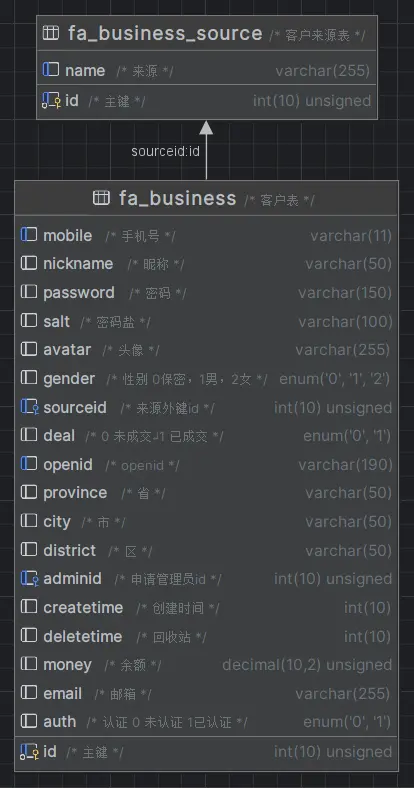
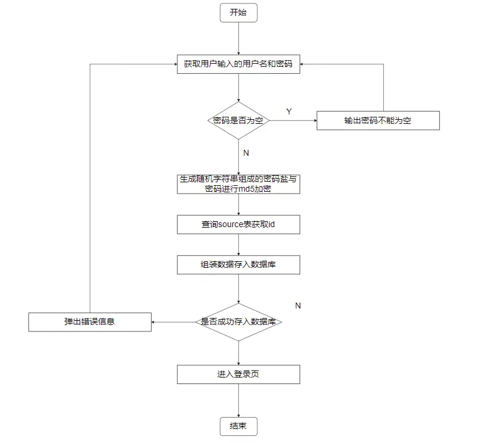

## 📑表结构
已创建的两个表结构如下


## 📝注册流程图



## 🔨Controller层

> 参考链接
> [请求-输入变量](https://www.kancloud.cn/manual/thinkphp5/118044)
> [请求类型](https://www.kancloud.cn/manual/thinkphp5/118045)

`home/controller/Index.php`

```php
    /**
     * 注册
     */
    public function register()
    {
        if ($this->request->isPost()) {
            $mobile = $this->request->param('mobile', '', 'trim');
            halt($mobile);
        }
        return $this->fetch();
    }
```

- 判断是否有post请求
  - 有的话在获取post变量时添加规则
    - 过滤左右空格
- `halt` 函数-调试变量并且中断输出

## 🔨Model

```shell
php think make:model common/business/Business
```

```shell
php think make:model common/business/Source
```

执行以上命令会在`application/common/model`下创建对应文件

`business/Business.php`

```php
<?php

namespace app\common\model\business;

use think\Model;

class Business extends Model
{
    /** 指定的数据表 */
    protected $name = 'business';
    /** 开启自动写入时间戳 */
    protected $autoWriteTimestamp = true;
    /** 定义时间戳字段名 */
    protected $createTime = 'createtime';
    /** 更新时间 */
    protected $updateTime = false;
}

```

模型会自动对应数据表，模型类的命名规则是除去表前缀的数据表名称，采用驼峰法命名，并且首字母大写

- 开启时间戳在单独的模型类里面设置
  - [时间戳 · ThinkPHP5.0完全开发手册 · 看云 (kancloud.cn)](https://www.kancloud.cn/manual/thinkphp5/138668)
- 关闭更新时间

### 初始化模型

模型同样支持初始化，与控制器的初始化不同的是，模型的初始化是重写`Model`的`initialize`，具体如下

`application\home\controller\Index.php`

```php
class Index extends Controller
{
    /** 用户模型 */
    protected $BusinessModel = null;
    
    public function _initialize()    {
        $this->BusinessModel = model('business.Business');
    }
    // ...
}
```

以上代码执行了构造函数调用了助手函数中的model方法,将model名称(命名空间.类名)传入获得model

[模型初始化 · ThinkPHP5.0完全开发手册 · 看云 (kancloud.cn)](https://www.kancloud.cn/manual/thinkphp5/177529)


`business/Source.php`

```php
<?php

namespace app\common\model\business;

use think\Model;

class Source extends Model
{
    protected $name = 'business_source';
}

```

## 🔨工具函数-生成随机字符串

在`application/common.php`中最底部添加工具函数
::: details
```php
/*
!==== 下面的函数都是自己添加 ====
*/

if (!function_exists('build_ranstr')) {
    /**
     * 获得随机字符串
     * @param   int     $len        需要的长度
     * @param   bool    $special    是否需要特殊符号
     * @return  string  返回随机字符串
     */
    function build_ranstr($len = 8, $special = false)
    {
        $chars = range('a', 'z');
        $chars = array_merge($chars, range('A', 'Z'));
        $chars = array_merge($chars, range(0, 9));

        if ($special) {
            $chars = array_merge($chars, array(
                "!", "@", "#", "$", "?", "|", "{", "/", ":", ";",
                "%", "^", "&", "*", "(", ")", "-", "_", "[", "]",
                "}", "<", ">", "~", "+", "=", ",", "."
            ));
        }

        $charsLen = count($chars) - 1;
        shuffle($chars); //打乱数组顺序
        $str = ''; // 用来拼接的
        for ($i = 0; $i < $len; $i++) {
            $str .= $chars[mt_rand(0, $charsLen)];    //随机取出一位
        }
        return $str;
    }
}
```
:::
## 🔨用户验证器

ThinkPHP5.0验证使用独立的\think\Validate类或者验证器进行验证
使用助手函数实例化验证器
[验证器 · ThinkPHP5.0完全开发手册 · 看云 (kancloud.cn)](https://www.kancloud.cn/manual/thinkphp5/129352)
可以在定义验证规则的时候定义场景，并且验证不同场景的数据
[验证场景 · ThinkPHP5.0完全开发手册 · 看云 (kancloud.cn)](https://www.kancloud.cn/manual/thinkphp5/129322)


`application\common\validate\business\Business.php`
::: details
```php
<?php

namespace app\common\validate\business;

use think\Validate;

/**
 * 用户验证器
 */
class Business extends Validate
{
    /**
     * 验证规则
     */
    protected $rule = [
        'mobile'   => ['require', 'number', 'unique:business', 'regex:/(^1[3|4|5|7|8][0-9]{9}$)/'],
        'money' => ['number', '>=:0'],
        'auth' => ['number', 'in:0,1'],
        'deal' => ['number', 'in:0,1'],
        'nickname' => ['require'],
        'email' => ['email', 'require'],
    ];

    /**
     * 错误提示信息
     */
    protected $message = [
        'mobile.require' => '手机号必填',
        'mobile.unique' => '手机号已存在，请重新输入',
        'password.require'  => '密码必填',
        'salt.require'      => '密码盐必填',
        'money.number'      => '余额必须是数字类型',
        'money.>='      => '余额必须大于等于0元',
        'auth.number'      => '认证状态的类型有误',
        'auth.in'      => '认证状态的值有误',
        'deal.number'      => '成交状态的类型有误',
        'deal.in'      => '成交状态的值有误',
        'nickname.require' => '昵称必填',
        'email.require' => '邮箱必填',
        'email.email' => '邮箱格式错误'
    ];

    /**
     * 验证场景
     */
    protected $scene = [
        'register' => ['mobile', 'password', 'salt', 'money', 'auth', 'deal'],
        'profile' => ['nickname', 'email']
    ];
}

```
:::
## ✨多语言支持

`application/home/lang/zh-cn.php`

::: details

```php
<?php

return [
    'Keep login'                                             => '保持会话',
    'Forgot password'                                        => '忘记密码?',
    'Username'                                               => '用户名',
    'User id'                                                => '会员ID',
    'Nickname'                                               => '昵称',
    'Password'                                               => '密码',
    'Sign up'                                                => '注 册',
    'Sign in'                                                => '登 录',
    'Sign out'                                               => '退 出',
    'Guest'                                                  => '游客',
    'Welcome'                                                => '%s，你好！',
    'Add'                                                    => '添加',
    'Edit'                                                   => '编辑',
    'Delete'                                                 => '删除',
    'Move'                                                   => '移动',
    'Name'                                                   => '名称',
    'Status'                                                 => '状态',
    'Weigh'                                                  => '权重',
    'Operate'                                                => '操作',
    'Warning'                                                => '温馨提示',
    'Default'                                                => '默认',
    'Article'                                                => '文章',
    'Page'                                                   => '单页',
    'OK'                                                     => '确定',
    'Cancel'                                                 => '取消',
    'Loading'                                                => '加载中',
    'Money'                                                  => '余额',
    'Score'                                                  => '积分',
    'More'                                                   => '更多',
    'Normal'                                                 => '正常',
    'Hidden'                                                 => '隐藏',
    'Submit'                                                 => '提交',
    'Reset'                                                  => '重置',
    'Execute'                                                => '执行',
    'Close'                                                  => '关闭',
    'Search'                                                 => '搜索',
    'Refresh'                                                => '刷新',
    'First'                                                  => '首页',
    'Previous'                                               => '上一页',
    'Next'                                                   => '下一页',
    'Last'                                                   => '末页',
    'None'                                                   => '无',
    'Online'                                                 => '在线',
    'Logout'                                                 => '退出',
    'Profile'                                                => '个人资料',
    'Index'                                                  => '首页',
    'Hot'                                                    => '热门',
    'Recommend'                                              => '推荐',
    'Dashboard'                                              => '控制台',
    'Code'                                                   => '编号',
    'Message'                                                => '内容',
    'Line'                                                   => '行号',
    'File'                                                   => '文件',
    'Menu'                                                   => '菜单',
    'Type'                                                   => '类型',
    'Title'                                                  => '标题',
    'Content'                                                => '内容',
    'Apply'                                                  => '应用',
    'Clear'                                                  => '清空',
    'Custom Range'                                           => '自定义',
    'Today'                                                  => '今天',
    'Yesterday'                                              => '昨天',
    'Last 7 days'                                            => '最近7天',
    'Last 30 days'                                           => '最近30天',
    'Last month'                                             => '上月',
    'This month'                                             => '本月',
    'Choose'                                                 => '选择',
    'Append'                                                 => '追加',
    'Upload'                                                 => '上传',
    'Memo'                                                   => '备注',
    'Parent'                                                 => '父级',
    'Params'                                                 => '参数',
    'Permission'                                             => '权限',
    'Go back'                                                => '返回上一页',
    'Jump now'                                               => '立即跳转',
    'Advance search'                                         => '高级搜索',
    'Check all'                                              => '选中全部',
    'Expand all'                                             => '展开全部',
    'Begin time'                                             => '开始时间',
    'End time'                                               => '结束时间',
    'Create time'                                            => '创建时间',
    'Flag'                                                   => '标志',
    'Gitee'                                                  => '码云',
    'Github'                                                 => 'Github',
    'QQ group'                                               => 'QQ群',
    'Member center'                                          => '会员中心',
    'Copyrights'                                             => '版权所有',
    'Responsive'                                             => '响应式开发',
    'Languages'                                              => '多语言',
    'Module'                                                 => '模块化开发',
    'Extension'                                              => '自由可扩展',
    'Auth'                                                   => '权限管理',
    'The fastest framework based on ThinkPHP5 and Bootstrap' => '基于ThinkPHP5和Bootstrap的极速后台开发框架',
    'Features'                                               => '功能特性',
    'Home'                                                   => '首页',
    'Store'                                                  => '插件市场',
    'Wxapp'                                                  => '小程序',
    'Services'                                               => '服务',
    'Download'                                               => '下载',
    'Demo'                                                   => '演示',
    'Donation'                                               => '捐赠',
    'Forum'                                                  => '社区',
    'Docs'                                                   => '文档',
    'User center'                                            => '会员中心',
    'Change password'                                        => '修改密码',
    'Please login first'                                     => '请登录后再操作',
    'Uploaded successful'                                    => '上传成功',
    'You can upload up to %d file%s'                         => '你最多还可以上传%d个文件',
    'You can choose up to %d file%s'                         => '你最多还可以选择%d个文件',
    'Chunk file write error'                                 => '分片写入失败',
    'Chunk file info error'                                  => '分片文件错误',
    'Chunk file merge error'                                 => '分片合并错误',
    'Chunk file disabled'                                    => '未开启分片上传功能',
    'Cancel upload'                                          => '取消上传',
    'Upload canceled'                                        => '上传已取消',
    'No file upload or server upload limit exceeded'         => '未上传文件或超出服务器上传限制',
    'Uploaded file format is limited'                        => '上传文件格式受限制',
    'Uploaded file is not a valid image'                     => '上传文件不是有效的图片文件',
    'Are you sure you want to cancel this upload?'           => '确定取消上传？',
    'Remove file'                                            => '移除文件',
    'You can only upload a maximum of %s files'              => '你最多允许上传 %s 个文件',
    'You can\'t upload files of this type'                   => '不允许上传的文件类型',
    'Server responded with %s code'                          => '服务端响应(Code:%s)',
    'File is too big (%sMiB), Max filesize: %sMiB'           => '当前上传(%sM)，最大允许上传文件大小:%sM',
    'Send verification code'                                 => '发送验证码',
    'Redirect now'                                           => '立即跳转',
    'Operation completed'                                    => '操作成功!',
    'Operation failed'                                       => '操作失败!',
    'Unknown data format'                                    => '未知的数据格式!',
    'Network error'                                          => '网络错误!',
    'Advanced search'                                        => '高级搜索',
    'Invalid parameters'                                     => '未知参数',
    'No results were found'                                  => '记录未找到',
    'Parameter %s can not be empty'                          => '参数%s不能为空',
    'Token verification error'                               => 'Token验证错误！',
    'You have no permission'                                 => '你没有权限访问',
    'An unexpected error occurred'                           => '发生了一个意外错误,程序猿正在紧急处理中',
    'This page will be re-directed in %s seconds'            => '页面将在 %s 秒后自动跳转',
];

```
:::
## ✨注册功能

```php
    /** 
     * 注册
     */
    public function register()
    {
        if ($this->request->isPost()) {
            $mobile = $this->request->param('mobile', '', 'trim');
            $password = $this->request->param('password', '', 'trim');

            if (empty($password)) {
                $this->error('密码不能为空');
            }
            /** 生成密码盐 */
            $salt = build_ranstr();
            /** md5密码 */
            $password = md5($password . $salt);
            // 组装注册的数据
            $data = [
                'mobile' => $mobile,
                'password' => $password,
                'salt' => $salt
            ];
            $result = $this->BusinessModel->validate('common/business/Business.register')->save($data);
            if ($result === false) {
                $this->error($this->BusinessModel->getError());
            } else {
                $this->success('注册成功', url('/home/index/login'));
            }
        }
        return $this->fetch();
    }
```


