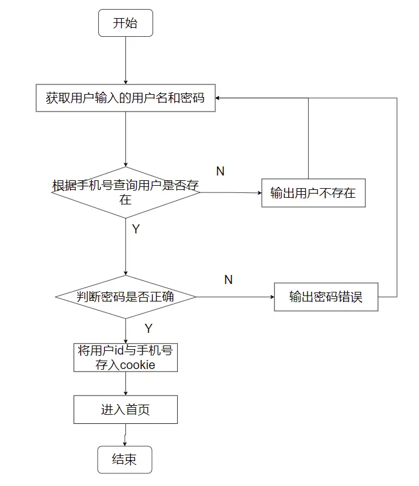

## ✒️登录流程图




`application\home\controller\Index.php`

```php
    /**
     * 登录
     */
    public function login()
    {
        if ($this->request->isPost()) {
            $mobile = $this->request->param('mobile', '', 'trim');
            $password = $this->request->param('password', '', 'trim');

            $business = $this->BusinessModel->where(['mobile' => $mobile])->find();

            if (!$business) {
                $this->error('用户不存在');
            }
            if (md5($password . $business['salt']) != $business['password']) {
                $this->error('密码错误');
            }

            $data = [
                'id' => $business['id'],
                'mobile' => $business['mobile']
            ];
            cookie('LoginBusiness', $data);

            $this->success('登录成功', url('home/business/index'));
        }
        return $this->fetch();
    }
```

---

`application\home\view\business\index.html` 去除首页登录按钮

```html
    <a href="login.html" class="login wow fadeInUp" data-wow-delay="200ms">登录</a>
```


## ✨追加字段与加密手机号

[获取器 · ThinkPHP5.0完全开发手册 · 看云 (kancloud.cn)](https://www.kancloud.cn/manual/thinkphp5/135192)

`application\common\model\business\Business.php`

```php
    /** 追加字段 */
    protected $append = [
        'mobile_text',
        'avatar_cdn'
    ];
    /**
     * 获取手机号将其加密
     */
    public function getMobileTextAttr($value, $data)
    {
        $mobile = $data['mobile'] ?? '';
        if (empty($mobile)) {
            return false;
        }
        return substr_replace($mobile, '****', 3, 4);
    }
```

## ✨创建home公共控制器

```shell
php think make:controller common/Home
```

`application\common\controller\Home.php`

```php
<?php

namespace app\common\controller;

use think\Controller;
use think\Request;

class Home extends Controller
{
    /** 不需要登录的方法 */
    protected $noNeedLogin = [];
    /** 全局登录的信息 */
    protected $LoginBusiness = [];

    public function __construct()
    {
        parent::__construct();
        // 获取当前的操作名
        $action = $this->request->action();

        // 判断哪些操作名需要调用验证登录
        if (!in_array($action, $this->noNeedLogin) && !in_array('*', $this->noNeedLogin)) {
            $this->isLogin();
        }
    }

    /**
     * 验证登录
     */
    protected function isLogin()
    {
        // 获取cookie
        $LoginBusiness = cookie('LoginBusiness') ?? [];
        if (empty($LoginBusiness)) {
            $this->error('请先登录', url('home/index/login'));
        }

        // 从登录信息获取相应的数据查询数据表有没有这个用户
        $id = $LoginBusiness['id'] ?? 0;
        $mobile = $LoginBusiness['mobile'] ?? '';

        // 查询数据表
        $business = model('business.Business')
            ->where(['id' => $id, 'mobile' => $mobile])
            ->find();

        if (!$business) {
            // 清除非法cookie
            cookie('LoginBusiness', null);

            $this->error('非法登录', url('/home/index/login'));
        }

        // 查询出来的用户信息赋值全局使用
        $this->LoginBusiness = $business;

        // 赋值全局的视图
        $this->assign([
            'LoginBusiness' => $business
        ]);
    }
}

```

将Business的父类改为上面的Home

`application\home\controller\Business.php`

```php
use app\common\controller\Home;
class Business extends Home
{
    public function index()
    {
        return $this->fetch();
    }
}
```


登录后台管理面板  常规设置->系统设置  添加域名变量


```php
    /**
     * 获取头像
     */
    public function getAvatarCdnAttr($value, $data)
    {
        $avatar = $data['avatar'] ?? '';

        if (empty($avatar)) {
            $avatar = 'assets/home/images/avatar.jpg';
        }

        // 获取网站域名
        $cdn = config('site.url');

        return $cdn . $avatar;
    }
```

`application\home\view\business\index.html`修改img的路径

```html

```

## ✨注销功能

`application\home\view\business\index.html` 最底部添加

```php
<script>
    $('#logout').click(() => {
        mui.confirm(
            '是否确认退出',
            '退出提醒',
            ['确认','取消'],
            function(res)
            {
                if(res.index === 0)
                {
                    $.ajax({
                        type:'post',
                        url:`{:url('/home/index/logout')}`,
                        dataType:'json',
                        success:function(result)
                        {
                            if(result.code === 1)
                            {
                                mui.toast(result.msg);

                                $('.mui-popup-backdrop').remove()
                                $('.mui-popup').remove()

                                setInterval(() => {
                                    location.href = `{:url('/home/index/login')}`;
                                },2000);
                            }
                        }
                    });
                }
            }
        )
    })
</script>
```

`application\home\controller\Index.php`

```php
    /**
     * 注销
     */
    public function logout()
    {
        if ($this->request->isAjax()) {
            cookie('LoginBusiness', null);
            $this->success('退出账号成功');
        }
    }
```

## ✨登录验证

`application\home\controller\Index.php`

```php
    public function login()
    {
        // 判断是否已经登录 登录后重定向到首页
        $LoginBusiness = cookie('LoginBusiness') ?? '';
        if ($LoginBusiness) {
            $this->redirect(url('/home/business/index'));
        }
        // ....
	}
    public function register()
    {
        // 判断是否已经登录 登录后重定向到首页
        $LoginBusiness = cookie('LoginBusiness') ?? '';
        if ($LoginBusiness) {
            $this->redirect(url('/home/business/index'));
        }
        //....
    }
```

## 🛠️代码重构优化

1. 减少重复代码：登录和注册方法中的判断是否已经登录的部分可以抽离一个单独的方法
2. 参数验证，在注册方法中，可以对手机号和密码进行非空验证
3. 注册成功后重定向首页抽离出函数：注册成功后，可以直接重定向登录页面
4. 使用密码哈希函数：可以使用密码哈希函数password_hash()来进行密码哈希和验证，而不是使用简单的md5。

`application\home\controller\Index.php`

```php
<?php

namespace app\home\controller;

use think\Controller;

class Index extends Controller
{
    /** 用户模型 */
    protected $BusinessModel = null;

    public function _initialize()
    {
        $this->BusinessModel = model('business.Business');
    }

    public function index()
    {
        return $this->fetch();
    }

    /** 
     * 注册
     */
    public function register()
    {
        // 判断是否已经登录 登录后重定向到首页
        if ($this->isUserLoggedIn()) {
            $this->redirectToHome();
        }

        if ($this->request->isPost()) {
            $mobile = $this->request->param('mobile', '', 'trim');
            $password = $this->request->param('password', '', 'trim');

            // 验证参数
            if (empty($mobile) || empty($password)) {
                $this->error('手机号和密码不能为空');
            }

            // 生成密码盐和哈希密码
            $salt = build_ranstr();
            $hashedPassword = password_hash($password . $salt, PASSWORD_DEFAULT);

            // 组装注册的数据
            $data = [
                'mobile' => $mobile,
                'password' => $hashedPassword,
                'salt' => $salt,
                'money' => 0,
                'auth' => 0,
                'deal' => 0,
            ];

            //  查询用户来源
            $source = model('business.Source')->where(['name' => ['LIKE', '%云课堂%']])->find();
            if ($source) {
                $data['sourceid'] = $source['id'];
            }

            // 保存用户数据
            $result = $this->registerUser($data);
            if ($result === false) {
                $this->error($this->getRegisterError());
            } else {
                $this->success('注册成功', url('/home/index/login'));
            }
        }

        return $this->fetch();
    }

    /**
     * 登录
     */
    public function login()
    {
        // 判断是否已经登录 登录后重定向到首页
        if ($this->isUserLoggedIn()) {
            $this->redirectToHome();
        }

        if ($this->request->isPost()) {
            $mobile = $this->request->param('mobile', '', 'trim');
            $password = $this->request->param('password', '', 'trim');

            // 查询用户
            $user = $this->getUserByMobile($mobile);

            if (!$user) {
                $this->error('用户不存在');
            }
            // 验证密码
            if (!password_verify($password . $user['salt'], $user['password'])) {
                $this->error('密码错误');
            }

            // 设置登录信息
            $data = [
                'id' => $user['id'],
                'mobile' => $user['mobile']
            ];
            cookie('LoginBusiness', $data);

            $this->success('登录成功', url('home/business/index'));
        }

        return $this->fetch();
    }

    /**
     * 判断是否已经登录
     */
    private function isUserLoggedIn()
    {
        $LoginBusiness = cookie('LoginBusiness') ?? '';
        return !empty($LoginBusiness);
    }

    /**
     * 重定向到首页
     */
    private function redirectToHome()
    {
        $this->redirect(url('/home/business/index'));
    }

    /**
     * 注册用户
     */
    private  function registerUser($data)
    {
        return $this->BusinessModel->validate('common/business/Business.register')->save($data);
    }

    /**
     * 获取注册错误信息
     */
    private  function getRegisterError()
    {
        return $this->BusinessModel->getError();
    }

    /**
     * 根据手机号获取用户
     */
    private function getUserByMobile($mobile)
    {
        return $this->BusinessModel->where(['mobile' => $mobile])->find();
    }

    /**
     * 注销
     */
    public function logout()
    {
        if ($this->request->isAjax()) {
            cookie('LoginBusiness', null);
            $this->success('退出账号成功');
        }
    }
}

```
