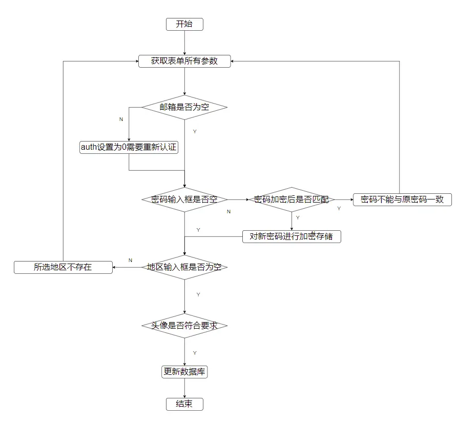

## ✨底部tabber选中切换颜色

删除html中class属性`mui-active`
添加以下script

`application\home\view\common\footer.html`

```html
<script>
    // 获取地址路径并且转为数组
    let pathArr = location.pathname.split('/');
    // 过滤数组里面的元素
    pathArr = pathArr.filter(val => val && val.trim())
    // 截取数组并且转成字符串
    let path = pathArr.slice(0, 2).join('/');
    // 截取数组并且转成字符串
    if (path == '' || path == '/') {
        $('.footer-bar .tab-item').eq(0).addClass('mui-active')
    } else if (path == 'home/business') {
        $('.footer-bar .tab-item').eq(2).addClass('mui-active')
    }
</script>
```
## ✨修改资料

`application\home\controller\Business.php`

```php
    /** 用户模型 */
    protected $BusinessModel = null;

    public function __construct()
    {
        parent::__construct();
        $this->BusinessModel = model('business.Business');
    }
     /**
     * 修改资料
     */
    public function profile()
    {
        return $this->fetch();
    }
```

`application\home\view\business\index.html`将基本资料a标签的href属性改为

```md
{:url('/home/business/profile')
```


`application\home\view\business\profile.html`

```html
<link rel="stylesheet" href="/assets/home/plugin/city/css/city-picker.css">
<link rel="stylesheet" href="/assets/home/css/profile.css">

<div class="user">
    <div class="avatar wow fadeInUp">
        
    </div>
</div>

<form class="mui-input-group" method="post" enctype="multipart/form-data">
    <div class="mui-input-row">
        <label>昵称</label>
        <input type="text" name="nickname" value="{$LoginBusiness.nickname}" class="mui-input-clear" placeholder="请输入昵称">
    </div>
    <div class="mui-input-row">
        <label>手机号码</label>
        <input type="text" value="{$LoginBusiness.mobile}" disabled class="mui-input-clear" placeholder="请输入手机号码">
    </div>
    <div class="mui-input-row">
        <label>邮箱</label>
        <input type="text" name="email" value="{$LoginBusiness.email}" class="mui-input-clear" placeholder="请输入邮箱">
    </div>
    <div class="mui-input-row">
        <label>密码</label>
        <input type="password" class="mui-input-password" placeholder="密码为空不修改密码">
    </div>
    <div class="mui-input-row">
        <label>性别</label>
        <select name="gender">
            <option value="0" {$LoginBusiness.gender == 0 ? 'selected' : ''}>保密</option>
            <option value="1" {$LoginBusiness.gender == 1 ? 'selected' : ''}>男</option>
            <option value="2" {$LoginBusiness.gender == 2 ? 'selected' : ''}>女</option>
        </select>
    </div>
    <div class="mui-input-row region">
        <label>地区</label>
        <div class="citypicker">
            <input id="city" type="text" data-toggle="city-picker" name="region" readonly />
            <!-- 隐藏域 -->
            <input type="hidden" name="code" id="code">
        </div>
    </div>

    <input type="file" class="form-control" id="avatar" name="avatar" style="display: none;" />
    
    <div class="mui-button-row">
        <button type="button" class="mui-btn mui-btn-primary">确认</button>
        <button type="button" class="mui-btn mui-btn-danger" onclick="history.go(-1)">返回</button>
    </div>
</form>


<script src="/assets/home/plugin/city/js/city-picker.data.min.js"></script>
<script src="/assets/home/plugin/city/js/city-picker.min.js"></script>

<script>
    // 选择地区
    $("#city").on("cp:updated", function() {
        var citypicker = $(this).data("citypicker");
        var code = citypicker.getCode("district") || citypicker.getCode("city") || citypicker.getCode("province");
        $("#code").val(code);
    });

    // 选择头像
    $('.avatar').click(function(){
        $('#avatar').click();
    });

    // 更新头像预览
    $('#avatar').change(function(){
        let file = $(this)[0].files[0];
        
        if(file)
        {
            let reader = new FileReader();

            reader.readAsDataURL(file);

            reader.onload = function()
            {
                $('.avatar img').attr('src',reader.result);
            }
        }
    });
</script>
```


---
## 📝执行sql语句添加地区表

从网盘下载数据库文件，运行 `fa_region.sql`

```
https://pan.baidu.com/s/1n4rrc7dmZlUwmGgbHkuuyg?pwd=hw66 
```


### 创建地区模型

`application\common\model\Region.php`

```php
<?php

namespace app\common\model;

use think\Model;

class Region extends Model
{
    // 表名
    protected $name = 'region';
}

```
## ✨修改功能流程图



## ✨修改资料功能

`application\home\controller\Business.php`

::: details

```php
    /**
     * 修改资料
     */
    public function profile()
    {
        if ($this->request->isPost()) {
            // 接收表单里的所有参数
            $params = $this->request->param();

            // 封装更新数据
            $data = [
                // 获取登录用户的id作为更新条件
                'id' => $this->LoginBusiness['id'],
                'nickname' => $params['nickname'],
                'email' => $params['email'],
                'gender' => $params['gender']
            ];

            // 如果邮箱更改的话，那么需要重新认证
            if ($params['email'] != $this->LoginBusiness['email']) {
                $data['auth'] = 0;
            }

            // 如果更新密码
            if (!empty($params['password'])) {

                // 验证密码
                if (password_verify($params['password'] . $this->LoginBusiness['salt'], $this->LoginBusiness['password'])) {
                    $this->error('新密码不能与原密码一致');
                }

                // 生成密码盐和哈希密码
                $salt = build_ranstr();
                $hashedPassword = password_hash($params['password'] . $salt, PASSWORD_DEFAULT);

                // 把处理好的密码追加更新数据
                $data['salt'] = $salt;
                $data['password'] = $hashedPassword;
            }

            // 地区
            if (!empty($params['code'])) {

                $path = model('Region')->where(['code' => $params['code']])->value('parentpath');
                if (empty($path)) {
                    $this->error('所选地区不存在');
                }

                $pathArr = explode(',', $path);

                $data['province'] = $pathArr[0] ?? null;
                $data['city'] = $pathArr[1] ?? null;
                $data['district'] = $pathArr[2] ?? null;
            }

            // 头像上传
            if (isset($_FILES['avatar']) && $_FILES['avatar']['size'] > 0) {
                $res = build_upload('avatar');

                if ($res['code'] === 0) {
                    $this->error($res['msg']);
                }

                $data['avatar'] = $res['data'];
            }

            // 更新数据表
            $result = $this->BusinessModel->validate('common/business/Business.profile')->isUpdate(true)->save($data);

            if ($result === false) {
                if (isset($data['avatar']) && $_FILES['avatar']['size']) {
                    @is_file(ltrim($data['avatar'], '/')) && @unlink($data['avatar'], '/');
                }

                $this->error($this->BusinessModel->getError());
            } else {
                if (isset($data['avatar']) && $_FILES['avatar']['size']) {
                    @is_file(ltrim($this->LoginBusiness['avatar'], '/')) && @unlink($this->LoginBusiness['avatar'], '/');
                }

                $this->success('更新成功', url('/home/business/index'));
            }
        }

        return $this->fetch();
    }
```

:::

### 资料修改页面

图片路径读取变量

```php

```

给密码添加上name

```html
 <input type="password" class="mui-input-password" placeholder="密码为空不修改密码">
```

确认按钮type从button改为submit

```html
<button type="submit" class="mui-btn mui-btn-primary">确认</button>
```

从全局中获取省市区的值更新到表单中

```js
// 获取省市区
let province = `{$LoginBusiness.province}`;
let city = `{$LoginBusiness.city}`;
let district = `{$LoginBusiness.district}`;
let code = district || city || province;
// 更新地区的值
$('#city').val(code);
$('#code').val(code);
```


### 单图上传工具函数

`application\common.php`

```php

if(!function_exists('build_upload'))
{
    /**
     * 单图上传
     * @param String $name 图片名称
     * @return Array 返回结果集
    */
    function build_upload($name)
    {
        $result = [
            'code' => 0,
            'msg' => '没有图片上传',
            'data' => null
        ];

        $file = request()->file($name);

        if($file)
        {
            // 把图片保存指定的目录
            $info = $file->move(ROOT_PATH . 'public' . DS . 'uploads');

            if($info)
            {
                // 修正路径的斜杠
                $fileName = str_replace('\\','/',$info->getSaveName());

                $result = [
                    'code' => 1,
                    'msg' => '上传成功',
                    'data' => '/uploads/' . $fileName
                ];
            }else{
                $result['msg'] = $file->getError();
            }
        }

        return $result;
    }
}
```


