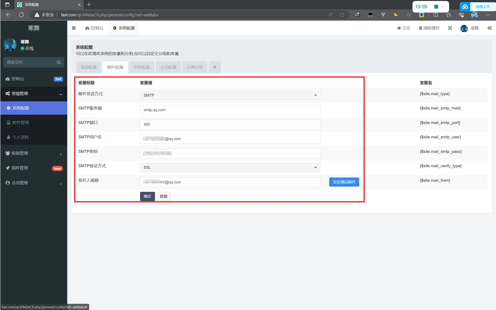
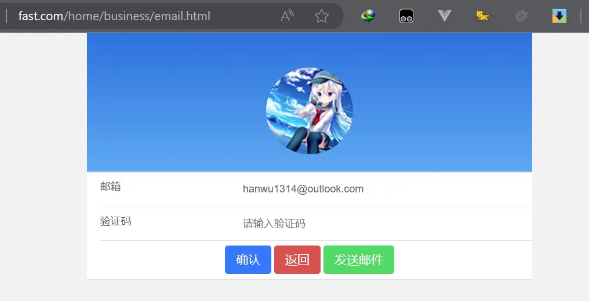

## 邮箱认证是否显示

`application\home\view\business\index.html`

```html
    {if condition="$LoginBusiness.auth == 0"}
    <a href="{:url('/home/business/email')}" class="item">
        <span>邮箱认证</span>
        
    </a>
    {/if}
```


### 在后台邮件配置增加SMTP授权码




### controller

`application\home\controller\Business.php`

```php
    /**
     * 邮箱
     */
    public function email()
    {
        return $this->fetch();
    }
```


### 邮箱认证页面

`application\home\view\business\email.html`

```html
<link rel="stylesheet" href="/assets/home/css/profile.css">

<div class="user">
    <div class="avatar wow fadeInUp">
        
    </div>
</div>

<form class="mui-input-group" method="post" enctype="multipart/form-data">
    <div class="mui-input-row">
        <label>邮箱</label>
        <input type="text" name="email" value="{$LoginBusiness.email}" class="mui-input-clear" placeholder="请输入邮箱"
            required disabled />
    </div>

    <div class="mui-input-row">
        <label>验证码</label>
        <input type="text" name="code" class="mui-input-clear" placeholder="请输入验证码" required />
    </div>


    <div class="mui-button-row">
        <button type="submit" class="mui-btn mui-btn-primary">确认</button>
        <button type="button" class="mui-btn mui-btn-danger" onclick="history.go(-1)">返回</button>
        <button type="button" id="send" class="mui-btn mui-btn-success">发送邮件</button>
    </div>
</form>
```




`application\home\view\business\email.html`

```html
<script>
    const SECONDS = 60;
    let timer;

    $("#send").click(function () {
        $.ajax({
            type: 'post',
            url: `{:url('/home/business/send')}`,
            dataType: 'json',
            success: function (res) {
                if (res.code === 0) {
                    mui.toast(res.msg, { duration: 2000 });
                    return;
                }

                //轻提醒
                mui.toast(res.msg, { duration: 2000 });

                //倒计时
                $(this).html(SECONDS);
                $(this).attr('disabled', true);
                timer = setInterval(countdown, 1000);
            }
        });
    })

    function countdown() {
        const $sendBtn = $("#send")
        let num = parseInt($sendBtn.html())

        if (num <= 0) {
            clearInterval(timer)
            $("#send").removeAttr('disabled')
            $("#send").html('重新发送验证码')
        } else {
            $sendBtn.html(num - 1)
        }
    }
</script>
```

## 邮件验证码的验证器

`application\common\validate\Ems.php`

```php
<?php

namespace app\common\validate;

use think\Validate;

/**
 * 邮件验证码的验证器
 */
class Ems extends Validate
{
    protected $rule =   [
        'event'  => 'require',
        'email'   => 'require',
        'code' => 'require',
        'ip' => 'require',
    ];

    protected $message  =   [
        'event.require' => '事件必填',
        'email.require'     => '邮箱必须填写',
        'code.require'   => '验证码未知',
        'ip.require'   => 'ip地址未知',
    ];
}

```

## 发送邮箱

`application\home\controller\Business.php`
:::details
```php
    /**
     * 发送邮件
     */
    public function send()
    {
        if ($this->request->isAjax()) {
            $email = $this->LoginBusiness['email'] ?? '';
            if (empty($email)) {
                $this->error('邮箱为空');
            }

            // 实例化邮箱验证码模型
            $Ems = model('Ems');

            // 组装条件
            $where = [
                'event' => 'email',
                'email' => $email,
                'times' => 0
            ];
            // 查询数据表是否有这条记录
            $ems = $Ems->where($where)->find();

            if ($ems) {
                $this->error('已发送验证码,请检查您的邮箱');
            }

            // 实例化邮件类
            $mail = new Email();

            // 开启事务
            $Ems->startTrans();
            // 生成验证码
            $code = build_ranstr(4);

            $data = [
                'event' => 'email',
                'email' => $email,
                'times' => 0,
                'ip' => $this->request->ip(),
                'code' => $code
            ];

            $EmsStatus = $Ems->validate('common/Ems')->save($data);
            if ($EmsStatus === false) {
                $this->error($Ems->getError());
            }

            // 正文内容
            $html = "<div>您的邮箱认证码为：<b>$code</b></div>";

            // 获取发送人的邮箱
            $FromEmail = config('site.mail_from');

            $res = $mail->from($FromEmail, '云平台')->subject('邮箱认证')->message($html)->to($email)->send();

            if ($res === false) {
                // 回滚事务
                $Ems->rollback();
                $this->error($mail->getError());
            } else {
                // 提交事务
                $Ems->commit();
                $this->success('发送成功');
            }
        }
    }
```
:::

## 邮箱认证功能

`application\home\controller\Business.php`
:::details
```php
    /**
     * 邮箱
     */
    public function email()
    {
        if ($this->request->isPost()) {
            $code = $this->request->param('code', '', 'trim');
            $email = $this->LoginBusiness['email'] ?? '';

            if (empty($code)) {
                $this->error('验证码不能为空');
            }

            if (empty($email)) {
                $this->error('邮箱地址为空');
            }

            $where = [
                'event' => 'email',
                'code' => $code,
                'email' => $email,
                'times' => 0
            ];

            $Ems = model('Ems');

            $ems = $Ems->where($where)->find();

            if (!$ems) {
                $this->error('验证码错误');
            }

            $this->BusinessModel->startTrans();
            // 开启事务
            $Ems->startTrans();

            // 更新用户的数据
            $BusinessData = [
                'id' => $this->LoginBusiness['id'],
                'auth' => 1
            ];
            // 更新结果
            $BusinessStatus = $this->BusinessModel->isUpdate(true)->save($BusinessData);

            if ($BusinessStatus === false) {
                $this->error($this->BusinessModel->getError());
            }

            // 删除验证码
            $EmsStatus = $Ems->destroy($ems['id']);

            if ($EmsStatus === false) {
                $this->BusinessModel->rollback();
                $this->error($Ems->getError());
            }

            if ($BusinessStatus === false || $EmsStatus === false) {
                $this->BusinessModel->rollback();
                $Ems->rollback();
                $this->error('认证失败');
            } else {
                $this->BusinessModel->commit();
                $Ems->commit();
                $this->success('认证成功', url('/home/business/index'));
            }
        }

        return $this->fetch();
    }
```

:::

---

## 代码重构优化

1.减少不必要的条件判断：
可以通过合并验证条件，减少判断的复杂性。例如，将判断验证码和邮箱是否为空的条件合并为一个条件。
2.减少数据库查询次数：
在代码中有两次查询数据库的操作，可以考虑将它们合并为一次查询，以减少数据库访问的次数。
3.简化事务处理：
使用数据库事务时，可以使用 try-catch 语句来简化事务处理逻辑。

:::details
```php
    /**
     * 邮箱
     */
    public function email()
    {
        if ($this->request->isPost()) {
            $code = $this->request->param('code', '', 'trim');
            $email = $this->LoginBusiness['email'] ?? '';

            if (empty($code) || empty($email)) {
                $this->error('验证码或邮箱地址不能为空');
            }

            $where = [
                'event' => 'email',
                'code' => $code,
                'email' => $email,
                'times' => 0
            ];

            $Ems = model('Ems');


            // 开启事务
            $this->BusinessModel->startTrans();
            $Ems->startTrans();

            try {
                $ems = $Ems->where($where)->find();

                if (!$ems) {
                    throw new \Exception('验证码错误');
                }

                $BusinessData = [
                    'id' => $this->LoginBusiness['id'],
                    'auth' => 1
                ];

                $BusinessStatus = $this->BusinessModel->isUpdate(true)->save($BusinessData);

                if ($BusinessStatus === false) {
                    throw new \Exception($this->BusinessModel->getError());
                }

                $EmsStatus = $Ems->destroy($ems['id']);

                if ($EmsStatus === false) {
                    throw new \Exception($Ems->getError());
                }

                $this->BusinessModel->commit();
                $Ems->commit();
            } catch (\Exception $e) {
                $this->BusinessModel->rollback();
                $Ems->rollback();
                $this->error($e->getMessage());
            }

            $this->success('认证成功', url('/home/business/index'));
        }

        return $this->fetch();
    }
```
:::

