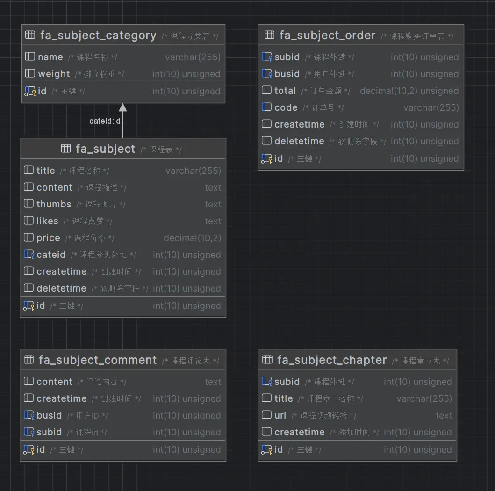

## 创建controller

```shell
php think make:controller home/subject/Subject
```

```php
<?php

namespace app\home\controller\subject;

use app\common\controller\Home;

class Subject extends Home
{
    public function search()
    {
        return $this->fetch();
    }
}

```


## 导入数据库

```shell
https://pan.baidu.com/s/1QcFT3_MijpKUChoyOYBitg?pwd=hw66 
```



## 页面修改

`application\home\view\common\footer.html` 搜索按钮地址修改

```html
<a href="{:url('/home/subject/subject/search')}">
    <span class="mui-icon mui-icon-search"></span>
    <span class="mui-tab-label">搜索</span>
</a>
```

将其原先用if判断高亮tabber的js代码换成switch语句

```js
    const tabItem = $('.footer-bar .tab-item');

    switch (path) {
        case '':
        case '/':
            tabItem.eq(0).addClass('mui-active')
            break;
        case 'home/subject':
            tabItem.eq(1).addClass('mui-active')
            break;
        case 'home/business':
            tabItem.eq(2).addClass('mui-active')
            break;
    }
```

## Model层

### subject

`application/common/model/subject/Subject.php`

```php
<?php

namespace app\common\model\subject;

use think\Model;

class Subject extends Model
{
    //模型对应的是哪张表
    protected $name = "subject";

    //指定一个自动设置的时间字段
    //开启自动写入
    protected $autoWriteTimestamp = true;

    //设置字段的名字
    protected $createTime = "createtime"; //插入的时候设置的字段名

    //禁止 写入的时间字段
    protected $updateTime = false;

    // 追加属性
    protected $append = [
        'likes_count',
        'thumbs_cdn', // 课程封面
        'createtime_text'
    ];

    public function getThumbsCdnAttr($value, $data)
    {
        // 获取网站域名
        $cdn = config('site.url');

        $thumbs = empty($data['thumbs']) ? '/assets/img/coures.jpg' : $data['thumbs'];
        return $cdn . $thumbs;
    }

    //获取器方法
    public function getLikesCountAttr($value, $data)
    {
        $likes = trim($data['likes']);
        //字符串转化为数组
        $likes = explode(',', $data['likes']);
        $likes = array_filter($likes);
        return count($likes);
    }

    public function getCreatetimeTextAttr($value,$data)
    {
        $createtime = $data['createtime'] ?? '';

        return date("Y-m-d",$createtime);
    }

    // 关联查询
    public function category()
    {
        return $this->belongsTo('app\common\model\subject\Category','cateid','id',[],'LEFT')->setEagerlyType(0);
    }

}

```

### Comment

`application\common\model\subject\Comment.php`

```php
<?php

namespace app\common\model\subject;

use think\Model;

class Comment extends Model
{
    protected $name = 'subject_comment';

    // 关联查询方法
    public function business()
    {
        return $this->belongsTo('app\common\model\business\Business','busid','id',[],'LEFT')->setEagerlyType(0);
    }
}

```

### Chapter

`application\common\model\subject\Chapter.php`

```php
<?php

namespace app\common\model\subject;

use think\Model;

class Chapter extends Model
{
    protected $name = 'subject_chapter';
}

```

### Category

`application\common\model\subject\Category.php`

```php
<?php

namespace app\common\model\subject;

use think\Model;

class Category extends Model
{
    protected $name = 'subject_category';
}

```

## View

### 创建search.html

`application\home\view\subject\subject\search.html`

```html
<link rel="stylesheet" href="/assets/home/plugin/mescroll/mescroll.min.css">
<link rel="stylesheet" href="/assets/home/css/search.css">

<!-- 搜索框 -->
<div class="mui-input-row mui-search">
    <input type="search" class="mui-input-clear" placeholder="请输入课程名称" name="search" />
</div>

<!-- 课程列表 -->
<div id="subject-list" class="mescroll mui-content">
    <ul class="mui-table-view">

    </ul>
</div>

{include file='common/footer'/}

<script src="/assets/home/plugin/mescroll/mescroll.min.js"></script>

<script>
    // 当前页
    var page = 1;

    // 每页查询多少条
    var limit = 10;

    // 关键词
    var search = '';

    //初始化下拉刷新插件
    var scroll = new MeScroll('subject-list', {
        down: {
            //下拉
            auto: false, //是否在初始化完毕之后自动执行下拉回调callback; 默认true
            callback: DownCallback //下拉刷新的回调
        },
        up: {
            auto: true, //是否在初始化时以上拉加载的方式自动加载第一页数据; 默认false
            callback: UpCallback, //上拉回调,此处可简写
            page: {
                size: limit
            },
            toTop: { //配置回到顶部按钮
                duration: 300,
                src: "/assets/home/plugin/mescroll/mescroll-totop.png", //默认滚动到1000px显示,可配置offset修改
                offset: 100
            },
            htmlNodata: '<div class="more">没有更多了..</div>',
        }
    });

    // 下拉刷新
    function DownCallback() {
        // 重置加载状态 清空page 直接从第一页开始
        scroll.resetUpScroll();
        $('#subject-list ul').empty();
    }

    // 上拉加载
    function UpCallback(current) {
        // 当前页
        page = current.num;

        // 每页显示多少条数据
        limit = current.size;

        // 封装数据
        let data = {
            page: page,
            limit: limit,
            search: search
        }

        $.ajax({
            type: 'post',
            url: `{:url('/home/subject/subject/search')}`,
            data: data,
            dataType: 'json',
            success: function (res) {
                if (res.code === 0) {
                    // 隐藏下拉刷新和上拉加载的状态
                    scroll.endBySize(0, 0);
                    return;
                }

                let count = res.data.count;
                let list = res.data.list;

                // 隐藏下拉刷新和上拉加载的状态
                scroll.endBySize(list.length, count);

                // 输出数据
                fetchList(list);
            }
        });
    }

    function fetchList(list) {
        let temp = '';

        for (let item of list) {
            temp += `
            <li class="mui-table-view-cell mui-media">
                <a class="item" href="{:url('/home/subject/subject/info')}?id=${item.id}">
                    <div class="thumb">
                        
                    </div>
                    <div class="info">
                        <h5 class="title">${item.title}</h5>
                        <p class="content mui-ellipsis">课程分类：${item.category.name}</p>
                        <p class="content mui-ellipsis">创建时间：${item.createtime_text}</p>
                        <p class="bottom">
                            <span class="like mui-icon mui-icon-starhalf">
                                <span>${item.likes_count}</span>
                            </span>
                            <span class="price">￥${item.price}</span>
                        </p>
                    </div>
                </a>
            </li>
            `
        }

        $('#subject-list ul').append(temp);
    }
</script>
```

### 创建info.html


`application\home\view\subject\subject\info.html`

```html
<link rel="stylesheet" href="/assets/home/css/details.css">

<div id="cover">
    <!-- 课程封面 -->
    
    <!-- 中间播放键 -->
    <div id="play">
        
    </div>
</div>

<!-- ckplayer视频容器元素 -->
<div id="video"></div>

<!-- 课程信息 -->
<div class="head">
    <div class="info">
        <h4 class="name">{$subject.title}</h4>
        <div class="action">
            <!-- 点赞 -->
            <!--  -->

            <!-- 未点赞 -->
            
            <span class="num">{$subject.likes_count}</span>
        </div>
    </div>
</div>

<div class="title">课程简介</div>
<table class="list">
    <tr>
        <td>课程名称</td>
        <td>{$subject.title}</td>
    </tr>
    <tr class="price">
        <td>课程价格</td>
        <td>￥{$subject.price}元</td>
    </tr>
    <tr>
        <td>发布时间</td>
        <td>{$subject.createtime_text}</td>
    </tr>
    <tr>
        <td>章节总数</td>
        <td>{$count}小节</td>
    </tr>
</table>

<div class="title">课程介绍</div>
<div class="mui-table-view content">{$subject.content}</div>

<div class="title">课程章节</div>
<ul class="mui-table-view">
    {if condition="$count > 0"}
        {foreach($ChapterList as $item)}
            <li class="mui-table-view-cell">{$item.title}</li>
        {/foreach}
    {else /}
        <li class="mui-table-view-cell">暂无课程章节</li>
    {/if}
</ul>

<div class="title">用户评论</div>

<!-- 评论内容 -->
<ul class="mui-table-view">
    {if condition="count($CommentList) > 0"}
        {foreach($CommentList as $item)}
            <li class="mui-table-view-cell mui-media">
                <a href="javascript:;">
                    
                    <div class="mui-media-body">
                        {$item.business.nickname ?: '未知昵称'}
                        <p class='mui-ellipsis'>{$item.content}</p>
                    </div>
                </a>
            </li>
        {/foreach}
    {else /}
        <li class="mui-table-view-cell mui-media">
            暂无评论
        </li>
    {/if}
</ul>

<div class="more">
    <a href="comment_list.html" class="mui-btn mui-btn-primary mui-btn-outlined">查看更多评论</a>
</div>

<!-- 弹出菜单 -->
<div id="sheet1" class="mui-popover mui-popover-bottom mui-popover-action">
    <!-- 可选择菜单 -->
    <ul class="mui-table-view">
        <li class="mui-table-view-cell">
            <a id="buy" href="javascript:void(0)">
                立即购买
            </a>
        </li>
    </ul>
    <!-- 取消菜单 -->
    <ul class="mui-table-view">
        <li class="mui-table-view-cell">
            <a href="#sheet1"><b>取消</b></a>
        </li>
    </ul>
</div>


<!-- 加载ckplayer视频插件 -->
<script src="/assets/home/plugin/ckplayer/ckplayer.min.js"></script>

<script>
    $("#iosActionsheetCancel").click(function () {
        mui('#sheet1').popover('toggle');
    })

    // 点击播放
    $("#play").on('click', function () {
        Paydata()
    })

    function Paydata() {
        mui('#sheet1').popover('toggle');
    }

    $("#buy").on('click', function () {
        mui('#sheet1').popover('toggle');
        var btnArray = ['否', '是'];
        mui.confirm('请问您确认购买吗？', '尊敬的用户', btnArray, function (e) {
            if (e.index = 1) {
                location.href = "./assets/buy.html";
            }
        })
    })

</script>
```


加入mescroll插件到`public\assets\home\plugin`

## Controller层

`application\home\controller\subject\Subject.php`

```php
<?php

namespace app\home\controller\subject;

use app\common\controller\Home;

class Subject extends Home
{
    protected $noNeedLogin = ['info'];

    // 课程模型
    protected $SubjectModel = null;

    // 课程章节模型
    protected $ChapterModel = null;

    // 课程评论模型
    protected $CommentModel = null;

    // 课程订单模型
    protected $OrderModel = null;

    // 用户模型
    protected $BusinessModel = null;

    // 用户消费记录模型
    protected $RecordModel = null;

    public function __construct()
    {
        parent::__construct();

        $this->SubjectModel = model('subject.Subject');
        $this->ChapterModel = model('subject.Chapter');
        $this->CommentModel = model('subject.Comment');
        $this->OrderModel = model('subject.Order');
        $this->BusinessModel = model('business.Business');
        $this->RecordModel = model('business.Record');
    }

    public function search()
    {
        if($this->request->isAjax())
        {
            $page = $this->request->param('page',1,'trim');
            $limit = $this->request->param('limit',10,'trim');
            $search = $this->request->param('search','','trim');

            // 条件数组
            $where = [];

            if($search)
            {
                $where['title'] = ['LIKE',"%$search%"];
            }

            $count = $this->SubjectModel->where($where)->count();

            $list = $this->SubjectModel->with(['category'])->where($where)->order('createtime DESC')->page($page,$limit)->select();

            if($list)
            {
                $this->success('查询成功',null,['count' => $count,'list' => $list]);
            }else{
                $this->error('暂无数据',null,['count' => 0,'list' => []]);
            }
        }

        return $this->fetch();
    }

    public function info()
    {
        $id = $this->request->param('id','','trim');

        $subject = $this->SubjectModel->find($id);

        if(!$subject)
        {
            $this->error('课程不存在');
        }

        // 获取cookie里面的信息
        $business = cookie('LoginBusiness');

        $subject['like_status'] = false;

        if($business)
        {
            $likeArr = explode(',',$subject['likes']);

            // 过滤空元素
            $likeArr = array_filter($likeArr);

            if(in_array($business['id'],$likeArr))
            {
                $subject['like_status'] = true;
            }
        }

        // 获取该课程的章节的总数
        $count = $this->ChapterModel->where(['subid' => $id])->count();

        // 获取该课程的所有章节的数据
        $ChapterList = $this->ChapterModel->where(['subid' => $id])->order('id ASC')->select();

        // 获取对该课程的评价
        $CommentList = $this->CommentModel->with(['business'])->where(['subid' => $id])->limit(5)->order('createtime DESC')->select();

        $this->assign([
            'subject' => $subject,
            'count' => $count,
            'ChapterList' => $ChapterList,
            'CommentList' => $CommentList
        ]);

        return $this->fetch();
    }

    public function like()
    {
        $subid = $this->request->param('subid',0,'trim');

        $subject = $this->SubjectModel->find($subid);

        if(!$subject)
        {
            $this->error('课程不存在');
        }

        $likeArr = explode(',',$subject['likes']);

        $likeArr = array_filter($likeArr);

        $msg = '';

        if(in_array($this->LoginBusiness['id'],$likeArr))
        {
            $index = array_search($this->LoginBusiness['id'],$likeArr);
            
            if(!$index)
            {
                $this->error('无法取消点赞');
            }

            unset($likeArr[$index]);

            $msg = '取消点赞';

        }else{
            $likeArr[] = $this->LoginBusiness['id'];

            $msg = '点赞';
        }

        // 封装更新数据
        $data = [
            'id' => $subid,
            'likes' => implode(',',$likeArr)
        ];

        $result = $this->SubjectModel->isUpdate(true)->save($data);
        
        if($result === false)
        {
            $this->error($msg . '失败');
        }else{
            $this->success($msg . '成功');
        }
    
    }

    public function play()
    {
        $subid = $this->request->param('subid',0,'trim');
        $cid = $this->request->param('cid',0,'trim');

        $subject = $this->SubjectModel->find($subid);

        if(!$subject)
        {
            $this->error('课程不存在');
        }

        $OrderWhere = [
            'busid' => $this->LoginBusiness['id'],
            'subid' => $subid
        ];

        $order = $this->OrderModel->where($OrderWhere)->find();

        if(!$order)
        {
            $this->error('请先购买课程',null,['buy' => 'buy']);
        }
    }

    public function buy()
    {
        $subid = $this->request->param('subid',0,'trim');

        // 查询这个课程是否存在
        $subject = $this->SubjectModel->find($subid);

        if(!$subject)
        {
            $this->error('课程不存在');
        }

        // 查询这个用户是否购买过了这个课程
        $OrderWhere = [
            'busid' => $this->LoginBusiness['id'],
            'subid' => $subid
        ];

        $order = $this->OrderModel->where($OrderWhere)->find();
        
        if($order)
        {
            $this->error('您已购买过了该课程，无须购买');
        }

        // 余额是否够购买该课程
        $UpdateMoney = bcsub($this->LoginBusiness['money'],$subject['price'],2);

        if($UpdateMoney < 0)
        {
            $this->error('余额不足，请及时充值');
        }

        /* 
            订单表 => 新增一个订单记录
            用户表 => 更新余额
            用户消费记录表 => 新增一条记录
        */

        // 开启事务
        $this->OrderModel->startTrans();
        $this->BusinessModel->startTrans();
        $this->RecordModel->startTrans();

        // 封装订单数据
        $OrderData = [
            'subid' => $subid,
            'busid' => $this->LoginBusiness['id'],
            'total' => $subject['price'],
            'code' => build_code('SU'),
        ];

        // 把数据插入数据表
        $OrderStatus = $this->OrderModel->validate('common/subject/Order')->save($OrderData);

        if($OrderStatus === false)
        {
            $this->error($this->OrderModel->getError());
        }

        // 更新用户数据
        $BusinessData = [
            'id' => $this->LoginBusiness['id'],
            'money' => $UpdateMoney
        ];

        // 自定义一个验证器
        $validate = [
            // 规则
            [
                'money' => ['number', '>=:0'],
            ],
            // 错误信息
            [
                'money.number' => '余额必须是数字类型',
                'money.>=' => '余额必须大于等于0元',
            ]
        ];

        $BusinessStatus = $this->BusinessModel->validate(...$validate)->isUpdate(true)->save($BusinessData);

        if($BusinessStatus === false)
        {
            $this->OrderModel->rollback();
            $this->error($this->BusinessModel->getError());
        }

        // 封装用户消费记录
        $RecordData = [
            'total' => $subject['price'],
            'busid' => $this->LoginBusiness['id'],
            'content' => "购买课程：【{$subject['title']}】花费了 ￥{$subject['price']} 元"
        ];

        $RecordStatus = $this->RecordModel->validate('common/business/Record')->save($RecordData);

        if($RecordStatus === false)
        {
            $this->OrderModel->rollback();
            $this->BusinessModel->rollback();
            $this->error($this->RecordModel->getError());
        }

        if($OrderStatus === false || $BusinessStatus === false || $RecordStatus === false)
        {
            $this->OrderModel->rollback();
            $this->BusinessModel->rollback();
            $this->RecordModel->rollback();
            $this->error('购买课程失败');
        }else{
            $this->OrderModel->commit();
            $this->BusinessModel->commit();
            $this->RecordModel->commit();
            $this->success('购买课程成功');
        }

    }
}

```


