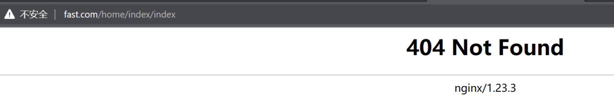
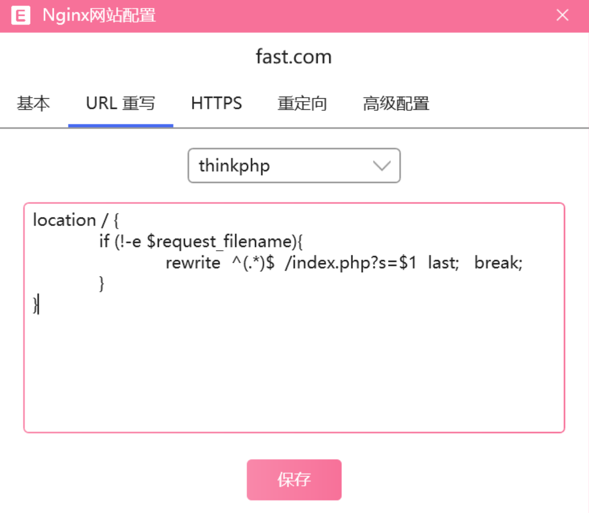
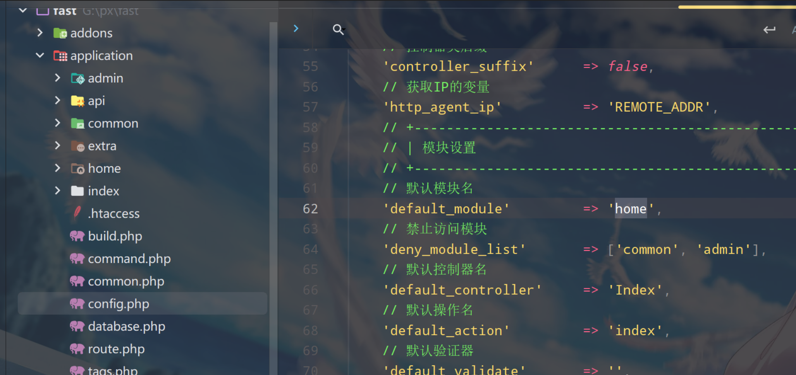

[介绍 - FastAdmin框架文档](https://doc.fastadmin.net/doc/construct.html#toc-4)


### 快速生成模块

自动生成相应的模块，自动生成的模块目录包含了config、controller、model和view目录以及common.php公共文件

```
php think build --module home
```






### 修改模块名为home

`application/config.php`


如果是阿帕奇服务器的话
伪静态配置的是

```html
<IfModule mod_rewrite.c>
  Options +FollowSymlinks -Multiviews
  RewriteEngine On

  RewriteCond %{REQUEST_FILENAME} !-d
  RewriteCond %{REQUEST_FILENAME} !-f
  RewriteRule ^(.*)$ index.php?/$1 [QSA,PT,L]
</IfModule>
```

### 开启调试模式

> 这是修改整个项目的默认配置，当环境变量值不存在时使用后面的值，不建议这样修改，参照下面修改变量



### .env.sample

环境变量配置文件

[框架 env 变量配置 - FastAdmin框架文档](https://doc.fastadmin.net/doc/2483.html)

框架在安装后不会自动启用`env`环境变量，如果需要启用 `env` 环境变量配置，可以手动复制一份`.env.sample`为`.env`，如果是在`Linux`环境下可以使用以下命令复制一份。

```shell
cp .env.sample .env
```

如果启用了 `env`，`.env` 文件中支持的配置就会覆盖掉框架中其他地方的配置，最终以 `.env`为准。

```json
[app]  
debug = true  
trace = false  
  
[database]  
hostname = 127.0.0.1  
database = fastadmin  
username = root  
password = root  
hostport = 3306  
prefix = fa_
```

### 快速生成控制器类

```php
php think make:controller home/Buisness
```


