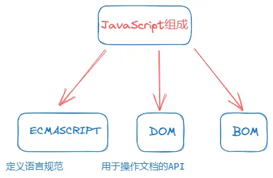

维基百科对JavaSccript的定义：
- JavaScript 是一种<mark style="background: #FF5582A6;">高级的、解释型</mark>的编程语言
- JavaScript是<mark style="background: #FF5582A6;">一门基于原型、头等函数</mark>的语言，是<mark style="background: #FF5582A6;">一门多范式的语言</mark>，它<mark style="background: #FF5582A6;">支持面向对象程序设计，指令式编程，以及函数式编程</mark>

> JavaScript是前端开发的灵魂

## JavaScript的起源

1994年，网景公司(Netscape)发布了Navigator浏览器0.9版
- 这是历史上第一个比较成熟的网络浏览器，轰动一时
- 但是，这个版本的浏览器只能用来浏览，不具备与访问者互动的能力
- 网景公司急需一种网页脚本语言，使得浏览器可以与网页互动

<mark style="background: #BBFABBA6;">网景公司当时想要选择一种语言来嵌入到浏览器中</mark>
- 采用现有的语言，比如Perl、Python、Tcl、Scheme等等, 允许它们直接嵌入网页
- 1995年网景公司招募了程序员Brendan Eich，希望将Scheme语言作为网页脚本语言的可能性

<mark style="background: #BBFABBA6;">就在这时，发生了另外一件大事：1995年Sun公司将Oak语言改名为Java，正式向市场推出</mark>
- Java推出之后立马在市场上引起了轰动，Java当初有一个口号：“write once run anywhere”
- 网景公司动了心，决定与Sun公司结成联盟，希望将Java嵌入到网页中来运行
- Brendan Eich本人非常热衷于Scheme，但是管理层那个时候有点倾向于Java，希望可以简化Java来适应网页脚本的需求

<mark style="background: #BBFABBA6;">但是Brendan Eich对此并不感兴趣，他用10天时间设计出来了JavaScript</mark>
- 最初这门语言的名字是Mocha（摩卡）
- 在Navigator2.0 beta版本更名为LiveScript
- 在Navigator2.0 beta 3版本正式重命名为JavaScript，当时是为了给这门语言搭上Java这个热词

<mark style="background: #BBFABBA6;">当然10天设计出来语言足够说明Brendan Eich是天才，但是这门语言当时更像是一个多种语言的大杂烩</mark>
- 借鉴C语言的基本语法
- 借鉴Java语言的数据类型和内存管理
- 借鉴Scheme语言，将函数提升到"第一等公民"（first class）的地位
- 借鉴Self语言，使用基于原型（prototype）的继承机制

<mark style="background: #BBFABBA6;">Brendan Eich曾经这样描述过JavaScript</mark>
- 与其说我爱Javascript，不如说我恨它，它是C语言和Self语言一夜情的产物
- 十八世纪英国文学家约翰逊博士说得好：'它的优秀之处并非原创，它的原创之处并不优秀。
- （the part that is good is not original, and the part that is original is not good.）

<mark style="background: #FFF3A3A6;">微软公司于1995年首次推出Internet Explorer，从而引发了与Netscape的浏览器大战</mark>
微软对Netscape Navigator解释器进行了逆向工程，创建了JScript，以与处于市场领导地位的网景产品同台竞争；
这个时候对于开发者来说是一场噩耗，因为需要针对不同的浏览器进行不同的适配；

<mark style="background: #BBFABBA6;">1996年11月，网景正式向ECMA（欧洲计算机制造商协会）提交语言标准</mark>
1997年6月，ECMA以JavaScript语言为基础制定了ECMAScript标准规范ECMA-262;
ECMA-262是一份标准，定义了ECMAScript;
JavaScript成为了ECMAScript最著名的实现之一;
除此之外，ActionScript和JScript也都是ECMAScript规范的实现语言；

<mark style="background: #FF5582A6;">所以说，ECMAScript是一种规范，而JavaScript是这种规范的一种实现</mark>

## JavaScript的组成

<mark style="background: #BBFABBA6;">ECMAScript是JavaScript的标准，描述了该语言的语法和基本对象</mark>

JavaScript是ECMAScript的语言层面的实现
因为除了语言规范之外，JavaScript还需要对页面和浏览器进行各种操作
除了基本实现之外，还包括DOM操作和BOM操作

## JavaScript由谁来运行？

<mark style="background: #BBFABBA6;">我们经常会说：不同的浏览器由不同的内核组成</mark>

[浏览器内核](../html/02浏览器内核.md)

事实上，我们经常说的浏览器内核指的就是浏览器的排版引擎
- 排版引擎，也被称为浏览器引擎、页面渲染引擎或者样板引擎

那么，JavaScript代码由谁来执行呢？

> JavaScript 引擎

<mark style="background: #BBFABBA6;">为什么需要JavaScript引擎？</mark>

- 高级的编程语言都是需要转成最终的机器指令来执行的
- 事实上我们编写的JavaScript无论你交给浏览器或者Node执行，最后都是需要被CPU执行的
- 但是CPU只认识自己的指令集，实际上是机器语言，才能被CPU所执行
- 所以我们需要JavaScript引擎帮助我们将JavaScript代码翻译成CPU指令来执行

## 常见的JS引擎

<mark style="background: #BBFABBA6;">比较常见的JavaScript引擎有哪些呢</mark>

- SpiderMonkey：第一款JavaScript引擎，由Brendan Eich开发（也就是JavaScript作者）；
- Chakra：微软开发，用于IT浏览器；
- JavaScriptCore：WebKit中的JavaScript引擎，Apple公司开发；
- V8：Google开发的强大JavaScript引擎，也帮助Chrome从众多浏览器中脱颖而出；

## 浏览器内核和JS引擎的关系

<mark style="background: #BBFABBA6;">这里我们先以WebKit为例，WebKit事实上由两部分组成的</mark>

1. WebCore：负责HTML解析、布局、渲染等等相关的工作
2. JavaScriptCore：解析、执行JavaScript代码；

小程序中也是这样划分的：在小程序中编写的JavaScript代码就是被JSCore执行的
