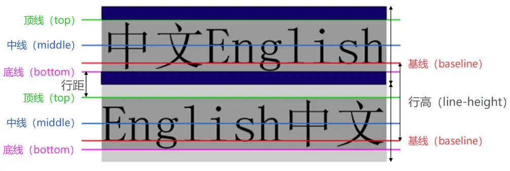

## 字体

### 字符间距

在CSS中，字间距属性可以通过letter-spacing属性来控制，这个属性用于设置字符与字符之间的距离，可以为正数、负数或零值。其取值范围为：normal | length | initial | inherit。

- normal：段落中字符的标准间隔。
- length：以像素、百分比或其他长度单位指定字符间距。
- initial：将属性设置为其默认值。
- inherit：从父元素中继承属性的值。

### 字体大小

font-size决定文字的大小

-  常用的设置
   具体数值+单位 比如100px， 也可以使用em单位(不推荐)：1em代表100%，2em代表200%，0.5em代表50%
- 百分比   基于父元素的font-size计算，比如50%表示等于父元素font-size的一半

### 字体名称

font-family：用于设置文字的字体名称

- 可以设置1个或者多个字体名称;
- 浏览器会选择列表中第一个该计算机上有安装的字体;
- 或者是通过 @font-face 指定的可以直接下载的字体。

### 字体粗细

font-weight：文字粗细
100 | 200 | 300 | 400 | 500 | 600 | 700 | 800 | 900 ：每一个数字表示一个重量

-  normal：等于400
-  bold：等于700

### 是否斜体

font-style用于设置文字的常规、斜体显示

-  normal：常规显示
-  italic(斜体)：用字体的斜体显示(通常会有专门的字体)
-  oblique(倾斜)：文本倾斜显示(仅仅是让文字倾斜)

### 小写显示形式

font-variant可以影响小写字母的显示形式
- normal：常规显示
- small-caps：将小写字母替换为缩小过的大写字母

### 行高

line-height 行高

行高的严格定义是：两行文字基线（baseline）之间的间距
基线（baseline）：与小写字母x最底部对齐的线

### 缩写

font是一个缩写属性
font 属性可以用来作为 font-style, font-variant, font-weight, font-size, line-height 和 font-family 属性的简写;
◼ 规则:

- font-style、font-variant、font-weight可以随意调换顺序，也可以省略
- line-height可以省略，如果不省略，必须跟在font-size后面
- font-size、font-family不可以调换顺序，不可以省略
