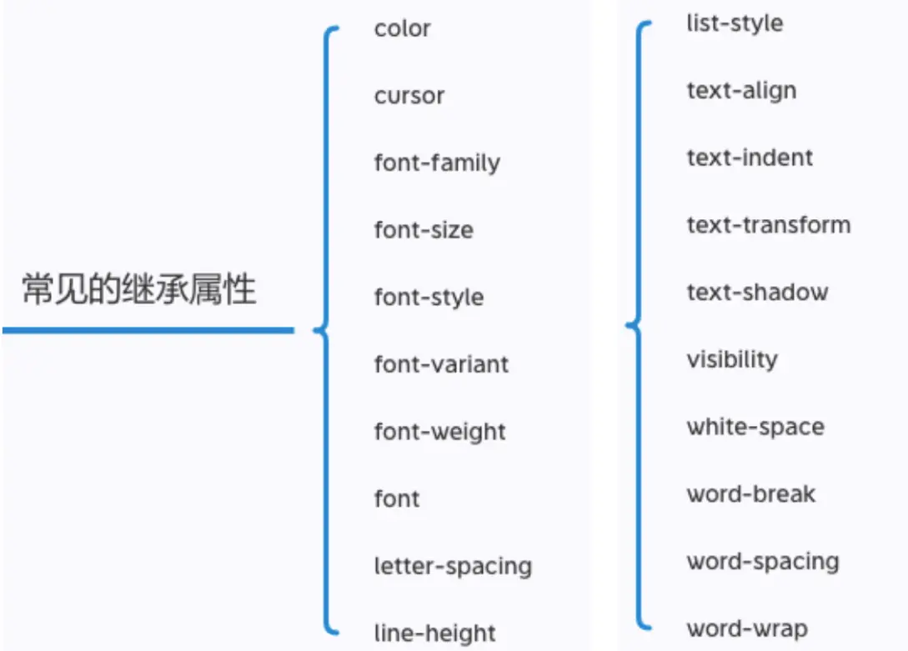

## 属性继承

CSS的某些属性具有继承性(Inherited):
如果一个属性具备继承性, 那么在该元素上设置后, 它的后代元素都可以继承这个属性;当然, 如果后代元素自己有设置该属性, 那么优先使用后代元素自己的属性(不管继承过来的属性权重多高);

如何知道一个属性是否具有继承性呢?
常见的font-size/font-family/font-weight/line-height/color/text-align都具有继承性;

## 属性的层叠
对于一个元素来说, 相同一个属性我们可以通过 不同的选择器给它进行多次设置;
那么属性会被一层层覆盖上去
但是最终只有一个会生效;

那么多个样式属性覆盖上去, 哪一个会生效呢?
判断一: 选择器的权重, 权重大的生效, 根据权重可以判断出优先级;
判断二: 先后顺序, 权重相同时, 后面设置的生效;

### 选择器的权重
- !important：10000
- 内联样式：1000
- id选择器：100
- 类选择器、属性选择器、伪类：10
- 元素选择器、伪元素：1
- 通配符：0

## HTML元素的类型

在前面我们会经常提到div是**块级元素**会独占一行, span是**行内级元素**会在同一行显示.

到底什么是块级元素, 什么是行内级元素呢?
◼ HTML定义元素类型的思路:

HTML元素有很多, 比如h元素/p元素/div元素/span元素/img元素/a元素等等;
当我们把这个元素**放到页面上**时, 这个元素到底**占据页面中一行多大的空间**呢?
✓ 为什么我们这里只说一行呢? 因为垂直方向的高度通常是内容决定的;
比如一个h1元素的标题, 我们必然是希望它独占一行的, 其他的内容不应该和我的标题放在一起;
比如一个p元素的段落, 必然也应该独占一行, 其他的内容不应该和我的段落放在一起;
而类似于img/span/a元素, 通常是对内容的某一个细节的特殊描述, 没有必要独占一行;
所以, 为了区分哪些元素需要独占一行, 哪些元素不需要独占一行, HTML将元素区分(本质是通过CSS的)成了两类:
块级元素（block-level elements）: **独占父元素的一行**
行内级元素（inline-level elements）:**多个行内级元素可以在父元素的同一行中显示**

## display

 CSS中有个display属性，能修改元素的显示类型，有4个常用值

-  block：让元素显示为块级元素
-  inline：让元素显示为行内级元素
-  inline-block：让元素同时具备行内级、块级元素的特征
-  none：隐藏元素

### display值的特性

- block
  - 独占一行
  - 可以设置宽高（设置后依旧独占一行）
  - 高度默认由内容决定
- inline-block
  - 和其他行内级元素在同一行
  - 可以设置宽高
  - 默认宽高由内容决定
- inline
  - 和其他行内级元素在同一行
  - 不可以设置宽度和高度
  - 宽度和高度由内容决定

## 元素隐藏方法

1. display设置为none
	- 元素不显示出来, 并且也不占据位置, **不占据任何空间**
2. visibility设置为hidden
	-  虽然元素不可见, 但是**会占据元素应该占据的空间**
3. rgba设置颜色, 将a的值设置为0
	-  rgba的a设置的是alpha值, 可以设置透明度, **不影响子元素**
4. opacity设置透明度, 设置为0
	- 设置整个元素的透明度, **会影响所有的子元素**

## overflow

overflow用于控制内容溢出时的行为

- visible：溢出的内容照样可见
- hidden：溢出的内容直接裁剪
- scroll：溢出的内容被裁剪，但可以通过滚动机制查看
  - 会一直显示滚动条区域，滚动条区域占用的空间属于width、height
  auto：自动根据内容是否溢出来决定是否提供滚动机制

