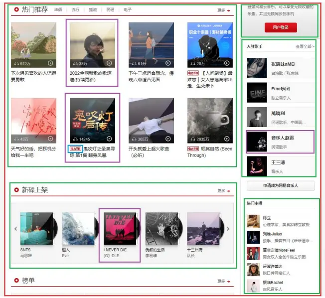
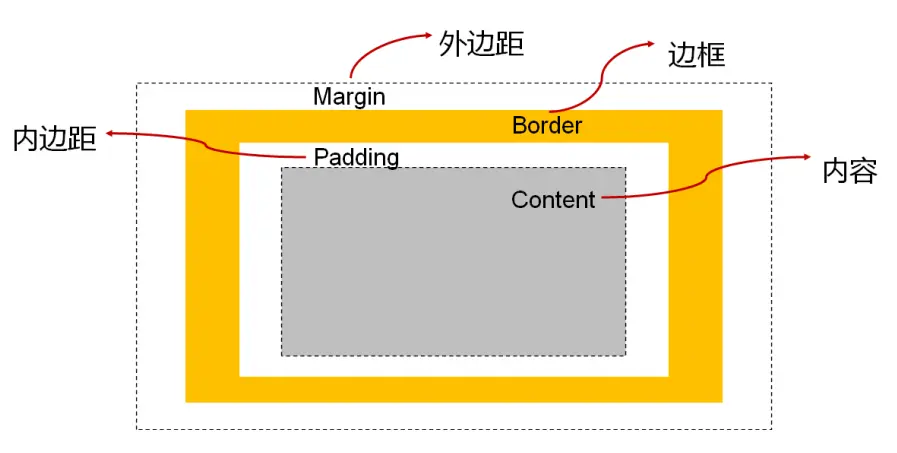
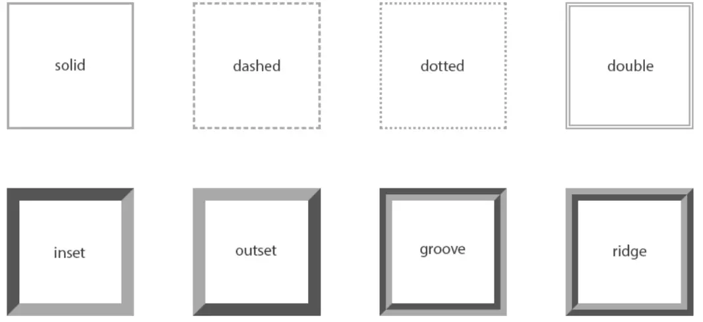
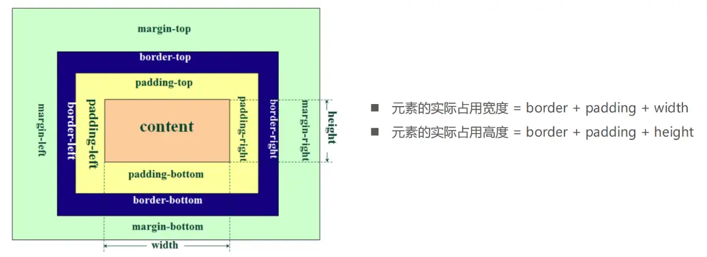
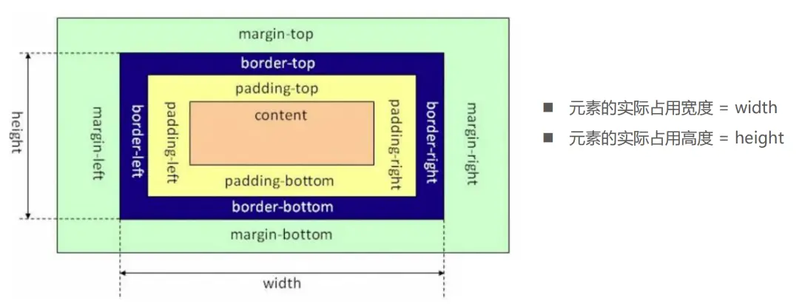
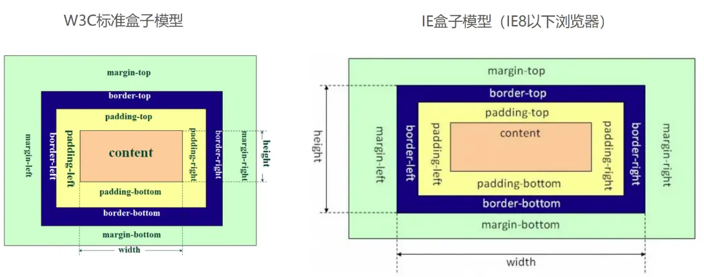

HTML中的每一个元素都可以看做是一个盒子，如右下图所示，可以具备这4个属性

 

## 盒子模型

HTML中的每一个元素都**可以看做是一个盒子**，如右下图所示，可以具备这4个属性

## 内容宽度和高度

设置内容是通过宽度和高度设置的:

宽度设置: width
高度设置: height
 注意: 对于**行内级非替换元素**来说, **设置宽高是无效的**!
另外我们还可以设置如下属性:

- **min-width**：最小宽度，无论内容多少，宽度都大于或等于min-width
- **max-width**：最大宽度，无论内容多少，宽度都小于或等于max-width

移动端适配时, 可以设置最大宽度和最小宽度;

## 边框

###  边框宽度

 border-top-width、border-right-width、border-bottom-width、border-left-width
 border-width是上面4个属性的简写属性

###  边框颜色

 border-top-color、border-right-color、border-bottom-color、border-left-color
 border-color是上面4个属性的简写属性

###  边框样式

 border-top-style、border-right-style、border-bottom-style、border-left-style
 border-style是上面4个属性的简写属性

### 边框的样式设置值

- `groove`：凹槽, 沟槽, 边框看上去好象是雕刻在画布之内

- `ridge`：山脊, 和grove相反，边框看上去好象是从画布中凸出来

### 圆角

border-radius常见的值:

- 数值: 通常用来设置小的圆角, 比如6px;
- 百分比: 通常用来设置一定的弧度或者圆形;
- 如果一个元素是正方形, 设置border-radius大于或等于50%时，就会变成一个圆

## 上下margin的传递

- margin-top传递

  - 如果块级元素的顶部线和父元素的顶部线重叠，那么这个块级元素的margin-top值会传递给父元素

- margin-bottom传递
  - 如果块级元素的底部线和父元素的底部线重写，并且父元素的高度是auto，那么这个块级元素的margin-bottom值会传递给父元素

::: info 如何防止出现传递问题？

给父元素设置padding-top | padding-bottom
给父元素设置border
触发BFC: 设置overflow为auto

:::

::: tip

margin一般是用来设置兄弟元素之间的间距
padding一般是用来设置父子元素之间的间距

:::

## outline

outline表示元素的外轮廓
不占用空间
默认显示在border的外面
- outline相关属性有
- outline-width: 外轮廓的宽度
- outline-style：取值跟border的样式一样，比如solid、dotted等
- outline-color: 外轮廓的颜色
- outline：outline-width、outline-style、outline-color的简写属性，跟border用法类似应用实例
- 去除a元素、input元素的focus轮廓效果

## 盒子阴影 box-shadow

shadow的常见格式如下
- offset-x, 水平方向的偏移，正数往右偏移
- offset-y, 垂直方向的偏移，正数往下偏移
- blur-radius, 模糊半径
- spread-radius, 延伸半径
- color：阴影的颜色，如果没有设置，就跟随color属性的颜色
- inset：外框阴影变成内框阴影

https://html-css-js.com/css/generator/box-shadow/

## 文字阴影  text-shadow

text-shadow用法类似于box-shadow，用于给文字添加阴影效果
相当于box-shadow, 它没有spread-radius的值;

https://html-css-js.com/css/generator/box-shadow/

行内非替换元素的注意事项

- 以下属性**对行内级非替换元素不起作用**
  - width、height、margin-top、margin-bottom
- 以下属性对行内级非替换元素的效果比较特殊
  - padding-top、padding-bottom、上下方向的border

## CSS属性 - box-sizing

box-sizing(怪异盒子)用来设置盒子模型中宽高的行为

- content-box
  - padding、border都布置在width、height外边	

- border-box
  - padding、border都布置在width、height里边

