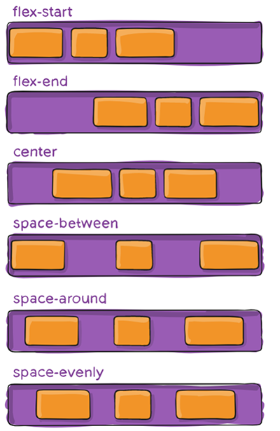

# 弹性盒flexbox

弹性盒子是一种用于按行或按列布局元素的一维布局方法
元素可以膨胀以填充额外的空间, 收缩以适应更小的空间;

应用在 flex container 上的 CSS 属性
- flex-flow
	- flex-flow 属性是 flex-direction 和 flex-wrap 的简写。
- flex-direction
	- row（默认值）、row-reverse、column、column-reverse
- flex-wrap
	- 决定了 flex container 是单行还是多行
	- nowrap
	- wrap
	- wrap-reverse
- flex-flow
- **justify-content**
	- 决定了 flex items 在 main axis 上的对齐方式
	- flex-start（默认值）：与 main start 对齐
	- flex-end：与 main end 对齐
	- center：居中对齐
	- space-between：
		- flex items 之间的距离相等
		- 与 main start、main end两端对齐
	- space-around：	
		- flex items 之间的距离相等
		- flex items 与 main start、main end 之间的距离是 flex items 之间距离的一半
	- space-evenly：
		- flex items 之间的距离相等
		- flex items 与 main start、main end 之间的距离 等于 flex items 之间的距离

- align-items  决定了 flex items 在 cross axis 上的对齐方式
	- normal：在弹性布局中，效果和stretch一样
	- stretch：当 flex items 在 cross axis 方向的 size 为 auto 时，会自动拉伸至填充 flex container
	- flex-start：与 cross start 对齐
	- flex-end：与 cross end 对齐
	- center：居中对齐
	- baseline：与基准线对齐

- align-content  决定了多行 flex items 在 cross axis 上的对齐方式，用法与 justify-content 类似
	- stretch（默认值）：与 align-items 的 stretch 类似
	- flex-start：与 cross start 对齐
	- flex-end：与 cross end 对齐
	- center：居中对齐
	- space-between
	- space-around
	- space-evenly

 应用在 flex items 上的 CSS 属性
 - flex-grow
	 - flex-grow 决定了 flex items 如何扩展(拉伸/成长)
		 - 可以设置任意非负数字（正小数、正整数、0），默认值是 0
		 - 当 flex container 在 main axis 方向上有剩余 size 时，flex-grow 属性才会有效
		 - 如果所有 flex items 的 flex-grow 总和 sum 超过 1，每个 flex item 扩展的 size 为flex container 的剩余 size * flex-grow / sum
		 - flex items 扩展后的最终 size 不能超过 `max-width\max-height`
 - flex-basis
	 - flex-basis 用来设置 flex items 在 main axis 方向上的 base size
	 - 决定 flex items 最终 base size 的因素，从优先级高到低
		 - `max-width\max-height\min-width\min-height`
		 - flex-basis
		 - `width\height`
		 - 内容本身的 size
 - flex-shrink 决定了flex items 如何收缩(缩小)
	 - 可以设置任意非负数字（正小数、正整数、0），默认值是 1
	 - 当 flex items 在 main axis 方向上超过了 flex container 的 size，flex-shrink 属性才会有效
	 - 如果所有 flex items 的 flex-shrink 总和超过 1，每个 flex item 收缩的 size为flex items 超出 flex container 的 size * 收缩比例 / 所有 flex items 的收缩比例之和
	 - flex items 收缩后的最终 size 不能小于 min-width\min-height
 - order 决定了 flex items 的排布顺序
	 - 可以设置任意整数（正整数、负整数、0），值越小就越排在前面
	 - 默认值是0
 - align-self
 - flex
	 - flex 是 flex-grow || flex-shrink || flex-basis 的简写,flex 属性可以指定1个，2个或3个值
	
 - flex-items  可以通过 align-self 覆盖 flex container 设置的 align-items
	 - auto（默认值）：遵从 flex container 的 align-items 设置
	- stretch、flex-start、flex-end、center、baseline，效果跟 align-items 一致

