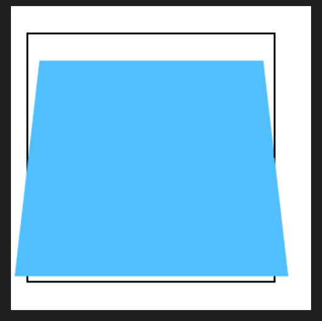

```html
  <div class="outer">
    <div class="inner"></div>
  </div>
```


```less
.outer{
  width: 200px;
  height: 200px;
  border: 2px solid black;
  margin: 0 auto;;
  margin-top: 100px;
  // 开启3d
  transform-style: preserve-3d;
  perspective: 500px;
}
.inner{
  width: 200px;
  height: 200px;
  background-color: deepskyblue;
  transition: .2s;
  transform: rotateX(30deg);
}

```


## 景深
人眼距离z轴的距离

元素高度 / 2

## 透视点

观察者的位置
默认位于开启3d空间的正中央 -->  outer




perspective-origin: 202px 102px;


## 3D位移

### Z轴位移


```less
.outer{
  width: 200px;
  height: 200px;
  border: 2px solid black;
  margin: 0 auto;;
  margin-top: 100px;
  // 开启3d
  transform-style: preserve-3d;
  perspective: 500px;
}

.inner{
  width: 200px;
  height: 200px;
  background-color: rgba(0, 191, 255, 0.628);  // 透明色便于观察
}
```

### translate3d

transform: translate3d(0px,0px,100px); 

## 3D旋转

transform: rotateX(45deg) //  -315deg


transform: rotateY(45deg) //  -315deg


## 3D缩放

transform: scaleX(1.5)


transform: scaleY(1.5)


### scaleZ  

影响厚度，但html元素是没有厚度的

transform: scaleZ(1) rotateY(45deg)


transform: scaleZ(3) rotateY(45deg)


**scaleZ 中的值影响的是景深值**

scaleZ(1)    perspective: 166px;   等价于   scaleZ(3)    perspective: 500px;

即 500 /  3 = 166

## 3D多重变换


```less
.outer{
  width: 200px;
  height: 200px;
  border: 2px solid black;
  margin: 0 auto;;
  margin-top: 100px;
  // 开启3d
  transform-style: preserve-3d;
  perspective: 500px;
  // 修改透视点的位置
}

.inner{
  width: 200px;
  height: 200px;
  background-color: rgba(0, 191, 255, 0.628);
  transform-origin: left;
  transform: rotateY(-45deg)
}

```


```less
transform-origin: 202px 202px;
transform: rotateX(-45deg)
```

----


```less
.inner{
  width: 200px;
  height: 200px;
  background-color: rgba(0, 191, 255, 0.628);
  transform: translateZ(100px) scale(1) rotateY(45deg)
}
```


::: danger 注意
`rotateY(45deg)` 属于破坏坐标系位置，需要放到最后写
:::

## 补充-旋转元素后背部不可见

```css
backface-visibility:hidden
```


