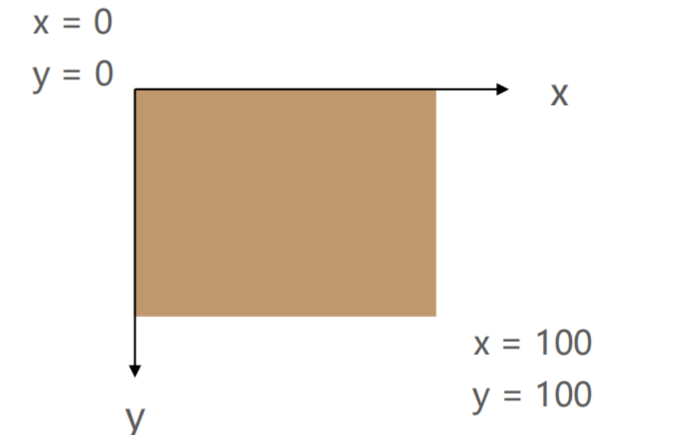

### background-image  用于设置元素的背景图片

会盖在(不是覆盖)background-color的上面
如果设置了多张图片
	设置的第一张图片将显示在最上面，其他图片按顺序层叠在下面
注意：如果设置了背景图片后，元素没有具体的宽高，背景图片是不会显示出来的

### background-repeat  用于设置背景图片是否要平铺
repeat：平铺
no-repeat：不平铺
repeat-x：只在水平方向平铺
repeat-y：只在垂直平方向平铺

### background-size  用于设置背景图片的大小

auto：默认值, 以背景图本身大小显示
cover：缩放背景图，以完全覆盖铺满元素,可能背景图片部分看不见
contain：缩放背景图，宽度或者高度铺满元素，但是图片保持宽高比
percentage：百分比，相对于背景区
length：具体的大小，比如100px

### background-position  用于设置背景图片在水平、垂直方向上的具体位置
- 可以设置具体的数值 比如 20px 30px;
- 水平方向还可以设值：left、center、right
- 垂直方向还可以设值：top、center、bottom
- 如果只设置了1个方向，另一个方向默认是center

### background-attachment  
决定背景图像的位置是在视口内固定，或者随着包含它的区块滚动。
- scroll：此关键属性值表示背景相对于元素本身固定， 而不是随着它的内容滚动
- local：此关键属性值表示背景相对于元素的内容固定。如果一个元素拥有滚动机制，背景将会随着元素的内容滚动.
- fixed：此关键属性值表示背景相对于视口固定。即使一个元素拥有滚动机制，背景也不会随着元素的内容滚动。

### background-image和img对比

|              | img    | background-image |
|:------------:|:------:|:----------------:|
| 性质           | HTML元素 | CSS样式            |
| 图片是否占用空间     |  ✔️      |         ❌         |
| 浏览器右键直接查看地址  |  ✔️      |        ❌          |
| 支持CSS Sprite |      ❌  |        ✔️          |
| 更有可能被搜索引擎收录  |  ✔️(结合alt属性)      |     ❌             |  
