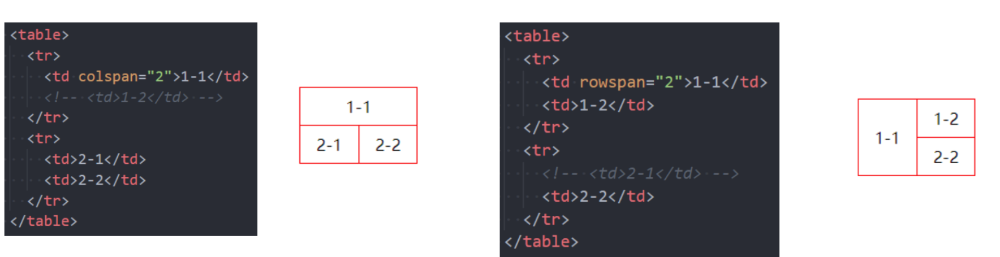

HTML提供了3组常用的用来展示列表的元素

- 有序列表：ol、li
- 无序列表：ul、li
- 定义列表：dl、dt、dd

## table
- 表格  table
- 表格中的行  tr  (table row)
- 行中的单元格 td(table data)

border-collapse：用来决定表格的边框是分开的还是合并的-合并单元格的边框

表格的其他元素
thead
	表格的表头
tbody
	表格的主体
tfoot
	表格的页脚
caption
	表格的标题
th
	表格的表头单元格

### 单元格合并

单元格合并分成两种情况:
- 跨列合并: 使用colspan
	- 在最左边的单元格写上colspan属性, 并且省略掉合并的td;
- 跨行合并: 使用rowspan
	- 在最上面的单元格写上rowspan属性, 并且省略掉后面tr中的td;

