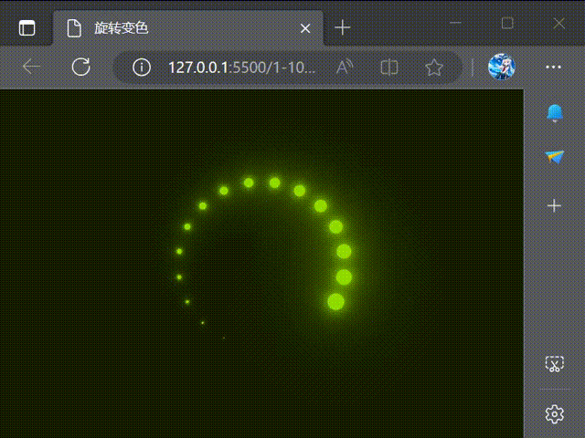

## 重点：


定义变量
```html
<span style="--i:1;"></span>
```

```less
    span {
      position: absolute;
      top: 0;
      left: 0;
      width: 100%;
      height: 100%;
      transform: rotate(calc(18deg * var(--i)));
      &:before {
        content: '';
        position: absolute;
        top: 0;
        left: 0;
        width: 15px;
        height: 15px;
        background-color: @bg;
        border-radius: 50%;
        box-shadow: 0 0 10px @bg, 0 0 20px @bg, 0 0 40px @bg,
			         0 0 60px @bg, 0 0 80px @bg, 0 0 100px @bg;
        animation: animate 2s linear infinite;
        animation-delay: (calc(0.1s * var(--i)));
      }
    }
  }
```


## 实现思路

span 绝对定位   --- >  20个重叠一起  
伪元素绝对定位左上    
父元素span 旋转不同角度后  `transform: rotate(calc(18deg * var(--i)));`带动伪元素绘制一个圆弧
给伪元素上border-radius 成为一个圆球
添加不同**模糊**数值的盒阴影  使其外扩散成为光晕
给最外层父元素添加上**滤镜**动画   使其变色

```less
@keyframes animateBg {
  0% {
    filter: hue-rotate(0deg);
  }
  100% {
    filter: hue-rotate(360deg);
  }
}

```

最后给伪元素添加上放大缩小的动画，并分别设置延迟
`animation: animate 2s linear infinite`
`animation-delay: (calc(0.1s * var(--i)))`

```less
@keyframes animate {
  0% {
    transform: scale(1);
  }
  80%,
  100% {
    transform: scale(0);
  }
}
```


## 完整代码


```html
  <section>
    <div class="loader">
      <span style="--i:1;"></span>
      <span style="--i:2;"></span>
      <span style="--i:3;"></span>
      <span style="--i:4;"></span>
      <span style="--i:5;"></span>
      <span style="--i:6;"></span>
      <span style="--i:7;"></span>
      <span style="--i:8;"></span>
      <span style="--i:9;"></span>
      <span style="--i:10;"></span>
      <span style="--i:11;"></span>
      <span style="--i:12;"></span>
      <span style="--i:13;"></span>
      <span style="--i:14;"></span>
      <span style="--i:15;"></span>
      <span style="--i:16;"></span>
      <span style="--i:17;"></span>
      <span style="--i:18;"></span>
      <span style="--i:19;"></span>
      <span style="--i:20;"></span>
    </div>
  </section>
```


```less
* {
  margin: 0;
  padding: 0;
  box-sizing: border-box;
}

@bg: #00ff0a;

section {
  display: flex;
  justify-content: center;
  align-items: center;
  min-height: 100vh;
  background-color: #042104;
  animation: animateBg 10s linear infinite;

  .loader {
    position: relative;
    width: 120px;
    height: 120px;

    span {
      position: absolute;
      top: 0;
      left: 0;
      width: 100%;
      height: 100%;
      transform: rotate(calc(18deg * var(--i)));
      &:before {
        content: '';
        position: absolute;
        top: 0;
        left: 0;
        width: 15px;
        height: 15px;
        background-color: @bg;
        border-radius: 50%;
        box-shadow: 0 0 10px @bg, 0 0 20px @bg, 0 0 40px @bg, 0 0 60px @bg, 0 0 80px @bg, 0 0 100px @bg;
        animation: animate 2s linear infinite;
        animation-delay: (calc(0.1s * var(--i)));
      }
    }
  }
}

@keyframes animateBg {
  0% {
    filter: hue-rotate(0deg);
  }
  100% {
    filter: hue-rotate(360deg);
  }
}

@keyframes animate {
  0% {
    transform: scale(1);
  }
  80%,
  100% {
    transform: scale(0);
  }
}

```


