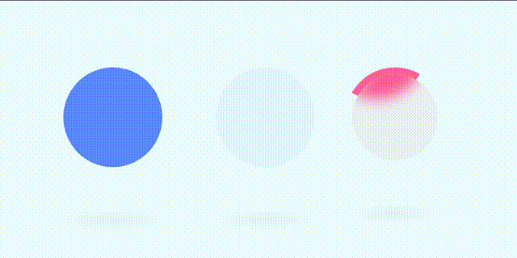

## 实现思路


1. 毛玻璃效果
	给一个偏向背景的颜色，加上高斯模糊，加上1像素的白框
```less
@bg:#eafdff;
@c1:#5989ff;
backdrop-filter: blur(10px);
```
2. 两圆交替动画
设置偏移量，并给第二个圆设置一半的动画延迟
```less
animation: animate ease-in-out 2s infinite;
@keyframes animate {
  0%,100%{
    transform: translateX(-80px);
  }
  50%{
    transform: translateX(80px);
  }
}
&:nth-child(2){
 animation-delay: -1s;
}
```


3. 旋转模糊效果
  定位到左上角 


```less
position:absolute;
top: -50%;
left: -50%;
```

两个span的作用：
	第一个盒子是做高斯模糊遮罩使用
	第二个是为了能够定位到一起，然后使用其伪元素做动画效果

给第二个span 设定 `overflow: hidden;`  使其超出不显示  再加上旋转效果即可


4. 底部扁圆阴影


## 完整代码


```html
    <div class="container">
      <div class="loader one">
        <span></span>
        <span></span>
      </div>
      <div class="loader two">
        <span></span>
        <span></span>
      </div>
    </div>
```


```less
*{
  margin:0;
  padding:0;
  box-sizing: border-box;
}

@bg:#eafdff;
@c1:#5989ff;
@c2: rgba(50,109,241,0.05);
@c3:#ff6198;
body{
  display: flex;
  background-color: #eafdff;
}
.container{
  width: 100%;
  min-height: 100vh;
  display: flex;
  justify-content: center;
  align-items: center;
  flex-wrap: wrap;
  .loader{
    position: relative;
    width: 150px;
    height: 150px;
    margin: 100px;
  }
  .one span{
    display: block;
    position:absolute;
    top:0;
    left:0;
    width: 100%;
    height: 100%;
    background-color: @c1;
    border-radius: 50%;
    animation: animate ease-in-out 2s infinite;
    &:nth-child(2){
      left:50%;
      background: @c2;
      backdrop-filter: blur(10px);
      border:1px solid rgba(255, 255, 255, 0.1);
      animation-delay: -1s;
    }
  }
  // 底部扁圆阴影
  .one span:before,.two span:nth-child(1):before{
    content: '';
    position: absolute;
    bottom: -100px;
    left: -20%;
    width: 140%;
    height: 40px;
    border-radius: 50%;
    /* 径向渐变 */
    background: radial-gradient(rgba(0,0,0,0.04),transparent,transparent);
  }
  .two span{
    &:nth-child(1){
      position:absolute;
      top:10px;
      left:10px;
      right:10px;
      bottom:10px;
      background-color: rgba(233, 30, 99, 0.05);
      border-radius: 50%; 
      backdrop-filter: blur(10px);
      border:1px solid rgba(255,255,255,0.1);
      z-index: 2;

    }

    &:nth-child(2){
      display: block;
      position: absolute;
      top:0;
      left:0;
      width: 100%;
      height: 100%;
      border-radius: 50%;
      z-index: 1;
      overflow: hidden;
      animation: rotateCircle 1s linear infinite;
      &:before{
        content:'';
        position:absolute;
        top: -50%;
        left: -50%;
        width: 100%;
        height: 100%;
        border-radius: 50%;
        background-color: @c3;
      }

    }

  }


}

@keyframes animate {
  0%,100%{
    transform: translateX(-80px);
  }
  50%{
    transform: translateX(80px);
  }

}

@keyframes rotateCircle {
  0%{
    transform: rotate(0deg);
  }
  100%{
    transform: rotate(360deg);
  }
  
}
```


