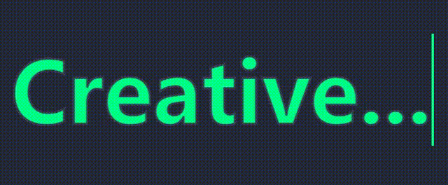

## 重要属性

`-webkit-text-stroke`  文字描边
text-stroke-width 和 text-stroke-color 的合体

## 实现思路

给文字设置描边效果，伪元素设置同样的描边并填充色，让其绝对定位，给其宽度动画

## 整体代码

```html
<h2 data-text="Creative...">Creative...</h2>
```


```less
*{
  box-sizing: border-box;
}

body{
  display: flex;
  justify-content: center;
  align-items: center;
  min-height: 100vh;
  background-color: #252839;
}

h2{
  position:relative;
  font-size: 14vw;
  color:#252839;
  -webkit-text-stroke: 0.3vw #383d52;
  &::before{
    content:attr(data-text);
    position:absolute;
    top: 0;
    left:0;
    width: 0%;
    height: 100%;
    color:#01fe87;
    -webkit-text-stroke: 0.3vw #383d52;
    border-right: 2px solid #01fe87;
    overflow: hidden;
    animation: animate 5s linear infinite;
  }
}

@keyframes animate {
  
  0%,10%,100%{
    width: 0;
  }
  70%,90%{
    width: 100%;
  }

}
```


