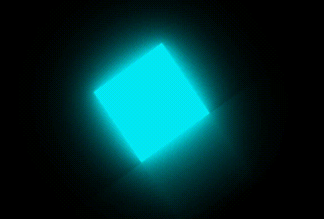

`-webkit-box-reflect: below 1px linear-gradient(transparent,#0004);`

[-webkit-box-reflect - CSS：层叠样式表 | MDN (mozilla.org)](https://developer.mozilla.org/zh-CN/docs/Web/CSS/-webkit-box-reflect)

## 实现思路

最外层元素    整体旋转35角度
父元素 -->滑道：宽度： 动态计算 当前子元素宽度+400px  
	添加倒影模拟滑道

子元素 
	使用多层阴影模拟光影  添加顺时针旋转动画，让其到90度时回弹几下模拟重力


## 整体代码

```html
  <div class="container">
    <div class="box">
      <div class="cube"></div>
    </div>
  </div>
```


```less
body{
  display: flex;
  justify-content: center;
  align-items: center;
  min-height:100vh;
  overflow: hidden;
  background-color: #000;
  .container{
    position: relative;
    width: 100%;
    transform: rotate(-35deg);
    .box{
      position: absolute;
      display: flex;
      justify-content: center;
      align-items: center;
      left: -200px;
      width: calc(100% + 400px);
      -webkit-box-reflect: below 1px linear-gradient(transparent,#0004);
      animation: animateSurface 1.5s ease-in-out infinite;
      .cube{
        position: relative;
        width: 200px;
        height: 200px;
        background-color: #03e9f4;
        box-shadow: 
        0 0 5px rgba(3,233,244,1),
        0 0 25px rgba(3,233,244,1),
        0 0 50px rgba(3,233,244,1),
        0 0 100px rgba(3,233,244,1),
        0 0 200px rgba(3,233,244,0.5),
        0 0 300px rgba(3,233,244,0.5);
        transform-origin: bottom right;
        animation: animate 1.5s ease-in-out infinite;
      }
    }
  }
}

@keyframes animateSurface {

  0%{
    transform: translateX(0px);
  }
  100%{
    transform: translateX(-200px);
  }
  
}

@keyframes animate {
  0%{
    transform: rotate(0deg);
  }

  60%{
    transform: rotate(90deg);
  }
  65%{
    transform: rotate(85deg);

  }
  70%{
    transform: rotate(90deg);

  }
  75%{
    transform: rotate(87.5deg);

  }
  80%,100%{
    transform: rotate(90deg);
  }
}
```


