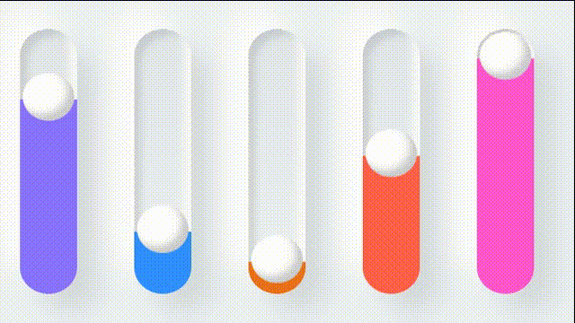

## 实现思路

多层阴影实现使馆容器   使用渐变黑增强视觉效果     多加一层伪元素使其立体
使用滤镜偏移色彩颜色

## 整体代码

```html
  <div class="loader">
    <div style="--i:0"></div>
    <div style="--i:1"></div>
    <div style="--i:2"></div>
    <div style="--i:3"></div>
    <div style="--i:4"></div>
  </div>
```


```less
body{
  display: flex;
  justify-content: center;
  align-items: center;
  background-color: #edf1f4;
  min-height: 100vh;
}
.loader{
  display: flex;
  flex-direction: row;
  div{
    position: relative;
    width: 40px;
    height: 200px;
    margin: 20px;
    overflow: hidden;
    border-radius: 40px;
    border:2px splid #edf1f4;
    background:linear-gradient(to bottom,rgba(0,0,0,0.05),#edf1f4);/* 顶部渐变黑 */
    box-shadow: 
    15px 15px 20px rgba(0,0,0,0.1),
    -15px -15px 20px rgba(255,255,255,1),
    inset -5px -5px 5px rgba(255,255,255,0.5),
    inset 5px 5px 5px rgba(0,0,0,0.05);
    &::before{   /* 加上一层伪元素，样式阴影一样，  可使其立体感增强 */
      content:'';
      position: absolute;
      top:0;
      left:0;
      width: 100%;
      height: 100%;
      border-radius: 40px;
      box-shadow: 
      15px 15px 20px rgba(0,0,0,0.1),
      -15px -15px 20px rgba(255,255,255,1),
      inset -5px -5px 5px rgba(255,255,255,0.5),
      inset 5px 5px 5px rgba(0,0,0,0.05);
    }
    &::after{
      content:'';
      position: absolute;
      top:0;
      left:2px;
      width: 36px;
      height: 36px;
      background-color: #fff;
      border-radius: 50%;
      box-shadow:
      inset -5px -5px 5px rgba(0,0,0,0.2),
      0 420px 0 400px #2196f3;
      animation: animate 2.5s ease-in-out infinite;
      animation-delay: calc(var(--i) * -0.5s);
    }
  }
}


@keyframes animate {
  0%{
    transform: translateY(160px);
    filter: hue-rotate(180deg);
  }
  50%{
    transform: translateY(00px);
  }
  100%{
    transform: translateY(160px);
    filter: hue-rotate(0deg);

  }
}
```


