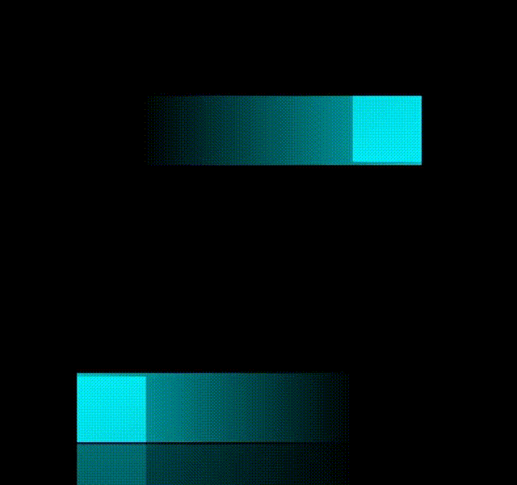

## 实现思路

子元素方向定位，渐变色角度方向偏移90，上下与左右延迟0.5s


## 整体代码

```html
  <div class="loader">
    <span></span>
    <span></span>
    <span></span>
    <span></span>
  </div>
```


```less
body {
  display: flex;
  justify-content: center;
  align-items: center;
  min-height: 100vw;
  background-color: #000;
}

@blue: #03e9f4;
.loader {
  position: relative;
  width: 200px;
  height: 200px;
  overflow: hidden;
  cursor: pointer;
  transition: all .5s;
  -webkit-box-reflect: below 1px linear-gradient(transparent, rgba(0, 0, 0, 0.5));
  &:hover {
    background-color: @blue;
    box-shadow: 0 0 5px @blue, 0 0 25px @blue, 0 0 50px @blue, 0 0 200px @blue;
  }
  span {
    position: absolute;
    display: block;
  }
  span:nth-child(1) {
    display: block;
    top: 0;
    left: -100%;
    width: 100%;
    height: 40px;
    background: linear-gradient(90deg, transparent, @blue);
    animation: animate1 1s linear infinite;
    animation-delay: 0.5s;

  }
  span:nth-child(3) {
    display: block;
    bottom: 0;
    left: -100%;
    width: 100%;
    height: 40px;
    background: linear-gradient(-90deg, transparent, @blue);
    animation: animate3 1s linear infinite;
    animation-delay: 0.5s;
  }

  span:nth-child(2) {
    display: block;
    right: 0;
    top: -100%;
    height: 100%;
    width: 40px;
    background: linear-gradient(180deg, transparent, @blue);
    animation: animate2 1s linear infinite;
  }
  span:nth-child(4) {
    display: block;
    top: -100%;
    left: 0;
    height: 100%;
    width: 40px;
    background: linear-gradient(0deg, transparent, @blue);
    animation: animate4 1s linear infinite;
  }


}
@keyframes animate1 {
  0%{
    left: -100%;
  }
  100%{
    left: 100%;
  }
}

@keyframes animate3 {
  0%{
    left: 100%;
  }
  100%{
    left: -100%;
  }
}
@keyframes animate2 {
  0%{
    top: -100%;
  }
  100%{
    top: 100%;
  }
}

@keyframes animate4 {
  0%{
    top: 100%;
  }
  100%{
    top: -100%;
  }
}


```


