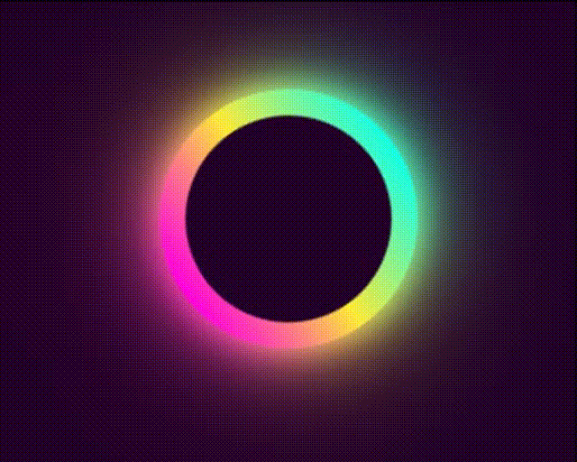

## 实现思路

渐变色  不同的高斯模糊


## 整体代码

```html
  <div class="loader">
    <span></span>
    <span></span>
    <span></span>
    <span></span>
  </div>

```


```less
body{
  display: flex;
  justify-content: center;
  align-items: center;
  height: 100vh;
  background-color: #240229;
}

.loader{
  position: relative; 
  width: 100px;
  height: 100px;
  border-radius: 50%;
  background:linear-gradient(#14ffe9,#ffeb3b,#ff00e0);
  animation: animate 0.5s linear infinite; 
  span{
    position: absolute;
    width: 100%;
    height: 100%;
    border-radius: 50%;
    background:linear-gradient(#14ffe9,#ffeb3b,#ff00e0);
    &:nth-child(1){
      filter:blur(5px) ;
    }
    &:nth-child(2){
      filter:blur(10px) ;
    }
    &:nth-child(3){
      filter:blur(25px) ;
    }
    &:nth-child(4){
      filter:blur(50zpx) ;
    }

  }


  &::after{
    content: '';
    position: absolute;
    top:10px;
    left:10px;
    right:10px;
    bottom: 10px;
    background: #240229;
    border-radius: 50%;
  }
}

@keyframes animate {
  0%{
    transform: rotate(0deg);
  }
  100%{
    transform: rotate(360deg);
  }
}
```


