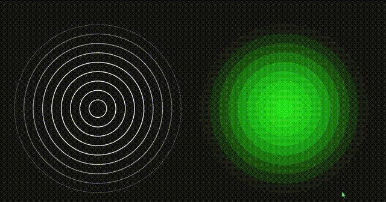

```html
  <div class="container">
    <div class="box">
        <span style="--i:1"></span>
        <span style="--i:2"></span>
        <span style="--i:3"></span>
        <span style="--i:4"></span>
        <span style="--i:5"></span>
        <span style="--i:6"></span>
        <span style="--i:7"></span>
        <span style="--i:8"></span>
        <span style="--i:9"></span>
        <span style="--i:10"></span>
    </div>
    <div class="box">
        <span style="--i:1"></span>
        <span style="--i:2"></span>
        <span style="--i:3"></span>
        <span style="--i:4"></span>
        <span style="--i:5"></span>
        <span style="--i:6"></span>
        <span style="--i:7"></span>
        <span style="--i:8"></span>
        <span style="--i:9"></span>
        <span style="--i:10"></span>
    </div>
</div>
```


## 核心代码

子级绝对定位  分别设定延迟
动画修改 宽高、透明度
	宽度 0  ->  设定像素
	

```less
    .container .box span {
        position: absolute;
        box-sizing: border-box;
        border: 2px solid #fff;
        border-radius: 50%;
        animation: animate 5s linear infinite;
        animation-delay: calc(0.5s * var(--i))
    }
    /* 动画*/
    @keyframes animate {
        0% {
            width: 0;
            height: 0;
        }

        50% {
            opacity: 1;
        }

        100% {
            width: 500px;
            height: 500px;
            opacity: 0;
        }
    }
```


```less
    * {
        margin: 0;
        padding: 0;
    }

    body {
        display: flex;
        justify-content: center;
        align-items: center;
        min-height: 100vh;
        background: #111;
    }

    .container {
        position: relative;
        display: flex;
        justify-content: center;
        align-items: center;
        flex-direction: row;
    }

    .container .box {
        width: 500px;
        height: 500px;
        display: flex;
        justify-content: center;
        align-items: center;
        margin: 50px 0;
    }

    .container .box span {
        position: absolute;
        box-sizing: border-box;
        border: 2px solid #fff;
        border-radius: 50%;
        animation: animate 5s linear infinite;
        animation-delay: calc(0.5s * var(--i))
    }

    .container .box:nth-child(2) span {
        border: none;
        background: rgba(0, 255, 0, 0.25)
    }

    @keyframes animate {
        0% {
            width: 0;
            height: 0;
        }

        50% {
            opacity: 1;
        }

        100% {
            width: 500px;
            height: 500px;
            opacity: 0;
        }
    }
```


