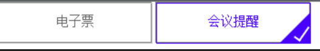

`accent-color`  ： 2022新增属性 修改input组件默认颜色

复选框的对勾无法更改颜色

创建伪元素实现对勾




对勾核心实现
伪元素右边框 + 下边框 向右旋转

```less
    content: '';
    background: transparent;
    right: 5px;
    border: 2px solid #fff;
    border-top: none;
    border-left: none;
    transform: rotate(35deg);
```


```html
<div class="div-checked">
  <label>
    <input type="checkbox" value="cbEticket" />
    <i>电子票</i><span></span>
  </label>
  <label>
    <input type="checkbox" checked="" value="cbMeetingRemind" />
    <i>会议提醒</i><span></span>
  </label>
</div>
```


```less
.div-checked label {
  cursor: pointer;
  position: relative;
  display: inline-block;
  width: 150px;
  height: 38px;
  border: 1px solid grey;
}

/**
* 按钮透明
*/

input[type='checkbox'] {
  opacity: 0;
}

/**
* checkbox选中样式
*/

input[type='checkbox']:checked+i {
  border-color: blue;
  color: blue;
}

/**
* i标签的大小
*/

i {
  position: absolute;
  top: 0;
  left: 0;
  width: 100%;
  height: 100%;
  border: 1px solid #ccc;
  text-align: center;
  line-height: 36px;
}

/**
* 对勾√效果，使用border
*/

span:after {
  opacity: 1;
  content: '';
  position: absolute;
  width: 5px;
  height: 15px;
  background: transparent;
  top: 10px;
  right: 5px;
  border: 2px solid #fff;
  border-top: none;
  border-left: none;
  transform: rotate(35deg);
}

/**
* 选中状态，span(三角形)样式
*/

input[type='checkbox']:checked+i+span {
  width: 0px;
  height: 0px;
  border-color: blue transparent;
  border-width: 0px 0px 30px 30px;
  border-style: solid;
  position: absolute;
  right: -1px;
  top: 10px;
  opacity: 1;
}
```


