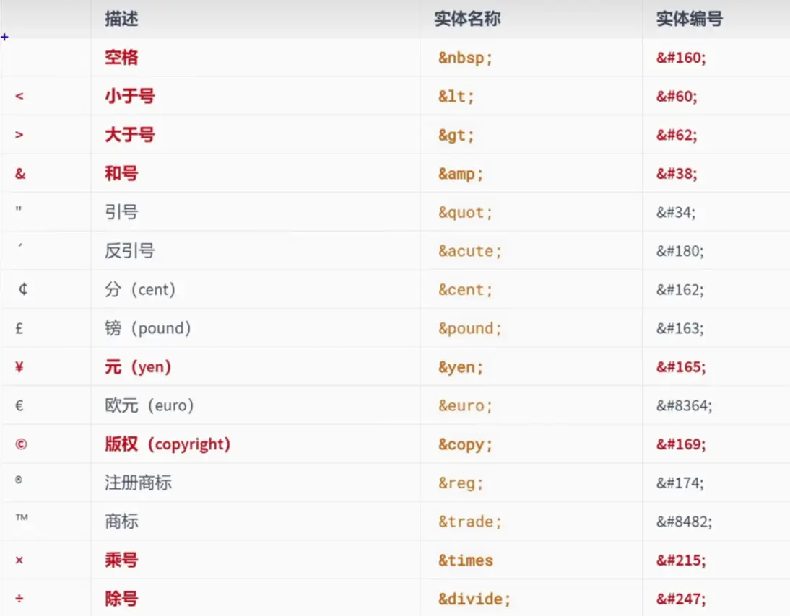

## 声明

使用`<!DOTYPE html>`声明是一个html页面
该语句一般写在HTML文档最上方，作用是告诉浏览器要用哪种渲染模式来解析文档

## 字符编码

| 编码         | 说明                           |
|------------|------------------------------|
| ASCII      | 大写字母、小写字母、数字、一些符号  共计128个    |
| ISO 8859-1 | 在ASCII基础上，扩充一些希腊字符串等  共计256个 |
| GB2312     | 继续扩充，收录了6763个常用汉字、682个字符     |
| GBK        | 收录了的汉字和符号达到20000+，支持繁体中文     |
| UTF-8      | 万国码，包含世界上所有语言的:所有文字与符号       |

## 设置语言

`<html lang="zh-CN">`

## 常见的标签

`h` 在一个页面中通常会有一些比较重要的文字作为标题，这个时候我们可以使用h元素

+ h1~h6

`p` 如果我们想表示一个段落，这个时候可以使用p元素

`img`  显示图片

- src 包含了你想嵌入的图片的文件路径
- alt 当图片加载不成功（错误的地址或者图片资源不存在），那么会显示这段文本；屏幕阅读器会将这些描述读给需要使用阅读器的使用者听，让他们知道图像的含义

`a` 定义超链接，用于打开新的URL

- href：Hypertext Reference的简称
  - 指定要打开的URL地址；
  - 也可以是一个本地地址；
- target：该属性指定在何处显示链接的资源。
  - _self：默认值，在当前窗口打开URL
  - _blank：在一个新的窗口中打开URL；
  - _parent：在父窗口中打开URL；
  - _top：在顶层窗口中打开URL
- 锚点连接
  - 在要跳到的元素上定义一个id属性；
  - 定义a元素，并且a元素的href指向对应的id

`ifame`

在一个HTML文档中嵌入其他HTML文档

- frameborder属性
  - 用于规定是否显示边框
    - 0 不显示
    - 1 显示

## 排版标签

h1~h6
p
div
span

## 语义标签

标签默认的效果不重要 语义最重要

1. 代码可读性强 清晰
2. 有益于SEO（搜索引擎优化）
3. 方便设备解析（屏幕阅读器 盲人阅读器）

## 块级元素

1. 块级元素：独占一行
2. 行内元素：不独占一行

::: info
1. 块级元素中能写 行内元素 和 块级元素
2. 行内元素中能写 行内元素 不能写 块级元素
3. 一些特殊的规则：
   - h1 ~ h6 不能互相嵌套
   - p 中不要写块级元素
:::


## 常用标签

|   标签名    | 标签语义             |
|:--------:|------------------|
|    em    | 要着重阅读的内容         |
|  strong  | 十分重要的内容（语义比em要强） |
|   span   | 没有语义，用于包裹容器的通用容器 |
|    br    | 换行               |
|    hr    | 分隔               |
|   pre    | 按原文显示            |

## 不常用的标签

|    标签名     | 标签含义                                 |
|:----------:|--------------------------------------|
|    cite    | 作品标题（书籍、歌曲、电影等）                      |
|    dfn     | 特殊术语                                 |
|  del与ins   | 删除的文本【与】插入的文本                        |
|  sub和sup   | 下标文字【与】上标文字                          |
|    code    | 一段代码                                 |
|    samp    | 从正常的上下文中，将某些内容提取出来，例如: 标识设备输出        |
|    kbd     | 键盘文本，表示文本是通过键盘输入的，经常用在与计算机相关的手册中     |
|    abbr    | 缩写，最好配合上 title 属性                    |
|    bdo     | 更改文本方向，要配合 dir 属性，可选值: tr (默认值) 、rt1 |
|    var     | 标记变量，可以与 code 标签一起使用                 |
|   small    | 附属细则，例如:包括版权、法律文本。一一很少使用             |
|     b      | 摘要中的关键字、评论中的产品名称。-- 很少使用             |
|     i      | 本意是:人物的思想活动、所说的话等等,现在多用于字体图标         |
|     u      | 与正常内容有反差文本，例如: 错的单词、不合适的描述等。。- 很少使用  |
|     q      | 短引用 -- 很少使用                          |
| blockquote | 长引用 -- 很少使用                          |
|  address   | 地址信息                                 |

## 图片标签

img

## 表格

table：表格
caption：表格标题
thead：表格头部
tbody：表格主体
tfoot：表格注脚
tr：每一行
th、td：每一个单元格
th：表格头部使用

td 属性

- align 对齐方式
- valign 垂直对齐方式
- rowspan 要跨的行数
- colspan 要跨的列数

## 表单

from

- action 用于指定表单提交地址
- 用于控制表单提交后，如何打开页面
  - _self  : 在本窗口打开
  - _blank  : 在新窗口打开

- method：用于控制表单的提交方式

### 隐藏域

```html
<input type="hidden" name="from" value="xxx">
```

## 常用字符实体




