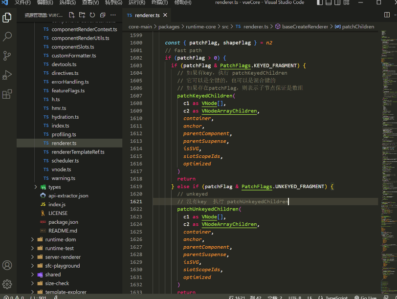
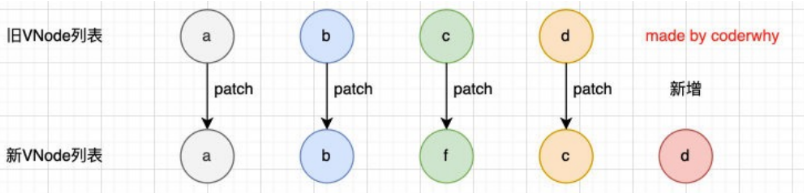
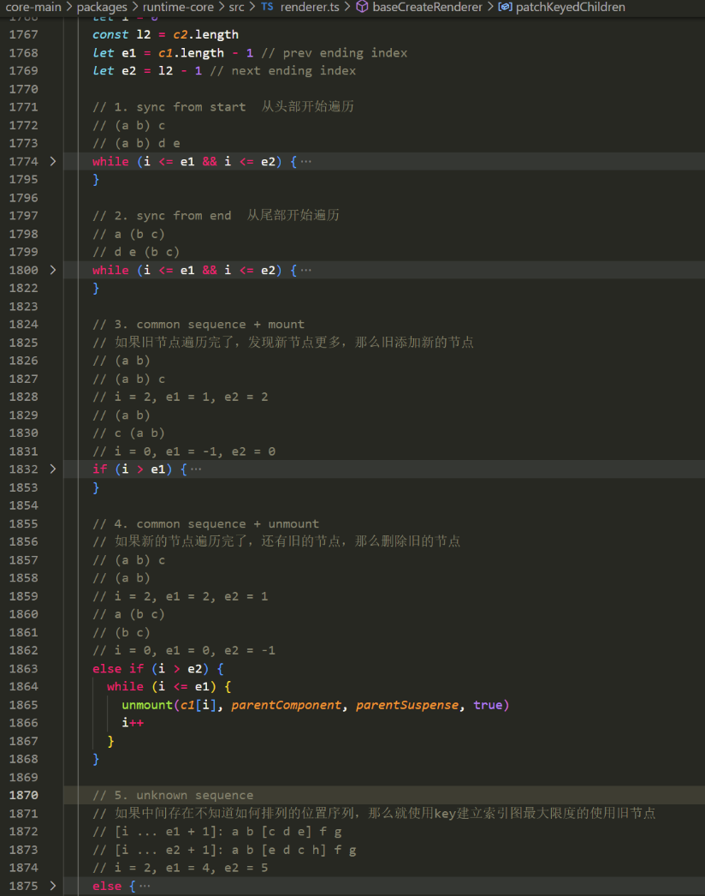
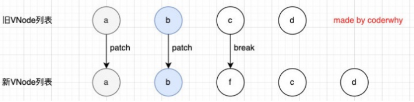
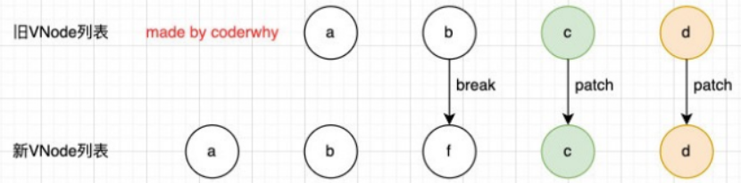
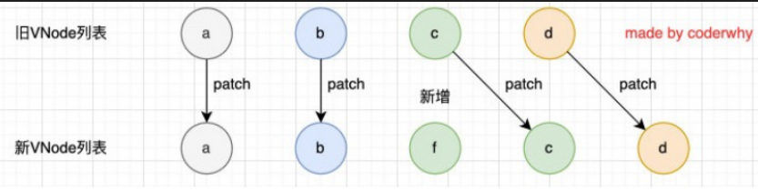
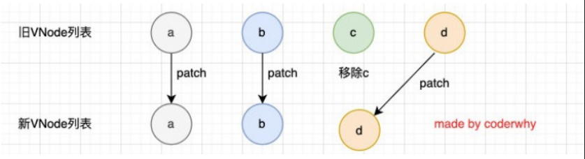
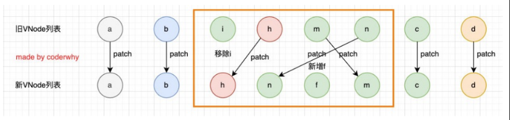

## 列表渲染

[教程 | Vue.js (vuejs.org)](https://cn.vuejs.org/tutorial/#step-7)

在真实开发中，我们往往会从服务器拿到一组数据，并且需要对其进行渲染

v-for的基本格式是 `item in 数组`
数组通常是来自data或者prop，也可以是其他方式
item是我们给每项元素起的一个别名，这个别名可以自定来定义

我们知道，在遍历一个数组的时候会经常需要拿到数组的索引： 
如果我们需要索引，可以使用格式： `(item, index) in 数组`； 
注意上面的顺序：数组元素项item是在前面的，索引项index是在后面的
### v-for基本使用

```html
<html lang="en">
<head>
  <meta charset="UTF-8">
  <meta http-equiv="X-UA-Compatible" content="IE=edge">
  <meta name="viewport" content="width=device-width, initial-scale=1.0">
  <title>Document</title>
  <style>
    .item {
      margin-top: 5px;
      background-color: orange;
    }

    .item .title {
      color: red;
    }
  </style>
</head>
<body>

  <div id="app">
    <!-- 1.电影列表进行渲染 -->
    <h2>电影列表</h2>
    <ul>
      <li v-for="movie in movies">{{ movie }}</li>
    </ul>

    <!-- 2.电影列表同时有索引 -->
    <ul>
      <li v-for="(movie, index) in movies">{{index + 1}} - {{ movie }}</li>
    </ul>

    <!-- 3.遍历数组复杂数据 -->
    <h2>商品列表</h2>
    <div class="item" v-for="item in products">
      <h3 class="title">商品: {{item.name}}</h3>
      <span>价格: {{item.price}}</span>
      <p>秒杀: {{item.desc}}</p>
    </div>
  </div>
  
  <script src="../lib/vue.js"></script>
  <script>
    // 1.创建app
    const app = Vue.createApp({
      // data: option api
      data() {
        return {
          // 1.movies
          movies: ["星际穿越", "少年派", "大话西游", "哆啦A梦"],

          // 2.数组: 存放的是对象
          products: [
            { id: 110, name: "Macbook", price: 9.9, desc: "9.9秒杀, 快来抢购!" },
            { id: 111, name: "iPhone", price: 8.8, desc: "9.9秒杀, 快来抢购!" },
            { id: 112, name: "小米电脑", price: 9.9, desc: "9.9秒杀, 快来抢购!" },
          ]
        }
      },
    })

    // 2.挂载app
    app.mount("#app")
  </script>
</body>
</html>
```


### v-for支持的类型

```html
    <!-- 2.遍历对象 -->
    <ul>
      <li v-for="(value, key, index) in info">{{value}}-{{key}}-{{index}}</li>
    </ul>

    <!-- 3.遍历字符串(iterable) -->
    <ul>
      <li v-for="item in message">{{item}}</li>
    </ul>

    <!-- 4.遍历数字 -->
    <ul>
      <li v-for="item in 100">{{item}}</li>
    </ul>
```

### template元素

```vue
<ul>
	<template v-for("value,key") in info">
	<li>{{key}} -- {{value}}</li>
</ul>
```

### 数组更新检测

[列表渲染 | Vue.js (vuejs.org)](https://cn.vuejs.org/guide/essentials/list.html#array-change-detection)

Vue将被侦听的数组的变更方法进行了包裹，所以它们也将会触发视图更新
这些被包裹的方法包括：
- push()
- pop()
- shift()
- unshift()
- splice()
- sort()
- reverse()


**替换数组的方法**
上面的方法会直接修改原来的数组，但是某些方法不会替换原来的数组，而是会生成新的数组，比如 filter()、
concat() 和 slice()。

```html
<html lang="en">
<head>
  <meta charset="UTF-8">
  <meta http-equiv="X-UA-Compatible" content="IE=edge">
  <meta name="viewport" content="width=device-width, initial-scale=1.0">
  <title>Document</title>
</head>
<body>

  <div id="app">
    <ul>
      <li v-for="item in names">{{ item }}</li>
    </ul>
    <button @click="changeArray">修改数组</button>
  </div>
  
  <script src="../lib/vue.js"></script>
  <script>
    // 1.创建app
    const app = Vue.createApp({
      // data: option api
      data() {
        return {
          names: ["abc", "cba", "nba", "aaa", "ccc"]
        }
      },
      methods: {
        changeArray() {
          // 1.直接将数组修改为一个新的数组
          // this.names = ["why", "kobe"]

          // 2.通过一些数组的方法, 修改数组中的元素
          // this.names.push("why")
          // this.names.pop()
          // this.names.splice(2, 1, "why")
          // this.names.sort()
          // this.names.reverse()

          // 3.不修改原数组的方法是不能侦听(watch)
            this.names = this.names.map(item => item + "why")
        }
      }
    })

    // 2.挂载app
    app.mount("#app")
  </script>
</body>
</html>

```


### v-for中的key是什么作用？

[内置的特殊 Attributes | Vue.js (vuejs.org)](https://cn.vuejs.org/api/built-in-special-attributes.html#key)

在使用v-for进行列表渲染时，我们通常会给元素或者组件绑定一个**key属性**。 
这个key属性有什么作用呢？我们先来看一下官方的解释： 
- key属性主要用在Vue的<span style="color:#00b0f0">虚拟DOM算法</span>，在新旧nodes对比时辨识VNodes； 
- 如果不使用key，Vue会==使用一种最大限度减少动态元素并且尽可能的尝试就地修改/复用相同类型元素的算法==；
- 而使用key时，它会==基于key的变化重新排列元素顺序，并且会移除/销毁key不存在的元素==；

 官方的解释对于初学者来说并不好理解，比如下面的问题： 
- 什么是新旧nodes，什么是VNode？ 
- 没有key的时候，如何尝试修改和复用的？
- 有key的时候，如何基于key重新排列的？

### vue删除列表的某一个元素

[vue教程-8 | Vue.js (vuejs.org)](https://cn.vuejs.org/tutorial/#step-8)
[Array.prototype.filter() - JavaScript | MDN (mozilla.org)](https://developer.mozilla.org/zh-CN/docs/Web/JavaScript/Reference/Global_Objects/Array/filter)

```vue
<script setup>
import { ref } from 'vue'

// 给每个 todo 对象一个唯一的 id
let id = 0

const newTodo = ref('')
const todos = ref([
  { id: id++, text: 'Learn HTML' },
  { id: id++, text: 'Learn JavaScript' },
  { id: id++, text: 'Learn Vue' }
])

function addTodo() {
  // ...
  //newTodo.value = ''
  todos.value.push({id:id++,text:newTodo.value})
}
// /*第一种方法 传入index值进行截取*/
// function removeTodo(index) {
//   todos.value.splice(index,1)
//   // ...
// }
/*第二种方法 找到索引值进行删除*/
// function removeTodo(todo) {
//   let i = todos.value.indexOf(todo)
//   if(i!==-1){
//     todos.value.splice(i,1)
//   }
// }
/*第三种方法*/
// 使用filter过滤
function removeTodo(todo){
  todos.value = todos.value.filter((item)=> item !== todo )
}
</script>

<template>
  <form @submit.prevent="addTodo">
    <input v-model="newTodo">
    <button @click=addTodo()>Add Todo</button>
  </form>
  <ul>
    <li v-for="(todo,index) in todos" :key="todo.id">
      {{ todo.text }}
      <button @click="removeTodo(todo)">X</button>
    </li>
  </ul>
</template>
```


## 认识VNode

Virtual Node，也就是虚拟节点,事实上，无论是组件还是元素，它们最终在Vue中表示出来的都是一个个VNode,<span style="color:#00b0f0">本质上就是一个javascript对象</span>。如果我们不只是一个简单的div，而是有一大堆的元素，那么它们应该会形成一个VNode Tree


### 插入F的案例


```html
<html lang="en">
<head>
  <meta charset="UTF-8">
  <meta http-equiv="X-UA-Compatible" content="IE=edge">
  <meta name="viewport" content="width=device-width, initial-scale=1.0">
  <title>Document</title>
</head>
<body>

  <div id="app">
    <button @click="insertF">插入f</button>
    <ul>
      <!-- key要求是唯一: id -->
      <li v-for="item in letters" :key="item">{{item}}</li>
    </ul>
  </div>
  
  <script src="../lib/vue.js"></script>
  <script>
    // 1.创建app
    const app = Vue.createApp({
      // data: option api
      data() {
        return {
          letters: ["a", "b", "c", "d", "e"]
        }
      },
      methods: {
        insertF() {
          this.letters.splice(2, 0, "f")

          this.letters.splice()
        }
      }
    })

    // 2.挂载app
    app.mount("#app")
  </script>
</body>
</html>
```


有key，使用 `patchKeyedChildren`方法

没有key，使用 `patchUnkeyedChildren`方法




#### 无key执行操作源码

```ts
  const patchUnkeyedChildren = (
    c1: VNode[],
    c2: VNodeArrayChildren,
    container: RendererElement,
    anchor: RendererNode | null,
    parentComponent: ComponentInternalInstance | null,
    parentSuspense: SuspenseBoundary | null,
    isSVG: boolean,
    slotScopeIds: string[] | null,
    optimized: boolean
  ) => {
    c1 = c1 || EMPTY_ARR
    c2 = c2 || EMPTY_ARR
    // 获取旧节点长度
    const oldLength = c1.length
    const newLength = c2.length
    // 获取最小的长度
    const commonLength = Math.min(oldLength, newLength)
    let i
    // 从0位置开始依次patch比较
    for (i = 0; i < commonLength; i++) {
      const nextChild = (c2[i] = optimized
        ? cloneIfMounted(c2[i] as VNode)
        : normalizeVNode(c2[i]))
      patch(
        c1[i],
        nextChild,
        container,
        null,
        parentComponent,
        parentSuspense,
        isSVG,
        slotScopeIds,
        optimized
      )
    }
    // 如果旧的节点数大于新的节点数
    if (oldLength > newLength) {
      // remove old
      // 移出旧的节点
      unmountChildren(
        c1,
        parentComponent,
        parentSuspense,
        true,
        false,
        commonLength
      )
    } else {
      // mount new
      // 创建新的节点
      mountChildren(
        c2,
        container,
        anchor,
        parentComponent,
        parentSuspense,
        isSVG,
        slotScopeIds,
        optimized,
        commonLength
      )
    }
  }
```

c和d来说它们事实上并不需要有任何的改动，
但是因为c被f所使用了，所有后续所有的内容都要一次进行改动，并且最后进行新增，**效率低下**




#### 有key执行操作源码




### 有key的diff算法

第一步的操作是从头开始进行遍历、比较： 
- a和b是一致的会继续进行比较； 
- c和f因为key不一致，所以就会break跳出循环



第二步的操作是从尾部开始进行遍历、比较：



第三步是如果旧节点遍历完毕，但是依然有新的节点，那么就新增节点



第四步是如果新的节点遍历完毕，但是依然有旧的节点，那么就移除旧节点：



第五步是最特色的情况，中间还有很多未知的或者乱序的节点：




