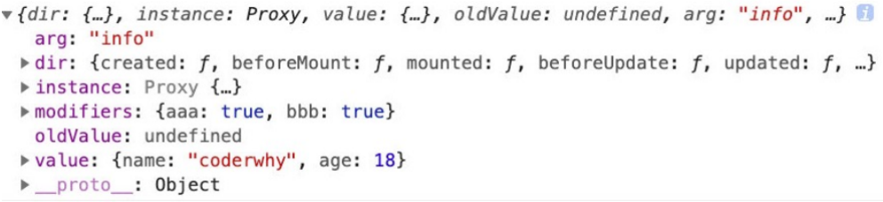

## 自定义指令

[自定义指令 | Vue.js (vuejs.org)](https://cn.vuejs.org/guide/reusability/custom-directives.html)

- 注意：在 Vue 中，代码的复用和抽象主要还是通过组件；
- 通常在某些情况下，你需要对<span style="color:#00b0f0">DOM 元素进行底层操作</span>，这个时候就会用到自定义指令；

  **自定义指令分为两种：**

- 自定义局部指令：组件中通过 `directives` 选项，只能在当前组件中使用；
- 自定义全局指令：app 的 `directive` 方法，可以在任意组件中被使用；

  **比如我们来做一个非常简单的案例：当某个元素挂载完成后可以自定获取焦点**

- 实现方式一：如果我们使用默认的实现方式；
- 实现方式二：自定义一个 v-focus 的局部指令；
- 实现方式三：自定义一个 v-focus 的全局指令；

### 实现方式一：聚焦的默认实现

```vue
<template>
  <div><input type="text" ref="input" /></div>
</template>
<script setup>
import { ref, onMounted } from "vue";
const input = ref(null);

onMounted(() => {
  input.value.focus();
});
</script>
```

### 实现方式二：自定义全局指令

```js
// main.js
app.directive("focus", {
  mounted(el, bindings, vnode, preVnode) {
    console.log("focus mounted");
    el?.focus();
  },
});
```

实际使用中，放到 main.js 不合适，将其抽取到单独的文件中

`directives\focus.js`

```js
export default function directiveFocus(app) {
  app.directive("focus", {
    // 生命周期的函数(自定义指令)
    mounted(el) {
      // console.log("v-focus应用的元素被挂载了", el)
      el?.focus();
    },
  });
}
```

`directives\index.js`

```js
import directiveFocus from "./focus";
export default function directives(app) {
  directiveFocus(app);
}
```

`main.js`

```js
import directives from "./01_自定义指令/directives/index";
//.....
createApp(App).use(directives).mount("#app");
```

### 实现方式三：局部自定义指令（很少使用）

在 `<script setup>` 中，==任何以 v 开头的驼峰式命名的变量都可以被用作一个自定义指令==

`vFocus` 即可以在模板中以 `v-focus` 的形式使用。

```vue
<template>
  <input v-focus />
</template>

<script setup>
// 在模板中启用 v-focus
const vFocus = {
  mounted: (el) => el.focus(),
};
</script>
```

在没有使用 `<script setup>` 的情况下，自定义指令需要通过 `directives` 选项注册：

```vue
<template>
  <div>
    <input type="text" v-focus />
  </div>
</template>
<script>
export default {
  // 局部指令
  directives: {
    focus: {
      mounted(el, bindings, vnode, preVnode) {
        console.log("focus mounted");
        el.focus();
      },
    },
  },
};
</script>
```

### 简化形式

对于自定义指令来说，一个很常见的情况是仅仅需要在 `mounted` 和 `updated` 上实现相同的行为，除此之外并不需要其他钩子。这种情况下我们可以直接用一个函数来定义指令

```js
app.directive("color", (el, binding) => {
  // 这会在 `mounted` 和 `updated` 时都调用
  el.style.color = binding.value;
});
```

### 自定义组件的生命周期

**一个指令定义的对象，Vue 提供了如下的几个钩子函数：**

#### 指令钩子

```js
const myDirective = {
  // 在绑定元素的 attribute 前
  // 或事件监听器应用前调用
  created(el, binding, vnode, prevVnode) {
    // 下面会介绍各个参数的细节
  },
  // 在元素被插入到 DOM 前调用
  beforeMount(el, binding, vnode, prevVnode) {},
  // 在绑定元素的父组件
  // 及他自己的所有子节点都挂载完成后调用
  mounted(el, binding, vnode, prevVnode) {},
  // 绑定元素的父组件更新前调用
  beforeUpdate(el, binding, vnode, prevVnode) {},
  // 在绑定元素的父组件
  // 及他自己的所有子节点都更新后调用
  updated(el, binding, vnode, prevVnode) {},
  // 绑定元素的父组件卸载前调用
  beforeUnmount(el, binding, vnode, prevVnode) {},
  // 绑定元素的父组件卸载后调用
  unmounted(el, binding, vnode, prevVnode) {},
};
```

- `el`：指令绑定到的元素。这可以用于直接操作 DOM。

- `binding`：一个对象，包含以下属性。

  - `value`：传递给指令的值
    - 例如在 `v-my-directive="1 + 1"` 中，值是 `2`。
  - `oldValue`：之前的值，仅在 `beforeUpdate` 和 `updated` 中可用。无论值是否更改，它都可用。
  - `arg`：传递给指令的参数 (如果有的话)。例如在 `v-my-directive:foo` 中，参数是 `"foo"`。
  - `modifiers`：一个包含修饰符的对象 (如果有的话)。
    - 例如在 `v-my-directive.foo.bar` 中，修饰符对象是 `{ foo: true, bar: true }`。
  - `instance`：使用该指令的组件实例。
  - `dir`：指令的定义对象。

- `vnode`：代表绑定元素的底层 VNode。
- `prevNode`：之前的渲染中代表指令所绑定元素的 VNode。仅在 `beforeUpdate` 和 `updated` 钩子中可用。

### 指令的参数和修饰符

如果我们指令需要**接受一些参数或者修饰符**应该如何操作呢？

info 是参数的名称；
aaa-bbb 是修饰符的名称；
后面是传入的具体的值；
在我们的生命周期中，我们可以**通过 bindings 获取到对应的内容**：

```html
<button v-if="counter < 2" v-why.aaaa.bbbb="'coderwhy'" @click="increment">
  当前计数: {{counter}}
</button>
```

```js
// 局部指令
    directives: {
      why: {
        created(el, bindings, vnode, preVnode) {
          console.log("why created", el, bindings, vnode, preVnode);
          console.log(bindings.value);
          console.log(bindings.modifiers);
        },
 }
```



**自定义指令案例：时间戳的显示需求：**

在开发中，大多数情况下从服务器获取到的都是时间戳；
我们需要将时间戳转换成具体格式化的时间来展示；
在 Vue2 中我们可以通过过滤器来完成；
在 Vue3 中我们可以通过 计算属性（computed） 或者 自定义一个方法（methods） 来完成；
其实我们还可以通过一个自定义的指令来完成；
我们来实现一个可以自动对**时间格式化的指令 v-format-time**：
这里封装了一个函数，在首页中我们只需要调用这个函数并且传入 app 即可；

```js
// directives/format-time.js

import dayjs from "dayjs";

export default function (app) {
  app.directive("format-time", {
    created(el, bindings) {
      bindings.formatString = "YYYY-MM-DD HH:mm:ss";
      // 如果没有参数时使用默认值
      if (bindings.value) {
        bindings.formatString = bindings.value;
      }
    },
    mounted(el, bindings) {
      const textContent = el.textContent;
      let timestamp = parseInt(textContent);
      // 如果是10位数，则是秒时间戳，否则是毫秒
      if (textContent.length === 10) {
        timestamp = timestamp * 1000;
      }
      el.textContent = dayjs(timestamp).format(bindings.formatString);
    },
  });
}
```

```js
// directives/index.js
import registerFormatTime from "./format-time";
export default function registerDirectives(app) {
  registerFormatTime(app);
}
```
