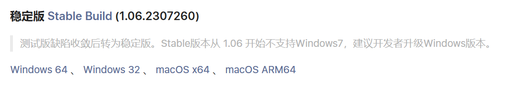
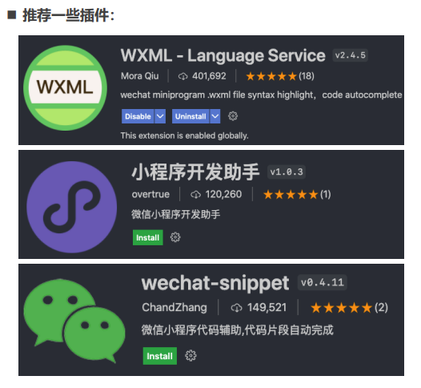
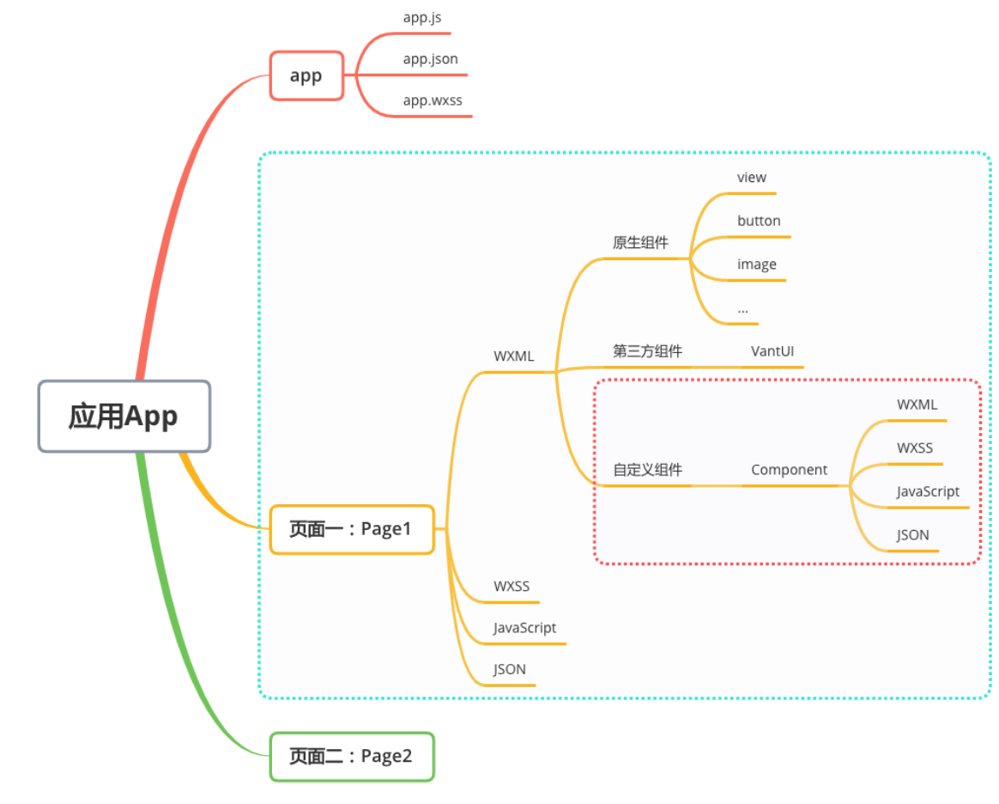
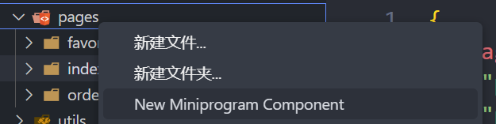
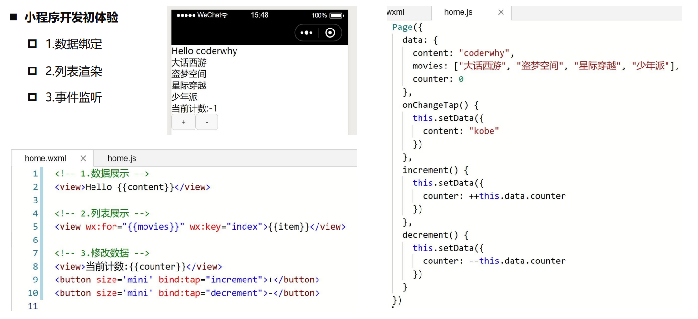
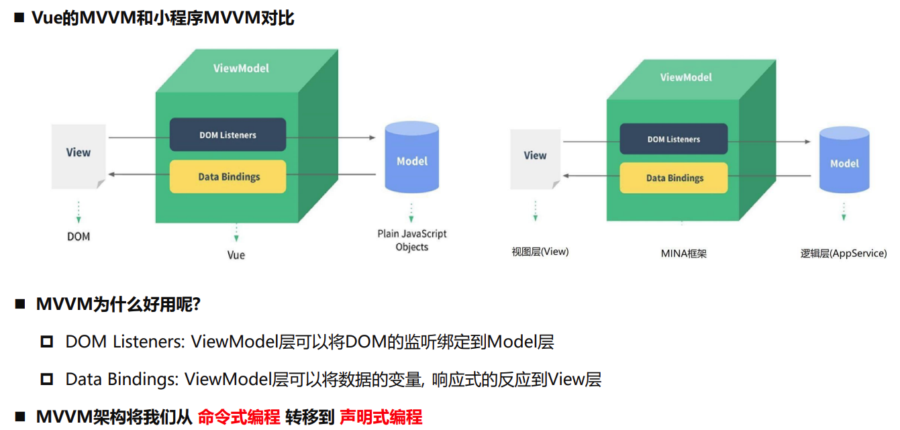

小程序（Mini Program） 是一种<span style="color:#00b0f0">不需要下载安装</span>即可使用的程序

小程序的优势：

- 方便易用，通过扫一扫、分享等方式轻松打开小程序
- 良好的用户体验，下载速度极快，小程序单个包体积不超过 2M
- 强大的能力，提供大量硬件级别的 API，如蓝牙、WIFI 等
- 获客成本低，提供获取微信用户手机号、昵称、头像等信息的能力

最初我们提到小程序时，往往指微信小程序
但是目前小程序技术已经被各个平台所实现与支持

各个平台小程序大概的发布时间线：

- 2017 年 1 月 微信小程序上线，依附于微信 App；
- 2018 年 7 月 百度小程序上线，依附于百度 App；
- 2018 年 9 月 支付宝程序线，依附于支付宝 App；
- 2018 年 10 月 抖音小程序上线，依附于抖音 App；
- 2018 年 11 月 头条小程序上线，依附于头条 App；
- 2019 年 5 月 QQ 小程序上线，依附于 QQApp；
- 2019 年 10 月 美团小程序上线，依附于美团 App；

**为什么各个平台都需要支持小程序呢？**

第一：你有，我也得有。
大厂竞争格局中一个重要的一环。

第二：小程序作为介于 H5 页面和 App 之间的一项技术，它有自身很大的优势，体验比传统 H5 页面要好很多；相当于传统的 App，使用起来更加方便，不需要在应用商店中下载安装，甚至注册登录等麻烦的操作；

第三：小程序可以间接的动态为 App 添加新功能。
传统的 App 更新需要先打包，上架到应用商店之后需要通过审核（App Store）；

但是小程序可以在 App 不更新的情况下，动态为自己的应用添加新的功能需求；

**那么目前在这么多小程序的竞争格局中，哪一个是使用最广泛的呢？**

微信小程序，支付宝、抖音小程序

其实我们透过小程序看本质，他们本身还是应用和平台之间的竞争，有最大流量入口的平台，对应的小程序也是用户更多一些

目前==在公司开发小程序主要开发的还是微信小程序==，其他平台的小程序往往是平台本身的一些公司或者顺手开发的；
所以重点学习的一定是**微信小程序**开发。

小程序的定位： 介于==原生 App 和手机 H5 页面==之间的一个产品

## 开发小程序的技术选型

微信小程序：https://developers.weixin.qq.com/miniprogram/dev/framework/

- 主要技术包括：WXML、WXSS、JavaScript
  支付宝小程序：https://opendocs.alipay.com/mini/developer
- 主要技术包括：AXML、ACSS、JavaScript

选择框架开发小程序：

::: warning
mpvue：

- mpvue 是一个使用 Vue 开发小程序的前端框架，也是支持微信小程序、百度智能小程序，头条小程序，和支付宝小程序
- ==该框架在 2018 年之后不再维护和更新了，目前已经被放弃==

wepy：

- 由腾讯开源，一款让小程序支持组件化开发的框架，通过预编译的手段让开发者可以选择自己喜欢的开发风格去开发小程序
- 该框架目前维护比较少，在前两年还有挺多项目在使用，==不推荐使用==
  :::

::: info

uni-app：

- 由<span style="color:#00b0f0">DCloud 团队</span>开发和维护
- uni-app 是一个<span style="color:#00b0f0">使用 Vue 开发</span>所有前端应用的框架，开发者编写一套代码，可发布到 iOS、Android、Web（响应式）、以及各种小程序（微信/支付宝/百度/头条/飞书/QQ/快手/钉钉/淘宝）、快应用等多个平台。
- uni-app 目前是<span style="color:#00b0f0">很多公司的技术选型</span>，特别是希望适配移动端 App 的公司；

taro：

- 由<span style="color:#00b0f0">京东团队</span>开发和维护
- taro 是一个开放式跨端 跨框架解决方案，支持使用<span style="color:#00b0f0">React/Vue/Nerv </span>等框架来开发 微信/京东/百度/支付宝/字节跳动/QQ/飞书雄安程序/H5/RN 等应用
- taro 因为本身支持 React、Vue 的选择，给了我们更加灵活的选择空间

  - 特别是在 Taro3.x 之后，支持 Vue3、React Hook 写法等

  :::

**uni-app 和 taro 开发原生 App**：

- 无论是适配原生小程序和原生 App，都有较多的适配问题
- 产品使用体验整体相较于原生 App 差很多
- 也有其他技术选型来开发原生 App：ReactNative、Flutter

## 需要掌握的预备知识

### 小程序的核心技术主要有三个

- 页面布局：WXML，类似于 HTML
- 页面样式：WXSS，几乎就是 CSS（某些不支持，某些进行了增强，但是基本是一致的）
- 页面脚本：JavaScript+WXS（WeixinScript）

### 注册账号-申请 AppID

[小程序 (qq.com)](https://mp.weixin.qq.com/wxopen/waregister?action=step1&source=mpregister&token=&lang=zh_CN)

### 小程序的开发工具

- 微信开发者工具：官方提供的开发工具，必须下载、安装 [微信开发者工具下载地址](https://developers.weixin.qq.com/miniprogram/dev/devtools/download.html)



- VsCode：很多人习惯使用 VsCode 来编写代码



## 小程序项目结构



小程序中所有的页面都必须在 app.json 文件中注册

项目配置文件`app.json`

```json
{
  "pages": ["pages/index/index", "pages/logs/logs"],
  "window": {
    "backgroundTextStyle": "light",
    "navigationBarBackgroundColor": "#fff",
    "navigationBarTitleText": "Weixin",
    "navigationBarTextStyle": "black"
  },
  "style": "v2",
  "sitemapLocation": "sitemap.json"
}
```

### 新建文件

微信开发工具两种方法

- 新建文件夹->新建 page
- 在 app.json 里面注册如`pages/order/order`，保存后会自动创建
  vscode 中如果安装了上述插件后，右键新建 New Miniprogram Component 即可自动创建一个文件夹并生成 4 个文件
  

## 小程序开发初体验



### 数据绑定

```html
<!-- 1.显示普通的文本 -->
<text class="title">我是普通的文本</text>
<!-- 2.动态绑定message属性 -->
<view class="message">{{ message }}</view>
```

```js
Page({
  data: {
    message: "Hello World",
  },
});
```

### 列表渲染

```html
<!-- 3.动态展示列表数据 -->
<view class="movies">
  <block wx:for="{{movies}}" wx:key="*this">
    <view>{{item}} -- {{index}}</view>
  </block>
</view>
```

```js
    movies: ["少年派", "大话西游", "星际穿越", "独行月球"],
```

### 数据绑定

```html
<!-- 4.事件绑定: 计数器案例 -->
<view class="counter">
  <view class="count">当前计数: {{ counter }}</view>
  <button size="mini" type="primary" bindtap="increment">+1</button>
  <button size="mini" type="warn" bindtap="decrement">-1</button>
</view>
```

```js
Page({
  data: {
    // 3.案例三: 计数器
    counter: 0,
  },
  increment() {
    console.log("+1");
    this.setData({
      counter: this.data.counter + 1,
    });
  },
  decrement() {
    console.log("-1");
    this.setData({
      counter: this.data.counter - 1,
    });
  },
});
```

## 小程序的 MVVM 架构



小程序页面有几个文件构成？

.wxml 页面结构以及内容、.wxss 外观样式 、 .js 和.json 分别处理逻辑和定义配置

小程序中定义块级和行内盒子的组件分别是什么？

- view 定义块级区域，相当于 html 的 div 标签
- text 定义行内块，相当于 span 标签
