## 小程序的架构模型

谁是小程序的宿主环境？微信客户端

- 宿主环境为了执行小程序的各种文件：wxl 文件、wxss 文件、js 文件

当小程序基于 WebView 环境下时，WebView 的 JS 逻辑、DOM 树创建、CSS 解析、样式计算、Layout、Paint (Composite) 都发生
在同一线程，在 WebView 上执行过多的 JS 逻辑可能阻塞渲染，导致界面卡顿。
以此为前提，小程序同时考虑了性能与安全，采用了目前称为「双线程模型」的架构。

### 双线程模型

- <span style="color:#00b0f0">WXML 模块和 WXSS 样式</span>运行于<span style="color:#00b0f0"> 渲染层</span>，渲染层使用
  <span style="color:#00b0f0">WebView 线程渲染</span>（一个程序有多个页面，会使用多个
  WebView 的线程）。
- JS 脚本（app.js/home.js 等）运行于 <span style="color:#00b0f0">逻辑层</span>，逻辑层使
  用 JsCore 运行 JS 脚本。
- 这两个线程都会经由<span style="color:#00b0f0">微信客户端</span>（Native）进行中转交互

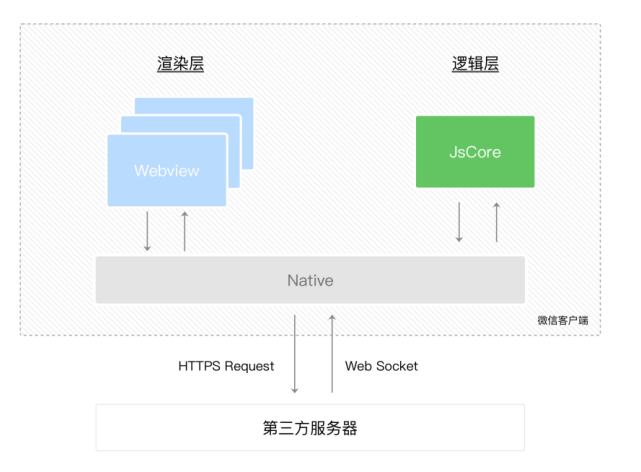

关于 Skyline 渲染引擎于 2023 年 7 月发布正式版：[Skyline 渲染引擎 / 概览 / 介绍 (qq.com)](https://developers.weixin.qq.com/miniprogram/dev/framework/runtime/skyline/introduction.html)

## 小程序的配置文件

小程序的很多开发需求被规定在了配置文件中

- 这样做有利于开发效率
- 可以保证开发出来的小程序某些风格是比较统一的

常见的配置文件：

- project.config.json:项目配置文件，比如项目名称、appid 等
- sitemap.json: 小程序搜索相关的
- app: 全局配置
- page.json: 页面配置

[设置 / 项目配置文件 (qq.com)](https://developers.weixin.qq.com/miniprogram/dev/devtools/projectconfig.html)

在  `project.private.config.json`  配置个人的配置，可以将  `project.private.config.json`  写到  `.gitignore`  避免版本管理的冲突。

### 全局 app 配置文件

[全局配置 | 微信开放文档 (qq.com)](https://developers.weixin.qq.com/miniprogram/dev/reference/configuration/app.html)

pages: 页面路径列表

- 用于指定小程序由哪些页面组成，每一项都对应一个页面的 路径（含文件名） 信息。
- 小程序中所有的页面都是必须在 pages 中进行注册的。
  window: 全局的默认窗口展示
- 用户指定窗口如何展示, 其中还包含了很多其他的属性
  tabBar: 顶部 tab 栏的展示

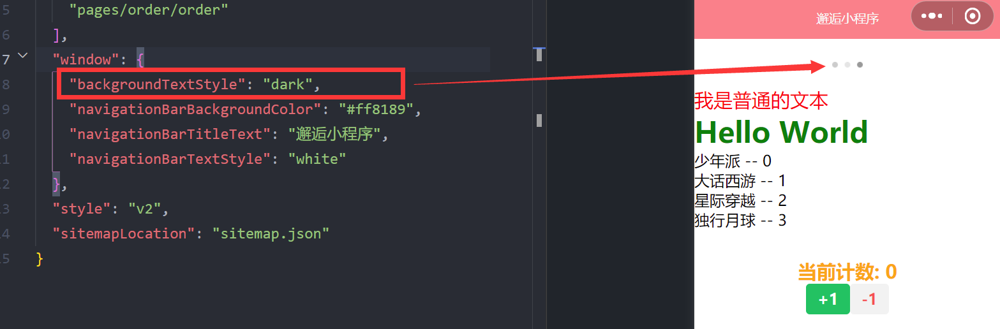
页面开启下拉
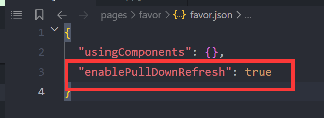

关于"style":"v2" [小程序配置 / 全局配置 / style](https://developers.weixin.qq.com/miniprogram/dev/reference/configuration/app.html#style)

### 页面配置

[小程序配置 / 页面配置 (qq.com)](https://developers.weixin.qq.com/miniprogram/dev/reference/configuration/page.html)

每一个页面的 json 文件会有默认的`usingComponents`，如果使用第三方组件或者自定义组件需要在此使用

单独页面进行配置

```json
{
  "usingComponents": {},
  "navigationBarTitleText": "个人信息",
  "navigationBarBackgroundColor": "#f00"
}
```

### 关于编译模式

普通编译则会自动读取 page 数组中的第一条数据
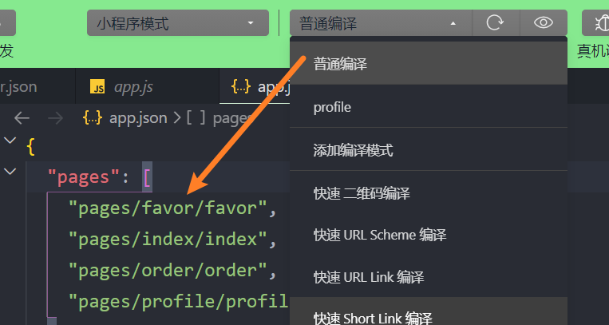
添加编译模式可以手动指定页面
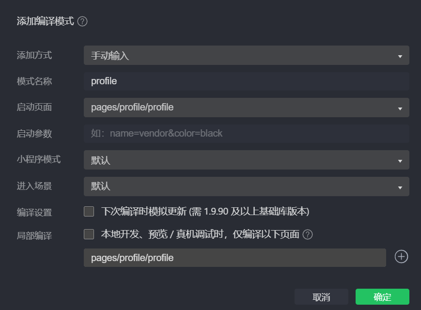

## Tabbar 实现

app.json 文件直接敲 tabbar 自动生成

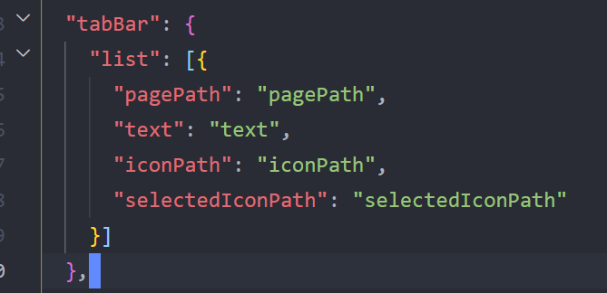

```json
  "tabBar": {
    "selectedColor": "ff8189",
    "list": [{
      "pagePath": "pages/index/index",
      "text": "首页",
      "iconPath": "assets/tabbar/home.png",
      "selectedIconPath": "assets/tabbar/home_active.png"
    }, {
      "pagePath": "pages/favor/favor",
      "text": "收藏",
      "iconPath": "assets/tabbar/category.png",
      "selectedIconPath": "assets/tabbar/category_active.png"
    }, {
      "pagePath": "pages/order/order",
      "text": "订单",
      "iconPath": "assets/tabbar/cart.png",
      "selectedIconPath": "assets/tabbar/cart_active.png"
    }, {
      "pagePath": "pages/profile/profile",
      "text": "我的",
      "iconPath": "assets/tabbar/profile.png",
      "selectedIconPath": "assets/tabbar/profile_active.png"
    }]
  },
```

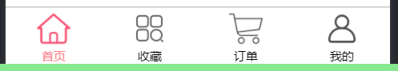

### 关于下拉刷新

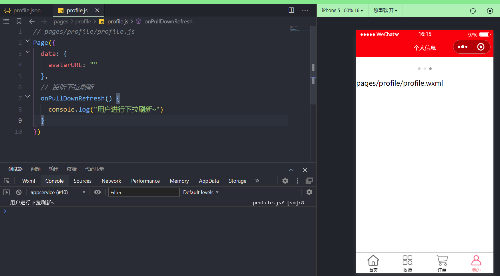

```js
// pages/profile/profile.js
Page({
  data: {
    avatarURL: "",
  },
  // 监听下拉刷新
  onPullDownRefresh() {
    console.log("用户进行下拉刷新~");
    // 使用定时器模拟网络请求
    setTimeout(() => {
      this.setData({
        listCount: 30,
      });
      // API: 停止下拉刷新
      wx.stopPullDownRefresh({
        success: (res) => {
          console.log("成功停止了下拉刷新", res);
        },
        fail: (err) => {
          console.log("失败停止了下拉刷新", err);
        },
      });
    }, 1000);
  },
});
```

### 关于监听滚动到底部

先模拟一段数据

```html
<view>
  <block wx:for="{{100}}" wx:key="*this">
    <view> 列表数据: {{item}} </view>
  </block>
</view>
```

默认是开启监听页面滚动底部的，无需配置，只需要调用 onReachBottom 即可

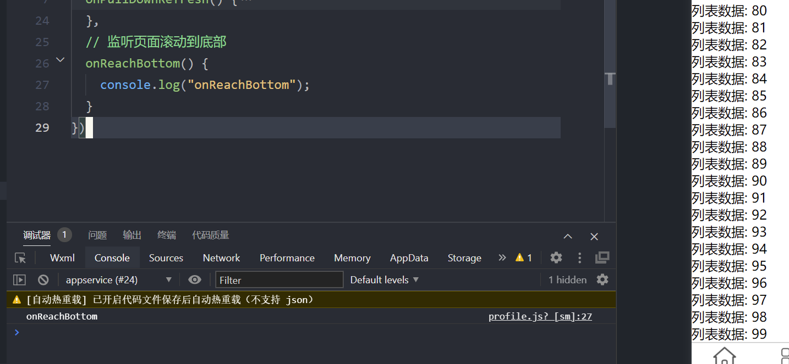

`onReachBottomDistance` 默认为 0，可以设置距离底部多少像素调用回调

```json
"onReachBottomDistance": 100,
```

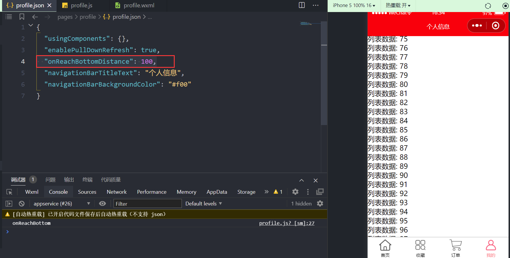

模拟滑动到底部以后请求更多数据

```js
// pages/profile/profile.js
Page({
  data: {
    listCount: 30,
  },
  // 监听页面滚动到底部
  onReachBottom() {
    console.log("onReachBottom");
    this.setData({
      listCount: this.data.listCount + 30,
    });
  },
});
```

```json
"onReachBottomDistance": 10,
```

### 下拉刷新后数据又回到 30 条

```js
  // 监听下拉刷新
  onPullDownRefresh() {
    console.log("用户进行下拉刷新~")
    // 使用定时器模拟网络请求
    setTimeout(() => {
      this.setData({
        listCount: 30
      })
      // API: 停止下拉刷新
      wx.stopPullDownRefresh({
        success: (res) => {
          console.log("成功停止了下拉刷新", res);
        },
        fail: (err) => {
          console.log("失败停止了下拉刷新", err);
        }
      })
    }, 1000)
  },
```

从调试工具的 AppData 查看

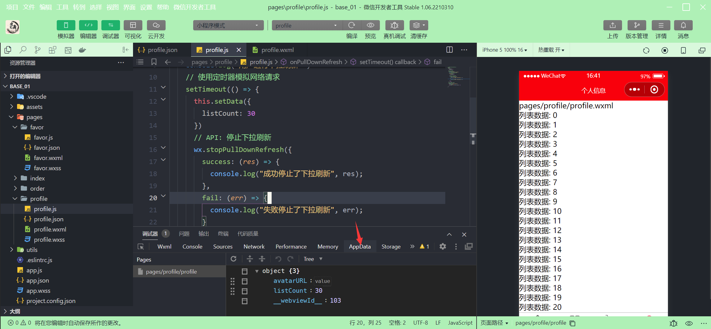

## 注册小程序-App 函数

每个小程序都需要在 app.js 中调用 App 函数 注册小程序

- 在注册时，可以绑定对应的==生命周期函数==
- [框架接口 / 小程序 App / App (qq.com)](https://developers.weixin.qq.com/miniprogram/dev/reference/api/App.html)

注册 App 时，一般会做什么？

- 判断小程序的进入场景
- 监听生命周期函数，在生命周期函数中执行对应的业务逻辑，比如在某个生命周期中进行登录操作或者请求网络数据
- 因为 App()实例只有一个，并且是全局共享的（单例对象），所以我们可以将一些共享数据放在这里

### 判断打开场景

常见的打开场景：群聊会话中打开、小程序列表中打开、微信扫一扫打开、另一个小程序打开
[微信开放文档/场景值列表](https://developers.weixin.qq.com/miniprogram/dev/reference/scene-list.html)

```js
// app.js
App({
  onLaunch(options) {
    console.log(options);
    console.log("生命周期回调——监听小程序初始化");
  },
});
```

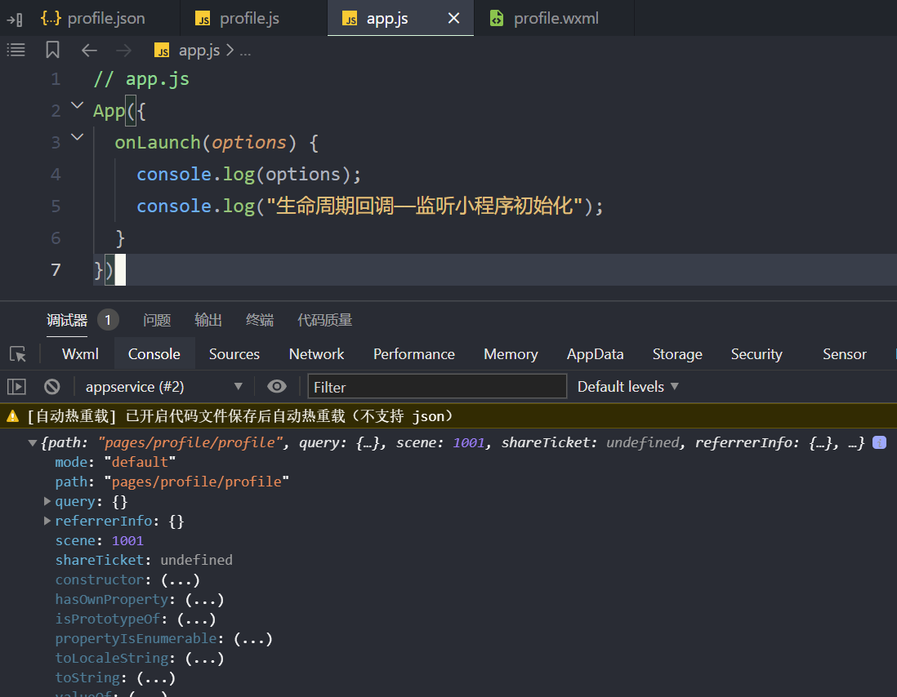

**开发者工具切换场景值**

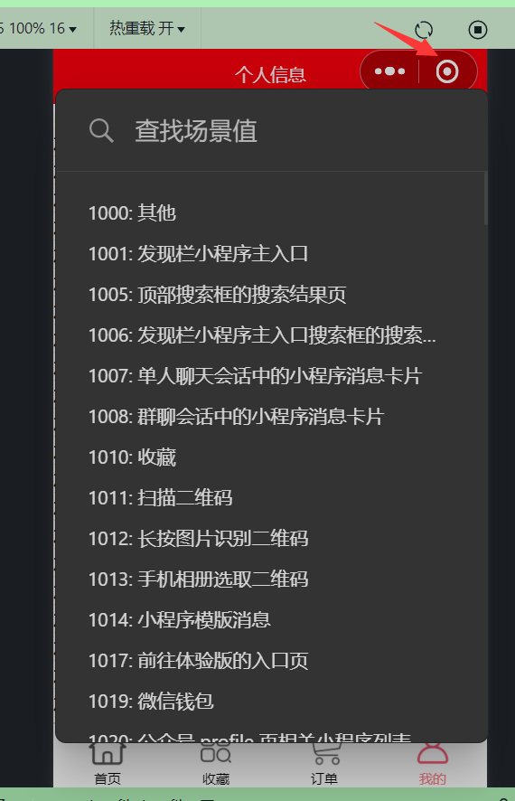
但是因为 onLaunch 只会执行一次，所以并不会再次输出

> 小程序初始化完成时触发，onLaunch 全局只触发一次

通过 onShow 去监听

```js
// app.js
App({
  onLaunch(options) {
    console.log(options);
    console.log("生命周期回调——监听小程序初始化");
  },
  onShow(options) {
    console.log("onShow", options);
  },
  onHide() {
    console.log("onHide");
  },
});
```

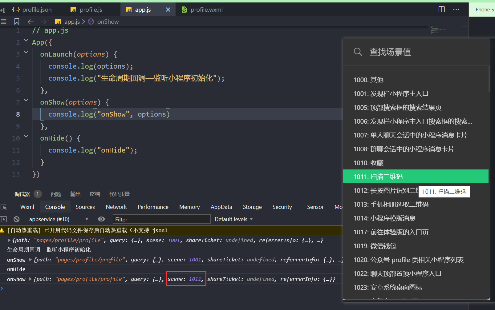

### 定义全局 App 的数据

注: 这个名字 globalData 是自定义的
数据不是响应式的，这里共享的数据通常是一些固定的数据

```js
// app.js
App({
  globalData: {
    token: "hanwutoken",
    userInfo: {
      nickname: "hanwu",
      level: 999,
    },
  },
});
```

[框架接口 / 页面 / Page / onLoad](https://developers.weixin.qq.com/miniprogram/dev/reference/api/Page.html#onLoad-Object-query)

```js
// pages/order/order.js
Page({
  data: {
    userInfo: {},
  },
  /**页面加载时触发。一个页面只会调用一次 */
  onLoad() {
    // 获取共享的数据： App实例中的数据
    // 1. 获取app实例对象
    const app = getApp();

    // 2.从app实例对象获取数据
    const token = app.globalData.token;
    const userInfo = app.globalData.userInfo;
    console.log(userInfo);
    // 3.拿到token目的  发送网络请求

    // 4.将数据展示到界面上
    this.setData({
      userInfo,
    });
  },
});
```

### 生命周期函数

在生命周期函数中，完成应用程序启动后的初始化操作

- 比如登录操作
- 比如本地数据，类似于 token，然后保存在全局方便使用
- 比如请求整个应用程序需要的数据

onLaunch-->进行用户登录-->将数据保存到 storage 和 globalData-->判断 token 是否过期-->发送一些必要的网络请求

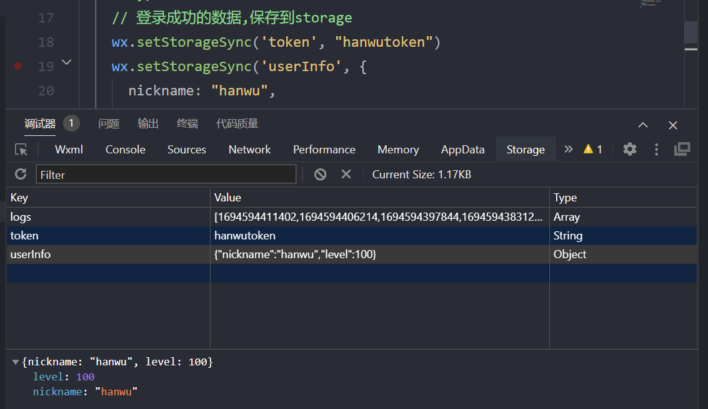

```js
// app.js
  onLaunch(options) {
    // 0.从本地获取token / userInfo
    const token = wx.getStorageSync('token');
    const userInfo = wx.getStorageSync('userInfo');

    if (!token || !userInfo) {
      // 1.进行登录操作(判断逻辑)
      // wx.login({
      //   timeout: 0 // code值-->后端与微信小程序服务器沟通-->返回结果
      // })
      // 登录成功的数据,保存到storage
      console.log("登录操作");
      wx.setStorageSync('token', "hanwutoken");
      wx.setStorageSync('userInfo', {
        nickname: "hanwu",
        level: 100
      })
    }
    // 2.将获取到的数据保存到globalData中
    this.globalData.token = token
    this.globalData.userInfo = userInfo
  },
```

## Page 函数-注册页面

小程序中的每个页面, 都有一个对应的 js 文件, 其中调用 Page 函数注册页面示例
在注册时, 可以绑定==初始化数据、生命周期回调、事件处理函数==等。
[框架接口 / 页面 / Page (qq.com)](https://developers.weixin.qq.com/miniprogram/dev/reference/api/Page.html)

```ad-summary
我们来思考：注册一个Page页面时，我们一般需要做什么呢？
```

1.在<span style="color:#00b0f0">生命周期函数</span>中发送网络请求，从服务器获取数据； 2.<span style="color:#00b0f0">初始化一些数据</span>，以方便被 wxml 引用展示； 3.<span style="color:#00b0f0">监听 wxml 中的事件</span>，绑定对应的事件函数； 4.其他一些<span style="color:#00b0f0">监听</span>（比如页面滚动、上拉刷新、下拉加载更多等）；

**page 页面的生命周期**

[小程序框架 / 逻辑层 / 页面生命周期 (qq.com)](https://developers.weixin.qq.com/miniprogram/dev/framework/app-service/page-life-cycle.html)

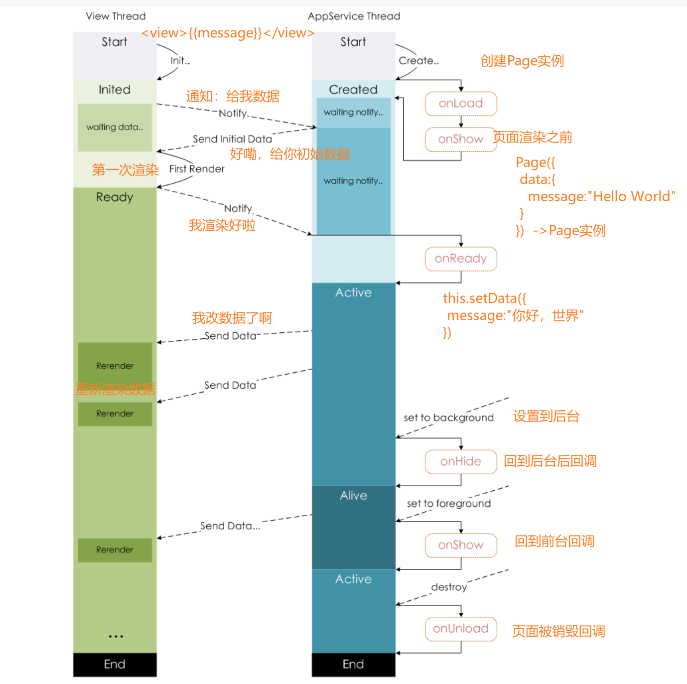

### 发送网络请求

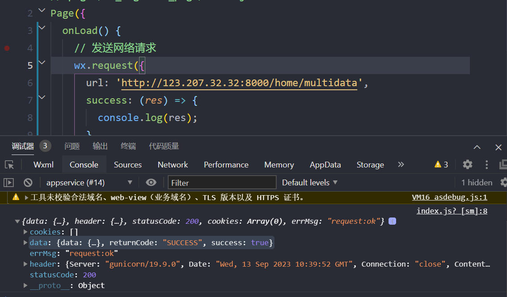

打开不校验合法域名设置

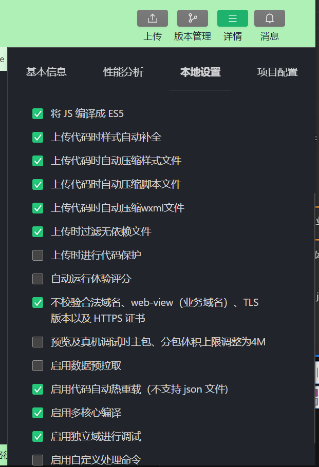

```js
// pages/01_register_page/index.js
Page({
  data: {
    banners: [],
    recommends: [],
  },
  onLoad() {
    // 发送网络请求
    wx.request({
      url: "http://123.207.32.32:8000/home/multidata",
      success: (res) => {
        const data = res.data.data;
        const banners = data.banner.list;
        const recommends = data.recommend;
        this.setData({
          banners,
          recommends,
        });
      },
    });
  },
});
```

可以看到数据已经获取到

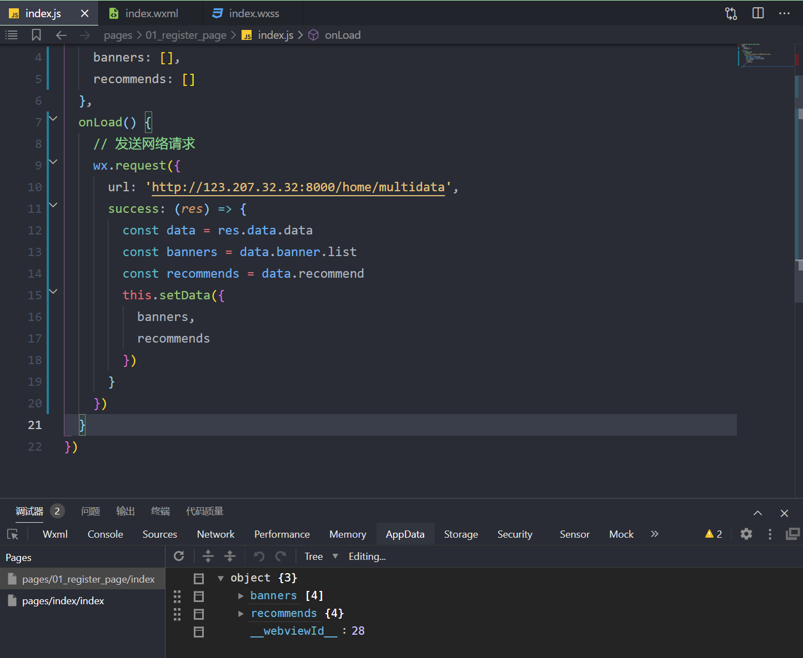

获取到数据，使用[swiper 组件](https://developers.weixin.qq.com/miniprogram/dev/component/swiper.html#)展示轮播图

```html
<view class="banner">
  <swiper
    circular
    autoplay
    indicator-dots
    vertical
    indicator-active-color="#318989"
    interval="3000"
    duration="500"
  >
    <block wx:for="{{banners}}" wx:key="acm">
      <swiper-item>
        <!-- image 组件默认宽高 320x240 
             mode="widthFix"  高度自适应        -->
        <image src="{{ item.image }}" mode="widthFix"></image>
      </swiper-item>
    </block>
  </swiper>
</view>
```

注意：使用`mode="widthFix"` 高度并不能完美计算出轮播图的高度
如何计算轮播图的高度在后续指出，本章节不叙述

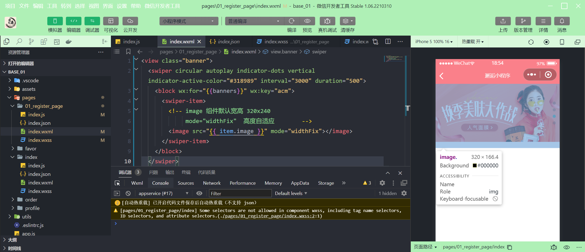

### 初始化一些数据

```html
<view> 初始化一些数据-counter: {{counter}} </view>
```

```js
  data: {
    // 初始化一些数据
    counter: 100
  },
```

### 绑定 wxml 中产生事件后的回调函数

```html
<button bindtap="onBtn1Click">按钮1</button>
```

```js
  onBtn1Click() {
    console.log("onBtn1Click");
  },
```

需求：根据动态数据渲染不同颜色的按钮

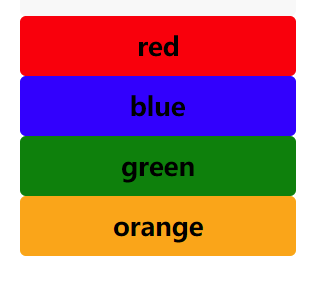

```html
<block wx:for="{{btns}}" wx:key="*this">
  <button
    class="btn"
    style="background: {{item}};"
    bindtap="onBtnClick"
    data-color="{{item}}"
  >
    {{ item }}
  </button>
</block>
```

```js
data(){
	btns: ["red", "blue", "green", "orange"]
},
  onBtnClick(event) {
    console.log("btn click:", event.target.dataset.color);
  },
```

### 绑定下拉刷新/达到底部/页面滚动

开启下拉刷新

```json
  "enablePullDownRefresh": true
```

给点数据

```html
<view class="list">
  <block wx:for="{{30}}" wx:key="*this">
    <view> 列表数据:{{item}} </view>
  </block>
</view>
```

```js
  // 4.绑定下拉刷新/达到底部/页面滚动
  onPullDownRefresh() {
    console.log("onPullDownRefresh");
  },
  onReachBottom() {
    console.log("onReachBottom");
  },
  onPageScroll(event) {
    console.log("onPageScroll", event);
  }
```

---

## 面试题：

小程序包括哪些？以及有哪些开发模式？

说说你对小程序双线程模型架构的理解？
