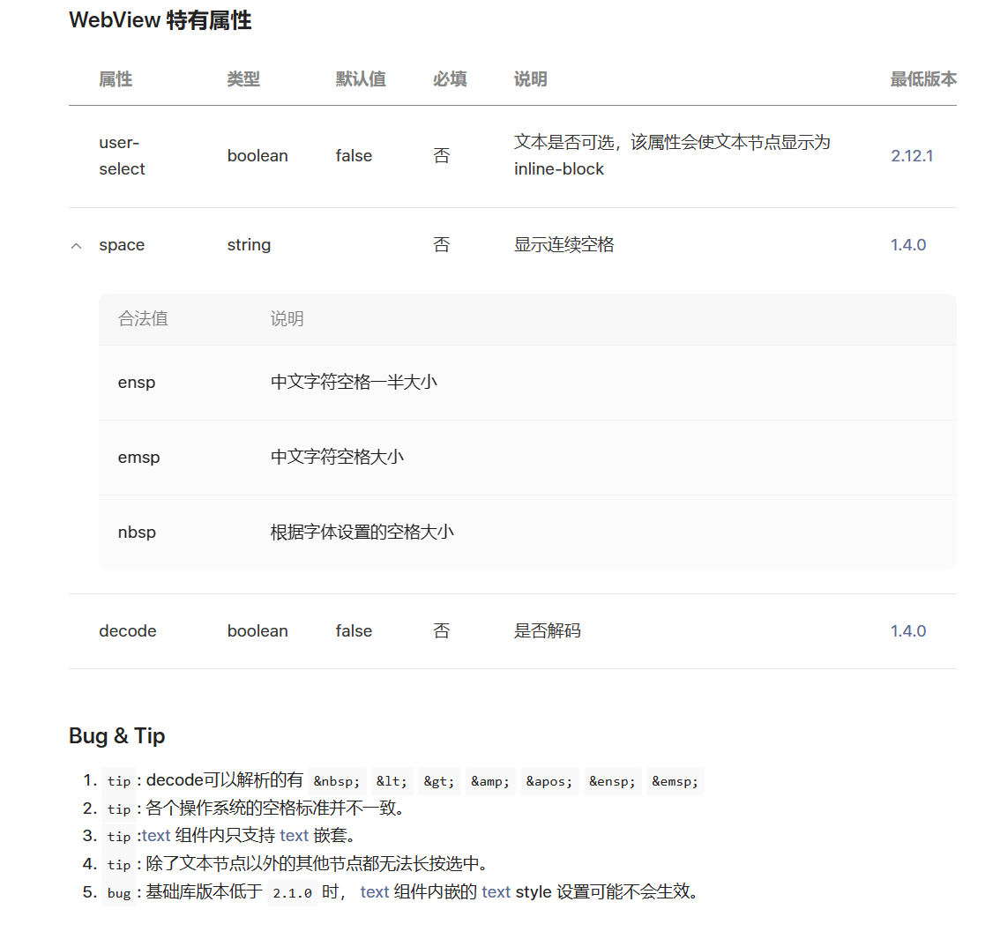
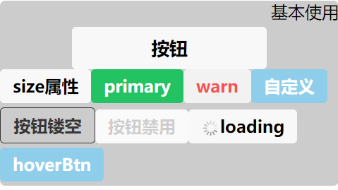
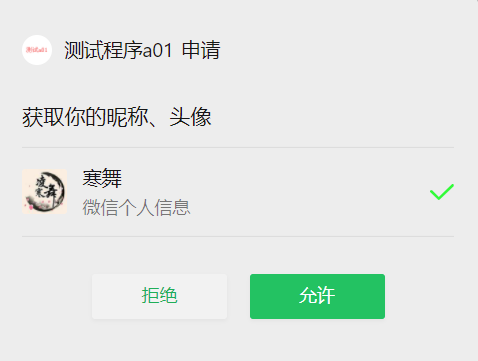
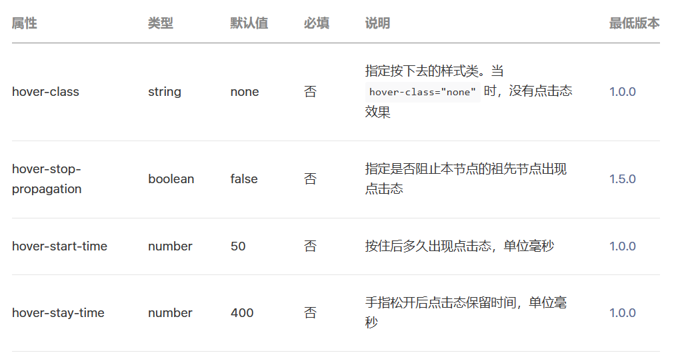
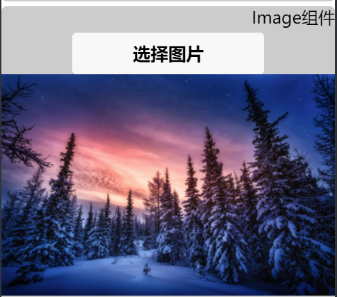
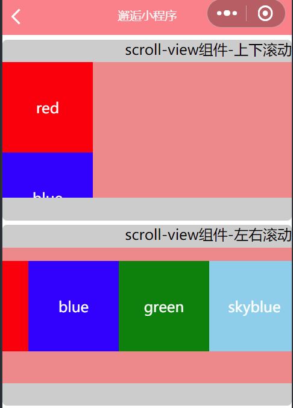
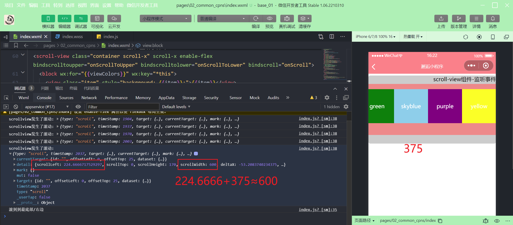
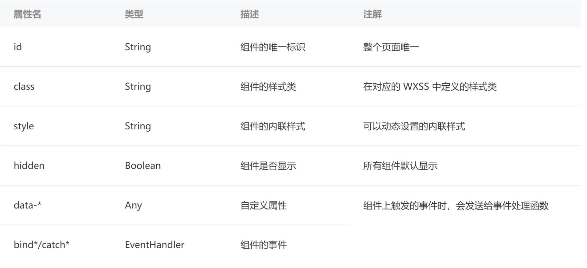
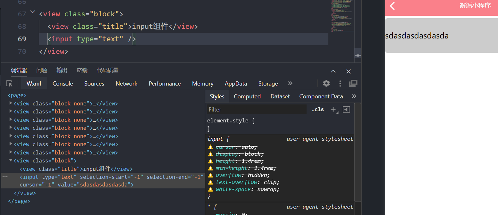
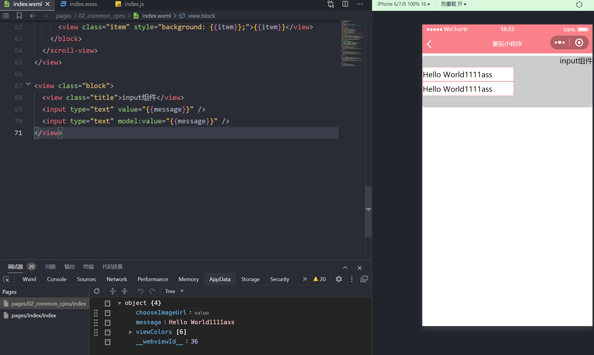

## Text 组件

[基础内容 / text (qq.com)](https://developers.weixin.qq.com/miniprogram/dev/component/text.html#WebView-%E7%89%B9%E6%9C%89%E5%B1%9E%E6%80%A7)



```html
<!--pages/02_common_cpns/index.wxml-->
<text>{{message}}</text>
<text user-select>这是一段可以选中的文本</text>
<text decode>
  decode可以解析的有 &nbsp; &lt; &gt; &amp; &apos; &ensp; &emsp;
</text>
```


## Button 组件

### 基本使用

```html
<button>按钮</button>
<button size="mini">size属性</button>
<button size="mini" type="primary">primary</button>
<button size="mini" type="warn">warn</button>
<button size="mini" class="btn">自定义</button>
<button size="mini" plain>按钮镂空</button>
<button size="mini" disabled>按钮禁用</button>
<button size="mini" loading>loading</button>
<button size="mini" class="btn" hover-class="active">hoverBtn</button>
```



### one-type

#### contact

```html
<button size="mini" type="primary" open-type="contact">打开会话</button>
```

#### 获取用户信息

[wx.getUserProfile(Object object) | 微信开放文档 (qq.com)](https://developers.weixin.qq.com/miniprogram/dev/api/open-api/user-info/wx.getUserProfile.html)



```html
<button
  size="mini"
  type="primary"
  open-type="getUserInfo"
  bindgetuserinfo="getUserInfo"
>
  getUserInfo已不被支持
</button>
<button size="mini" type="primary" bindtap="getUserInfo">获取用户信息</button>
```

```js
  getUserInfo(event) {
    wx.getUserProfile({
      desc: 'desc'
    }).then(res => {
      console.log(res);
    })
  }
```

### 获取手机号

```html
<button
  size="mini"
  type="primary"
  open-type="getPhoneNumber"
  bindgetphonenumber="getPhoneNumber"
>
  获取用户手机号
</button>
```

```js
  getPhoneNumber(event) {
    console.log(event);
  }
```

注意：个人用户无法获取，需要企业级用户

## View 组件

[视图容器 / view (qq.com)](https://developers.weixin.qq.com/miniprogram/dev/component/view.html)



## Image 图片组件

[Image 组件](https://developers.weixin.qq.com/miniprogram/dev/component/image.html)

Image 默认具有宽高 320x240
mode 属性：图片裁剪、缩放的模式

- 使用最多的是 widthFix

```html
<!-- <image src="/assets/132.jfif" /> -->
<!-- <image src="/assets/132.jfif" mode="aspectFit" /> -->
<image src="/assets/132.jfif" mode="widthFix" />
<!-- <image src="/assets/132.jfif" mode="heightFix" /> -->
```

### 选择本地图片



```html
<button bindtap="onChooseImage">选择图片</button>
<image src="{{chooseImageUrl}}" mode="widthFix" />
```

## ScrollView 滚动组件

[视图容器 / scroll-view (qq.com)](https://developers.weixin.qq.com/miniprogram/dev/component/scroll-view.html)

### 上下滚动

想要 ScrollView 能够滑动，需要设定固定的高度，而不是让内容撑起高度


```html
<scroll-view class="container" scroll-y>
  <block wx:for="{{viewColors}}" wx:key="*this">
    <view class="item" style="background: {{item}};">{{item}}</view>
  </block>
</scroll-view>
```

```js
viewColors: ["red", "blue", "green", "skyblue", "purple", "yellow"];
```

```css
/* scroll-view */
.container {
  background-color: #f18989;
  padding: 0;
  height: 150px;
}
.item {
  width: 100px;
  height: 100px;
  color: #fff;
  flex-shrink: 0;
  display: flex;
  align-items: center;
  justify-content: center;
}
```

### 左右滚动

```html
<view class="block">
  <view class="title">scroll-view组件-左右滚动</view>
  <scroll-view class="container scroll-x" scroll-x enable-flex>
    <block wx:for="{{viewColors}}" wx:key="*this">
      <view class="item" style="background: {{item}};">{{item}}</view>
    </block>
  </scroll-view>
</view>
```

```css
.scroll-x {
  display: flex;
  flex-direction: row;
}
```

### 监听滚动事件

```html
<scroll-view
  class="container scroll-x"
  scroll-x
  enable-flex
  bindscrolltoupper="onScrollToUpper"
  bindscrolltolower="onScrollToLower"
  bindscroll="onScroll"
>
  <block wx:for="{{viewColors}}" wx:key="*this">
    <view class="item" style="background: {{item}};">{{item}}</view>
  </block>
</scroll-view>
```

```js
  // 监听scroll-view滚动
  onScrollToUpper() {
    console.log("滚动到最顶部/左边");
  },
  onScrollToLower() {
    console.log("滚到到最底部/右边");
  },
  onScroll(event) {
    console.log("scrollview发生了滚动:", event);
  }
```



## 组件的共同属性



## input 组件

[表单组件 / input (qq.com)](https://developers.weixin.qq.com/miniprogram/dev/component/input.html)
默认 input 组件什么样式也没有



### 双向绑定

[小程序框架 / 视图层 / 简易双向绑定 (qq.com)](https://developers.weixin.qq.com/miniprogram/dev/framework/view/two-way-bindings.html)

```html
<input type="text" value="{{message}}" />
<input type="text" model:value="{{message}}" />
```

```css
input {
  width: 200px;
  height: 30px;
  border: 1px solid #f18989;
  background-color: #fff;
}
```


