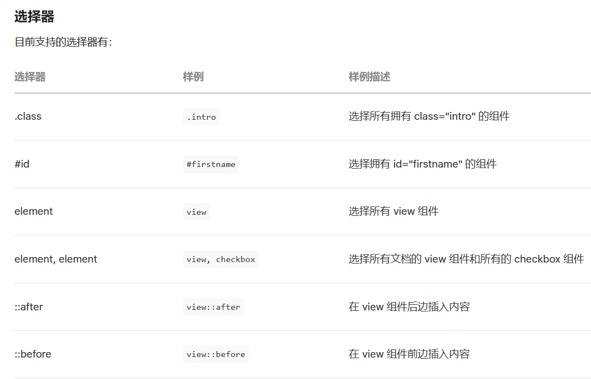

## WXSS编写程序样式

[小程序框架 / 视图层 / WXSS (qq.com)](https://developers.weixin.qq.com/miniprogram/dev/framework/view/wxss.html)

页面样式的三种写法：
- 行内样式
- 页面样式
- 全局样式


```html
<!-- 1.1.应用全局样式 -->
<view class="red">learn wxss title</view>

<!-- 1.2.页面中的样式 -->
<view class="message">learn wxss message</view>

<!-- 1.3.行内的样式 -->
<view style="color: blue;">inline style</view>
```


全局样式：

```css
/* app.wxss */
.red {
  color: red;
}
```

页面样式：

```css
/* index.wxss */
.green {
  color: green;
}
```

### 目前支持的选择器



### wxss的自适应单位

rpx（responsive pixel）: 可以根据屏幕宽度进行自适应，规定屏幕宽为750rpx
如在 iPhone6 上，屏幕宽度为375px，共有750个物理像素，则750rpx = 375px = 750物理像素，1rpx = 0.5px = 1物理像素

> 建议： 开发微信小程序时设计师可以用 iPhone6 作为视觉稿的标准

## Mustache语法绑定

WXML基本格式：
 类似于HTML代码：比如可以写成单标签，也可以写成双标签；
 必须有严格的闭合：没有闭合会导致编译错误
 ==大小写敏感==：class和Class是不同的属性

```html
<view>{{ message }}</view>
<view>{{ firstname + " " + lastname }}</view>
<view>{{ date }}</view>
```

```js
  data: {
    message: "Hello HanWu",
    firstname: "Kobe",
    lastname: "bryant",
    date: new Date().toLocaleDateString()
  }
```


## WXML的条件渲染

### 逻辑判断

```html
<!-- 2.条件判断 -->
<input type="text" model:value="{{score}}" />
<view>{{score}}</view>
<view wx:if="{{score> 90}}">优秀</view>
<view wx:elif="{{score > 80}}">良好</view>
<view wx:elif="{{score >= 60}}">及格</view>
<view wx:else>不及格</view>
```

### hidden属性

类似于v-show
**hidden和wx:if的区别**
hidden控制隐藏和显示是控制是否添加hidden属性
wx:if是控制组件是否渲染的

```html
<!-- 切换案例 -->
<button bindtap="onChangeTap">切换</button>
<view hidden="{{isHidden}}">哈哈哈哈</view>
<view wx:if="{{!isHidden}}">呵呵呵呵</view>
```

```js
Page({
  data: {
    isHidden: false,
  },
  onChangeTap() {
    this.setData({
      isHidden: !this.data.isHidden
    })
  }
})
```

## WXML的列表渲染

```html
<view class="books">
  <view wx:for="{{books}}" wx:key="id">
    <!-- item: 每项内容, index: 每项索引 -->
    {{item.name}}-{{item.price}}
  </view>
</view>
<!-- 遍历数字 -->
<view class="number">
  <view wx:for="{{10}}" wx:key="*this" style="float: left;margin:5px;">
    {{ item }}
  </view>
</view>
<!-- 遍历字符串 -->
<view class="str">
  <view wx:for="hanwu" wx:key="*this" style="float: left;margin:5px;">
    {{ item }}
  </view>
</view>
```

```js
    books: [
      { id: 111, name: "代码大全", price: 98 },
      { id: 112, name: "你不知道JS", price: 87 },
      { id: 113, name: "JS高级设计", price: 76 },
    ]
```

`<block/>` 并不是一个组件，它仅仅是一个包装元素，不会在页面中做任何渲染，只接受控制属性，类似于`<template>`

指定item和index

```html
<!-- 4.2. 细节补充: block-item/index名称-key的使用 -->
<view class="books">
  <block wx:for="{{books}}" wx:key="id" wx:for-item="book" wx:for-index="i">
    <view>{{ book.name }}-{{ book.price }}-{{ i }}</view>
  </block>
</view>
```

key作用，跟Vue 的key作用一样，小程序内部也是用了虚拟DOM
- 插入、删除一个新的节点，可以更好的复用节点

字符串，代表在 for 循环的 array 中 item 的某个 property，该 property 的值需要是列表中唯一的字符串或数字，且不能动态改变。
保留关键字 `*this` 代表在 for 循环中的 item 本身，这种表示需要 item 本身是一个唯一的字符串或者数字。

## WXS语法基本使用

[小程序框架 / 视图层 / WXS (qq.com)](https://developers.weixin.qq.com/miniprogram/dev/framework/view/wxs/)

**什么是WXS?**
WXS（WeiXin Script）是小程序的脚本语言，用来结合WXML构建页面的结构，与JS不同，但基本一致，[wxs对ES6及以上语法不支持](https://developers.weixin.qq.com/miniprogram/dev/framework/runtime/env.html#%E5%B9%B3%E5%8F%B0%E5%B7%AE%E5%BC%82) 
> 语法上开发者可以通过开启 `ES6` 转 `ES5` 的功能来规避

**为什么要设计WXS语言呢？**
- 在WXML中是不能直接调用Page/Component中定义的函数的
- 但是某些情况, 我们可以希望使用函数来处理WXML中的数据(类似于Vue中的过滤器)，这个时候就使用WXS


**使用限制和特点：**
WXS 不依赖于运行时的基础库版本，可以在所有版本的小程序中运行；
WXS 的运行环境和其他 JavaScript 代码是隔离的，WXS 中不能调用其他 JavaScript 文件中定义的函数，也不能调用小程序提供的API；
由于运行环境的差异，在 iOS 设备上小程序内的 WXS 会比 JavaScript 代码快 2 ~ 20 倍。在 android 设备 上二者运行效率无差异；

### 写法：
[WXS 语法参考 / 模块 (qq.com)](https://developers.weixin.qq.com/miniprogram/dev/reference/wxs/01wxs-module.html)
- 写在`<wxs>`标签中
- 写在以.wxs结尾的文件

#### 第一种写法

```html
<!-- 1.方式一: 标签 -->
<wxs module="format">
  function formatPrice(price) {
    return "¥" + price
  }
  // 必须导出后, 才能被其他地方调用: 必须使用CommonJS导出
  module.exports = {
    formatPrice: formatPrice
  }
</wxs>

<view class="books">
  <block wx:for="{{books}}" wx:key="id">
    <view>name:{{item.name}}-price:{{format.formatPrice(item.price)}}</view>
  </block>
</view>
```

```js
// pages/05_learn_wxs/index.js
Page({
  data: {
    books: [
      { id: 111, name: "代码大全", price: 98, coverURL: "" },
      { id: 112, name: "你不知道JS", price: 87, coverURL: "" },
      { id: 113, name: "JS高级设计", price: 76, coverURL: "" },
    ],
    playCount: 2232,
    duration: 255,
    currentTime: 65
  }
})
```

#### 第二种写法：抽离到文件

```html
<!-- 2.方式二: 独立的文件, 通过src引入 -->
<wxs module="format" src="/utils/format.wxs"></wxs>
```

计算价格总价

```html
<view class="total">总价格: {{format.calcPrice(books)}}</view>
```

```js
function calcPrice(books) {
  return "¥" + books.reduce(function (preValue, item) {
    return preValue + item.price
  }, 0)
}
```

## WXS语法案例练习
题目一：传入一个数字，格式化后进行展示（例如36456，展示结果3.6万）；
题目二：传入一个时间（秒），格式化后进行展示（例如100秒，展示结果为01:40）；


```html
<view class="count">播放量: {{format.formatCount(playCount)}}</view>
<view class="time">
  {{format.formatTime(currentTime)}}/{{format.formatTime(duration)}}
</view>
```

```js
function formatCount(count) {
  count = Number(count)
  if (count >= 100000000) {
    return (count / 100000000).toFixed(1) + "亿"
  } else if (count >= 10000) {
    return (count / 10000).toFixed(1) + "万"
  } else {
    return count
  }
}
```

```js
function padLeft(time) {
  time = time + ""
  return ("00" + time).slice(time.length)
}

// 对time进行格式化
// 100 -> 01:40
function formatTime(time) {
  // 1.获取时间
  var minute = Math.floor(time / 60)
  var second = Math.floor(time) % 60

  // 2.拼接字符串
  return padLeft(minute) + ":" + padLeft(second)
}
```


