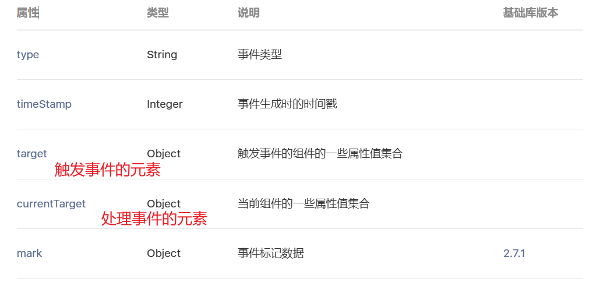

## 事件的监听

[小程序框架 / 视图层 / 事件系统 / 介绍 (qq.com)](https://developers.weixin.qq.com/miniprogram/dev/framework/view/wxml/event.html#%E4%BB%80%E4%B9%88%E6%98%AF%E4%BA%8B%E4%BB%B6)

事件是视图层到逻辑层的通讯方式，将用户的行为反馈到逻辑层

事件是通过bind/catch这个属性绑定在组件上

通过key=“value”的形式，key以==bind或catch开头==，从1.5.0版本开始，可以在bind和catch后加一个冒号

同时在当前页面的Page构造器中定义对应的事件处理函数


```html
<button bindtap="onBtnTap">按钮</button>
```

```js
Page({
  // 绑定事件监听函数
  onBtnTap(event) {
    console.log("onBtnTap:", event);
  },
})
```

[小程序框架 / 视图层 / 事件系统 / 事件分类)](https://developers.weixin.qq.com/miniprogram/dev/framework/view/wxml/event.html#%E4%BA%8B%E4%BB%B6%E5%88%86%E7%B1%BB)


## 事件对象event
[小程序框架 / 视图层 / 事件系统 / 事件对象](https://developers.weixin.qq.com/miniprogram/dev/framework/view/wxml/event.html#%E4%BA%8B%E4%BB%B6%E5%AF%B9%E8%B1%A1)
当某个事件触发时，会产生一个事件对象，并且这个对象被传入到回调函数中



```html
<!-- 2.event中target和currentTarget区别 -->
<view id="outer" class="outer" data-name="hanwu" bindtap="onOuterViewTap">
  <view id="inner" class="inner"></view>
</view>
```

```css
.outer {
  display: flex;
  justify-content: center;
  align-items: center;
  width: 400rpx;
  height: 400rpx;
  background-color: orange;
}

.inner {
  width: 200rpx;
  height: 200rpx;
  background-color: red;
}
```

```js
  onOuterViewTap(event) {
    // 1.target触发事件的元素
    // 2.currentTarget处理事件的元素
    console.log("onOuterViewTap:", event);
    console.log("event.target", event.target);
    console.log("event.currentTarget", event.currentTarget);
    console.log(event.target === event.currentTarget)
    // 3.获取自定义属性: name
    const name = event.currentTarget.dataset.name
    console.log("name", name);
  }
```


## touches和changedTouches的区别

[新手必‘晕’的changedTouches](http://www.wxappclub.com/topic/542)

```html
<!-- 3.event中touches和changeTouches区别 -->
<view class="touches" bindtap="onTouchTap" bindlongpress="onLongPress" bindtouchend="onTouchEnd">
  多指触摸
</view>
```

```js
  // 监听触摸事件
  onTouchTap(event) {
    console.log("tap:", event);
  },
  onLongPress(event) {
    console.log("long:", event);
  },
  onTouchEnd(event) {
    console.log("end:", event);
  },
```


**开始**  
放下一个手指在`div2`上，触发了`touchstart`事件，  
这个时候，两个集合的内容是一样的，都包含这个手指的touch。

**然后**  
再放下两个手指一个在`div1`上，一个在`div2`上，这个时候又会触发事件。  
但`changedTouches`里面只包含第二个第三个手指的信息，因为第一个没有发生变化。  
而`touches`包含屏幕上所有手指的信息，也就是三个手指。


## 事件参数的传递

- data-属性
- [mark](https://developers.weixin.qq.com/miniprogram/dev/framework/view/wxml/event.html#mark)

### data-

```html
<!-- 4.event的参数传递 -->
<view 
  class="arguments"
  bindtap="onArgumentsTap"
  data-name="hanwu"
  data-age="18"
  data-height="1.88"
>
  参数传递
</view>
```

```js
  // 监听事件, 并且传递参数
  onArgumentsTap(event) {
    console.log("onArgumentsTap:", event);
    const { name, age, height } = event.currentTarget.dataset;
    console.log(name, age, height);
  }, 
```


### mark

```html
<!-- 8.给逻辑传递数据, 另外一种方式: mark -->
<view class="mark" bindtap="onMarkTap" data-name="hanwu" data-age="18" mark:name="kobe" mark:age="30">
  <text mark:address="洛杉矶" class="title">mark</text>
</view>
```

```js
  // mark的数据传递
  onMarkTap(event) {
    console.log(event);
    const data1 = event.currentTarget.dataset;
    console.log(data1);

    const data2 = event.mark;
    console.log(data2);
  },
```


## tab-control案例⭐


```html
<!-- 5.tab-control案例(重要) -->
<view class="tab-control">
  <block wx:for="{{ titles }}" wx:key="*this">
    <view class="item {{index === currentIndex ? 'active': ''}}" bindtap="onItemTap" data-index="{{index}}">
      <text class="title">{{ item }}</text>
    </view>
  </block>
</view>
```

```js
  onItemTap(event) {
    const currentIndex = event.currentTarget.dataset.index;
    console.log(currentIndex);
    this.setData({ currentIndex });
  },
```

```css
/* tab-control */
.tab-control {
  display: flex;
  height: 40px;
  line-height: 40px;
  text-align: center;
}

.tab-control .item {
  flex: 1;
}

.tab-control .item.active {
  color: #ff8189;
}

.tab-control .item.active .title {
  border-bottom: 3px solid #ff8189;
  padding: 5px;
}
```

## 事件冒泡与事件捕获

```html
<!-- 6.捕获和冒泡阶段 -->
<view class="view1" capture-bind:tap="onView1CaptureTap" bindtap="onView1Tap">
  <view class="view2" capture-bind:tap="onView2CaptureTap" bindtap="onView2Tap">
    <view class="view3" capture-bind:tap="onView3CaptureTap" bindtap="onView3Tap"></view>
  </view>
</view>
```


```js
  // 捕获和冒泡过程
  onView1CaptureTap() {
    console.log("onView1CaptureTap");
  },
  onView2CaptureTap() {
    console.log("onView2CaptureTap");
  },
  onView3CaptureTap() {
    console.log("onView3CaptureTap");
  },
  onView1Tap() {
    console.log("onView1Tap");
  },
  onView2Tap() {
    console.log("onView2Tap");
  },
  onView3Tap() {
    console.log("onView3Tap");
  },
```

```css
/* 捕获和冒泡 */
.view1 {
  display: flex;
  justify-content: center;
  align-items: center;
  width: 600rpx;
  height: 600rpx;
  background-color: orange;
}

.view2 {
  display: flex;
  justify-content: center;
  align-items: center;
  width: 400rpx;
  height: 400rpx;
  background-color: purple;
}

.view3 {
  width: 200rpx;
  height: 200rpx;
  background-color: red;
}
```

### 绑定并阻止事件冒泡
[小程序框架 / 视图层 / 事件系统 / 绑定并阻止事件冒泡](https://developers.weixin.qq.com/miniprogram/dev/framework/view/wxml/event.html#%E7%BB%91%E5%AE%9A%E5%B9%B6%E9%98%BB%E6%AD%A2%E4%BA%8B%E4%BB%B6%E5%86%92%E6%B3%A1)
除 `bind` 外，也可以用 `catch` 来绑定事件。与 `bind` 不同， `catch` 会阻止事件向上冒泡


