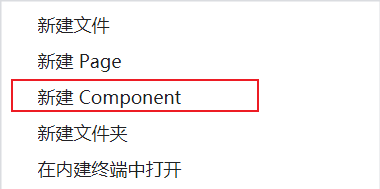
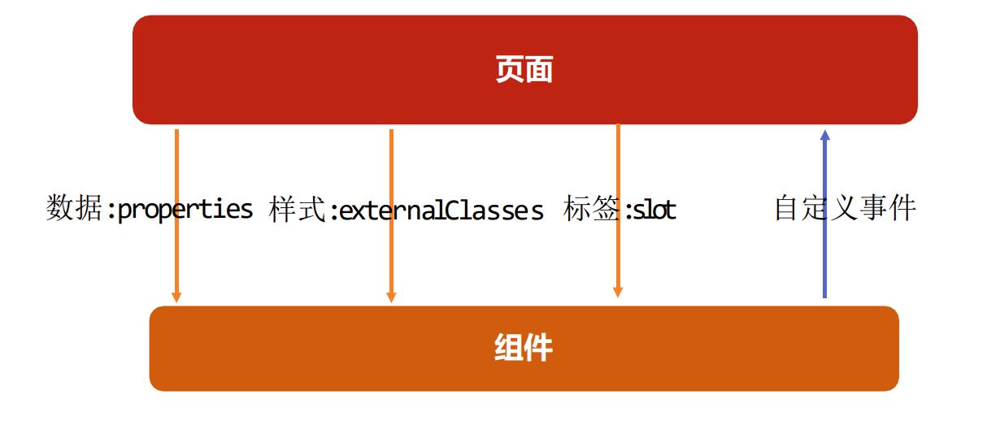

[小程序框架 / 自定义组件](https://developers.weixin.qq.com/miniprogram/dev/framework/custom-component/)

## 自定义组件的过程
**自定义组件的步骤：**
1.首先需要在 json 文件中进行自定义组件声明（将component 字段设为 true 可这一组文件设为自定义组件）：
2.在wxml中编写属于我们组件自己的模板
3.在wxss中编写属于我们组件自己的相关样式
4.在js文件中, 可以定义数据或组件内部的相关逻辑(后续我们再使用)


鼠标右键新建Component，它所作的操作，主要是创建了4个文件，并且 `"component": true`

```json
{
  "component": true,
  "usingComponents": {}
}
```



其他页面想要使用自定义组件，则需要在json文件中声明

```ad-note
自定义组件也是可以使用自定义组件的
自定义组件和页面所在的目录名不能以"wx-"为前缀
如果在app.json的usingComponents声明某个组件，那么所有页面和组件可以直接使用该组件
```

```json
{
  "usingComponents": {
    "section-info": "/components/section-info/section-info"
  }
}
```


## 组件样式实现细节

[自定义组件 / 组件模板和样式 (qq.com)](https://developers.weixin.qq.com/miniprogram/dev/framework/custom-component/wxml-wxss.html)

### 组件内的样式 对 外部样式 的影响

```ad-note
组件内的class样式，只对组件wxml内的节点生效, 对于引用组件的Page页面不生效。
组件内不能使用id选择器、属性选择器、标签选择器
```

### 外部样式 对 组件内样式 的影响

```ad-node
外部使用class的样式，只对外部wxml的class生效，对组件内是不生效的
外部使用了id选择器、属性选择器不会对组件内产生影响
外部使用了标签选择器，会对组件内产生影响
```

### 如何让class可以相互影响
[自定义组件 / 组件模板和样式 / 样式隔离](https://developers.weixin.qq.com/miniprogram/dev/framework/custom-component/wxml-wxss.html#%E7%BB%84%E4%BB%B6%E6%A0%B7%E5%BC%8F%E9%9A%94%E7%A6%BB)
在<span style="color:#00b0f0">Component对象</span>中，可以传入一个<span style="color:#00b0f0">options属性</span>，其中options属性中有一个<span style="color:#00b0f0">styleIsolation（隔离）属性</span>
styleIsolation有三个取值：
- <span style="color:#00b0f0">isolated</span> 表示启用样式隔离，在自定义组件内外，使用 class 指定的样式将不会相互影响（默认取值）；
- <span style="color:#00b0f0">apply-shared </span>表示页面 wxss 样式将影响到自定义组件，但自定义组件 wxss 中指定的样式不会影响页面；
- <span style="color:#00b0f0">shared</span> 表示页面 wxss 样式将影响到自定义组件，自定义组件 wxss 中指定的样式也会影响页面和其他设置 

> 一般开发都是用的默认的隔离

## 组件使用过程通信



```html
<!--components/section-info/section-info.wxml-->
<view class="section">
  <view class="title" bindtap="onTitleTap">{{ title }}</view>
  <view class="content info">{{ content }}</view>
</view>
```

```js
// components/section-info/section-info.js
Component({
  properties: {
    title: {
      type: String,
      value: "默认标题"
    },
    content: {
      type: String,
      value: "默认内容"
    }
  },
  externalClasses: ["info"],

  methods: {
    onTitleTap() {
      console.log("title被点击了~");
      this.triggerEvent("titleclick", "aaa")
    }
  }
})

```

```css
/* components/section-info/section-info.wxss */
.section .title {
  font-size: 40rpx;
  font-weight: 700;
  color: red;
}

.section .content {
  font-size: 24rpx;
  color: purple;
}
```


```html
<!-- 2.自定义组件 -->
<section-info info="green" title="每日一言" content="人生用特写镜头来看是悲剧，长镜头来看则是喜剧" bind:titleclick="onSectionTitleClick" />
<section-info info="red" title="黄金时代" content="在我一生中最好的黄金时代, 我想吃, 我想爱" />
```

```js
  onSectionTitleClick(event) {
    console.log("区域title发生了点击", event.detail);
  },
```

### 像组件传递样式：  externalClasses

[自定义组件 / 组件模板和样式 / externalClasses](https://developers.weixin.qq.com/miniprogram/dev/framework/custom-component/wxml-wxss.html#%E5%A4%96%E9%83%A8%E6%A0%B7%E5%BC%8F%E7%B1%BB)
[glass-easel 组件框架 / 新增特性 / Chaining API/ externalClasses](https://developers.weixin.qq.com/miniprogram/dev/framework/custom-component/glass-easel/chaining-api.html#%E5%B8%B8%E7%94%A8%E7%9A%84%E9%93%BE%E5%BC%8F%E8%B0%83%E7%94%A8%E9%A1%B9)

### 组件向外传递事件

需要写到methods
triggerEvent类似于vue中的$emit

```js
  methods: {
    onTitleTap() {
      console.log("title被点击了~");
      this.triggerEvent("titleclick", "aaa")
    }
  }
```


## 页面直接调用组件
父组件里调用this.selectComponent,获取子组件的实例对象
- 调用时传入一个匹配选择器selector

类似于vue的ref

```html
<!-- 4.tab-control的使用 -->
<tab-control class="tab-control" titles="{{digitalTitles}}" bind:indexchange="onTabIndexChange" />
<button bindtap="onExecTCMethod">调用TC方法</button>

<tab-control titles="{{['流行', '新款', '热门']}}" />
```

```js
  onTabIndexChange(event) {
    const index = event.detail
    console.log("点击了", this.data.digitalTitles[index]);
  },
  onExecTCMethod() {
    // 1.获取对应的组件实例对象
    const tabControl = this.selectComponent(".tab-control")

    // 2.调用组件实例的方法
    tabControl.test(2)
  }
```

子组件

```html
<!--components/tab-control/tab-control.wxml-->
<view class="tab-control">
  <block wx:for="{{ titles }}" wx:key="*this">
    <view 
      class="item {{index === currentIndex ? 'active': ''}}"
      bindtap="onItemTap"
      data-index="{{index}}"
    >
      <text class="title">{{ item }}</text>
    </view>
  </block>
</view>

```

```js
// components/tab-control/tab-control.js
Component({
  properties: {
    titles: {
      type: Array,
      value: []
    }
  },

  data: {
    currentIndex: 0
  },

  methods: {
    onItemTap(event) {
      const currentIndex = event.currentTarget.dataset.index
      this.setData({ currentIndex })

      // 自定义事件
      this.triggerEvent("indexchange", currentIndex)
    },
    test(index) {
      console.log("tab control test function exec");
      this.setData({
        currentIndex: index
      })
    }
  }
})

```

```css
/* components/tab-control/tab-control.wxss */
.tab-control {
  display: flex;
  height: 40px;
  line-height: 40px;
  text-align: center;
}

.tab-control .item {
  flex: 1;
}

.tab-control .item.active {
  color: #ff8189;
}

.tab-control .item.active .title {
  border-bottom: 3px solid #ff8189;
  padding: 5px;
}

```


## 组件插槽的使用

### 基本使用

小程序中插槽是不支持默认值的，通过css样式可以实现 vue插槽的默认值的功能

```html
<!--components/my-slot/my-slot.wxml-->
<view class="my-slot">
  <view class="header">Header</view>
  <view class="content">
    <!-- 小程序中插槽是不支持默认值的 -->
    <slot></slot>
  </view>
  <view class="default">通过CSS实现的默认值</view>
  <view class="footer">Footer</view>
</view>

```

```css
/* components/my-slot/my-slot.wxss */
.my-slot {
  margin: 20px 0;  
}

.default {
  display: none;
}

.content:empty + .default {
  display: block;
}

```


```html
<my-slot>
  <button>我是按钮</button>
</my-slot>
<my-slot>
  <image src="/assets/132.jfif" mode="widthFix"></image>
</my-slot>
```


多个插槽的使用

```html
<mul-slot>
  <button slot="left" size="mini">left</button>
  <view slot="center">哈哈哈</view>
  <button slot="right" size="mini">right</button>
</mul-slot>
```

```html
<!--components/mul-slot/mul-slot.wxml-->
<view class="mul-slot">
  <view class="left">
    <slot name="left"></slot>
  </view>
  <view class="center">
    <slot name="center"></slot>
  </view>
  <view class="right">
    <slot name="right"></slot>
  </view>
</view>

```

```css
/* components/mul-slot/mul-slot.wxss */
.mul-slot {
  display: flex;
  text-align: center;
}

.left, .right {
  width: 160rpx;
}

.center {
  flex: 1;
}

```

声明组件使用多插槽

```js
// components/mul-slot/mul-slot.js
Component({
  options: {
    multipleSlots: true
  }
})

```

### behaviors

小程序的混入

[自定义组件 / behaviors (qq.com)](https://developers.weixin.qq.com/miniprogram/dev/framework/custom-component/behaviors.html)

```html
<!--components/c-behavior/c-behavior.wxml-->
<view>
  <view class="counter">当前计数: {{counter}}</view>
  <button bindtap="increment">+1</button>
  <button bindtap="decrement">-1</button>
</view>
```

```js
// components/c-behavior/c-behavior.js
import { counterBehavior } from "../../behaviors/counter"

Component({
  behaviors: [counterBehavior]
})

```

```js
// behaviors\counter.js
export const counterBehavior = Behavior({
  data: {
    counter: 100
  },
  methods: {
    increment() {
      this.setData({ counter: this.data.counter + 1 })
    },
    decrement() {
      this.setData({ counter: this.data.counter - 1 })
    }
  }
})

```

## 组件的生命周期

[自定义组件 / 组件生命周期 (qq.com)](https://developers.weixin.qq.com/miniprogram/dev/framework/custom-component/lifetimes.html)

```js
// components/c-lifetime/c-lifetime.js
Component({
  lifetimes: {
    created() {
      console.log("组件被创建created");
    },
    attached() {
      console.log("组件被添加到组件树中attached");
    },
    detached() {
      console.log("组件从组件树中被移除detached");
    }
  },
  pageLifetimes: {
    show() {
      console.log("page show");
    },
    hide() {
      console.log("page hide");
    }
  }
})

```

