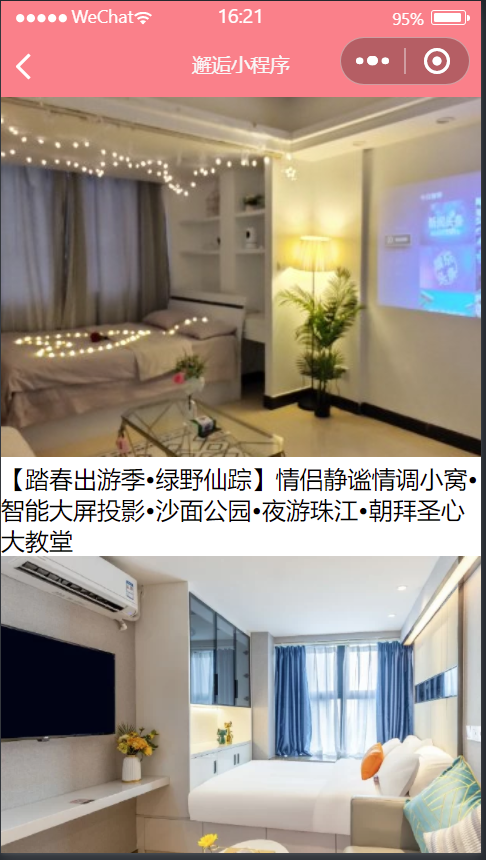
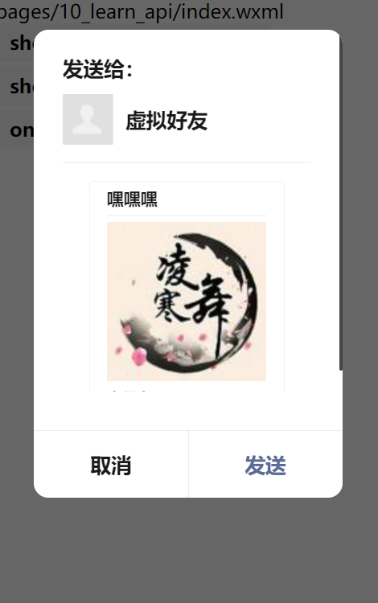
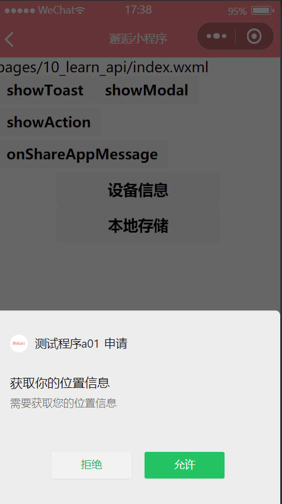
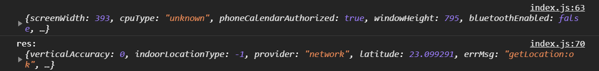
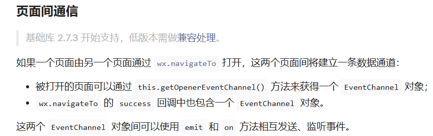
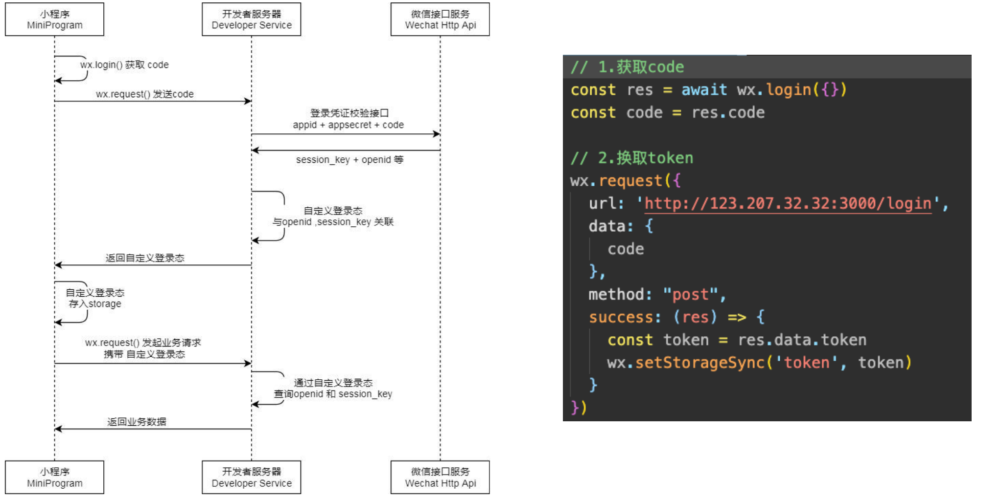

## 网络请求 API 和封装

### wx.request

[网络 / 发起请求 / wx.request (qq.com)](https://developers.weixin.qq.com/miniprogram/dev/api/network/request/wx.request.html)

不支持 promise 风格

```js
// pages/09_learn_network/index.js
Page({
  data: {
    allCities: {},
  },
  onLoad() {
    wx.request({
      url: "https://mock.mengxuegu.com/mock/64f53d0be70b8004a69e9b62/city/all",
      success: (res) => {
        const data = res.data.data;
        this.setData({ allCities: data });
      },
      fail: (res) => {
        console.log(res);
      },
    });
  },
});
```

---



```html
<!--pages/09_learn_api/index.wxml-->
<view class="house-list">
  <block wx:for="{{houselist}}" wx:key="abc">
    <view class="item">
      <image src="{{item.data.image.url}}"></image>
      <view class="title">{{item.data.houseName}}</view>
    </view>
  </block>
</view>
```

```js
// pages/09_learn_network/index.js
Page({
  data: {
    allCities: {},
    houselist: [],
    currentPage: 1,
  },
  onLoad() {
    wx.request({
      url: "https://mock.mengxuegu.com/mock/64f53d0be70b8004a69e9b62/home/houselist/1",
      success: (res) => {
        const data = res.data.data;
        this.setData({ houselist: data });
      },
      fail: (res) => {
        console.log(res);
      },
    });
  },
});
```

### 请求域名配置

每个微信小程序需要事先设置通讯域名，小程序只可以跟指定的域名进行网络通信

- 小程序登录后台 – 开发管理 – 开发设置 – 服务器域名；
  服务器域名请在 「小程序后台 - 开发 - 开发设置 - 服务器域名」 中进行配置，配置时需要注意：
- 域名只支持 https (wx.request、wx.uploadFile、wx.downloadFile) 和 wss (wx.connectSocket) 协议；
- 域名不能使用 IP 地址（小程序的局域网 IP 除外）或 localhost；
- 可以配置端口，如 `https://myserver.com:8080`，但是配置后只能向 `https://myserver.com:8080` 发起请求。如果向
- `https://myserver.com` 、`https://myserver.com:9091` 等 URL 请求则会失败。
- 如果不配置端口。如 `https://myserver.com`，那么请求的 URL 中也不能包含端口，甚至是默认的 443 端口也不可以。如果向 https://myserver.com:443 请求则会失败。
- 域名必须经过 ICP 备案；
- 出于安全考虑，api.weixin.qq.com 不能被配置为服务器域名，相关 API 也不能在小程序内调用。 开发者应将 AppSecret 保存到后台服务器中，通过服务器使用 getAccessToken 接口获取 access_token，并调用相关 API；
- 不支持配置父域名，使用子域名。

### 网络请求的封装

#### 封装成函数使用 Promise

`service\index.js`

```js
// 封装成函数
export function hwRequest(options) {
  return new Promise((resolve, reject) => {
    wx.request({
      ...options,
      success: (res) => {
        resolve(res.data);
      },
      fail: reject,
    });
  });
}
```

```js
// pages/09_learn_network/index.js
import { hwRequest } from "../../service/index";
hwRequest({
  url: "https://mock.mengxuegu.com/mock/64f53d0be70b8004a69e9b62/home/houselist/1",
}).then((res) => {
  this.setData({ houselist: res.data });
});
```

#### await / async

```js
// 3. await / async
onLoad() {
	this.getHouselistData();
}
async getHouselistData(){
	const houselist = await hwRequest({
	  url: "https://mock.mengxuegu.com/mock/64f53d0be70b8004a69e9b62/home/houselist/1"
	})
	this.setData({ houselist: houselist.data })
}
```

### 滑动到底部刷新数据

```js
  async getHouselistData() {
    const houseRes = await hwRequest({
      url: "https://mock.mengxuegu.com/mock/64f53d0be70b8004a69e9b62/home/houselist/" + this.data.currentPage
    })
    const finalHouseList = [...this.data.houselist, ...houseRes.data]
    this.setData({ houselist: finalHouseList })
    this.data.currentPage++
  },
  onReachBottom() {
    this.getHouselistData()
  }
```

### 封装成类

```js
// 封装成类 -> 实例
class HWRequest {
  constructor(baseURL) {
    this.baseURL = baseURL;
  }
  request(options) {
    const { url } = options;
    return new Promise((resolve, reject) => {
      wx.request({
        ...options,
        url: this.baseURL + url,
        success: (res) => {
          resolve(res.data);
        },
        fail: (err) => {
          console.log("err:", err);
        },
      });
    });
  }
  get(options) {
    return this.request({ ...options, method: "get" });
  }
  post(options) {
    return this.request({ ...options, method: "post" });
  }
}

export const hwReqInstance = new HWRequest(
  "https://mock.mengxuegu.com/mock/64f53d0be70b8004a69e9b62"
);
```

```js
// 5.使用类的实例发送请求
hwReqInstance
  .get({
    url: "/city/all",
  })
  .then((res) => {
    console.log(res);
  });
```

## 展示弹窗和页面分享

[界面 / 交互 / wx.showToast (qq.com)](https://developers.weixin.qq.com/miniprogram/dev/api/ui/interaction/wx.showToast.html)

```html
<view>
  <button size="mini" bindtap="onShowToast">showToast</button>
  <button size="mini" bindtap="onShowModal">showModal</button>
  <button size="mini" bindtap="onShowAction">showAction</button>
</view>
```

```js
  // 1.弹窗相关的API
  onShowToast() {
    wx.showToast({
      title: '购买失败!',
      icon: "error",
      duration: 5000,
      mask: true,
      success: (res) => {
        console.log("res:", res);
      },
      fail: (err) => {
        console.log("err:", err);
      }
    })
  },
  onShowModal() {
    wx.showModal({
      title: "真的要删除吗?",
      content: "如果真的要删除的话，那我不打扰了",
      confirmColor: "#f00",
      cancelColor: "#0f0",
      success: (res) => {
        if (res.cancel) {
          console.log("用户点击取消");
        } else if (res.confirm) {
          console.log("用户点击了确定");
        }
      }
    })
  },
  onShowAction() {
    wx.showActionSheet({
      itemList: ["衣服", "裤子", "鞋子"],
      success: (res) => {
        console.log(res.tapIndex);
      },
      fail: (err) => {
        console.log("err:", err);
      }
    })
  }
```

### 分享

```html
<button open-type="share" size="mini">onShareAppMessage</button>
```

```js
  // 2.分享功能
  onShareAppMessage() {
    return {
      title: "嘿嘿嘿",
      path: "/pages/favor/favor",
      imageUrl: "/assets/132.jfif"
    }
  },
```



## 设备信息和位置信息



app.json 配置

```json
  "permission": {
    "scope.userLocation": {
      "desc": "需要获取您的位置信息"
    }
  },
```

```js

```



## 小程序 Storage 存储

**同步存取数据的方法：**

- wx.setStorageSync(string key, any data)
- any wx.getStorageSync(string key)
- wx.removeStorageSync(string key)
- wx.clearStorageSync()
  **异步存储数据的方法：**
- wx.setStorage(Object object)
- wx.getStorage(Object object)
- wx.removeStorage(Object object)
- wx.clearStorage(Object object)

```js
  // 4.本地存储方式
  onLocalStorage() {
    // 1.存储一些键值对
    // wx.setStorageSync('name', "why")
    // wx.setStorageSync('age', 18)
    // wx.setStorageSync('friends', ["abc", "cba", "nba"])

    // 2.获取storage中内容
    // const name = wx.getStorageSync('name')
    // const age = wx.getStorageSync('age')
    // const friends = wx.getStorageSync('friends')
    // console.log(name, age, friends);

    // 3.删除storage中内容
    // wx.removeStorageSync('name')

    // 4.清空storage中内容
    // wx.clearStorageSync()

    // 异步操作
    wx.setStorage({
      key: "books",
      data: "哈哈哈",
      encrypt: true,  // 是否加密 2.21.3版本+
      success: (res) => {
        wx.getStorage({
          key: "books",
          encrypt: true,
          success: (res) => {
            console.log(res);
          }
        })
      }
    })

    console.log("-------");
  }
```

## 页面跳转和数据传递

### 通过 wx 的 API 跳转

wx.switchTab 跳转到 tabBar 页面， 并关闭其他所有非 tabBar 页面
wx.reLaunch 关闭所有页面，打开到引用的某个页面
wx.redirectTo 跳转到应用内的某个页面
wx.navigateTo 保留当前页面，跳转到应用内的某个页面
wx.navigateBack 关闭当前页面，返回上一页面或者多级页面

[路由 / wx.switchTab (qq.com)](https://developers.weixin.qq.com/miniprogram/dev/api/route/wx.switchTab.html)

```html
<button bindtap="onNavTap">跳转</button>
<navigator class="nav" url="/pages2/detail/detail?name=hanwu&age=18"
  >跳转</navigator
>
```

```js
// pages/11_learn_nav/index.js
Page({
  data: {
    name: "kobe",
    age: 30,
    message: "一些信息",
  },
  onNavTap() {
    const name = this.data.name;
    const age = this.data.age;

    // 页面导航操作
    wx.navigateTo({
      // 跳转的过程, 传递一些参数过去
      url: `/pages2/detail/detail?name=${name}&age=${age}`,
      events: {
        backEvent(data) {
          console.log("back:", data);
        },
        hanwu(data) {
          console.log("hanwu:", data);
        },
      },
    });
  },
});
```

```html
<button size="mini" type="primary" bindtap="onBackTap">返回</button>
```

```js
wx.navigateBack({
  delta: 2, // 设置返回层级
});
```

### 页面跳转的数据传递

```js
  onUnload() {
    // 2.方式一: 给上一级的页面传递数据
    // 2.1. 获取到上一个页面的实例
    const pages = getCurrentPages()
    const prePage = pages[pages.length - 2]

    // // 2.2.通过setData给上一个页面设置数据
    prePage.setData({ message: "呵呵呵" })
 }
```

getOpenerEventChannel 参考[框架接口 / 页面 / Page (qq.com)](https://developers.weixin.qq.com/miniprogram/dev/reference/api/Page.html#%E9%A1%B5%E9%9D%A2%E9%97%B4%E9%80%9A%E4%BF%A1)


```js
// 3.方式二: 回调events的函数
// 3.1. 拿到eventChannel
const eventChannel = this.getOpenerEventChannel();

// 3.2. 通过eventChannel回调函数
eventChannel.emit("backEvent", { name: "back", age: 111 });
eventChannel.emit("hanwu", { name: "wu", age: 18 });
```

## 小程序登录流程演练

为什么需要用户登录？

- 增加用户的粘性和产品的停留时间；

如何识别同一个小程序用户身份？

- 认识小程序登录流程
- openid 和 unionid
- 获取 code
- 换取 authToken

用户身份多平台共享

- 账号绑定
- 手机号绑定



```js

```

```js
import { getCode } from "../../service/login";
import { hwLoginReqInstance } from "../../service/index";

// pages/12_learn_login/index.js
Page({
  // onLoad登录的流程
  async onLoad() {
    // 1.获取token, 判断token是否有值
    const token = wx.getStorageSync("token") || "";

    // 2.判断token是否过期
    const res = await hyLoginReqInstance.post({
      url: "/auth",
      header: {
        token: token,
      },
    });
    // console.log(res);

    // 2.如果token有值
    if (token && res.message === "已登录") {
      console.log("请求其他的数据");
    } else {
      this.handleLogin();
    }
  },

  async handleLogin() {
    // 1.获取code
    const code = await getCode();

    // 2.使用code换取token
    const res = await hyLoginReqInstance.post({
      url: "/login",
      data: { code },
    });

    // 3.保存token
    wx.setStorageSync("token", res.token);
  },
});
```
