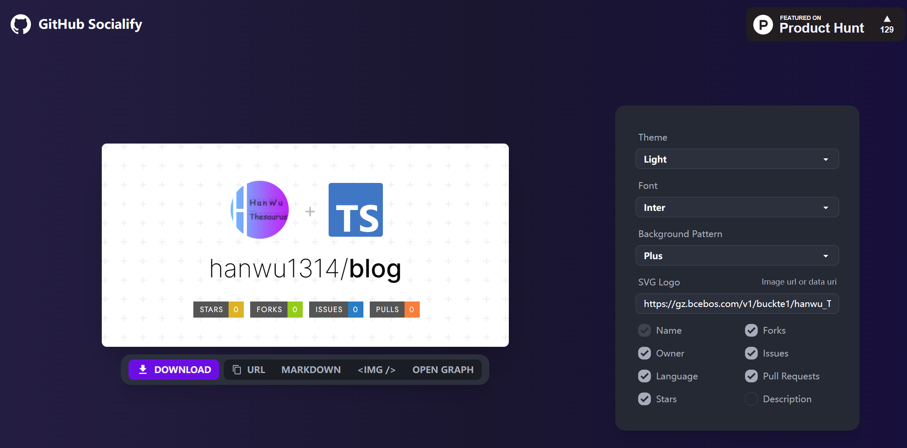
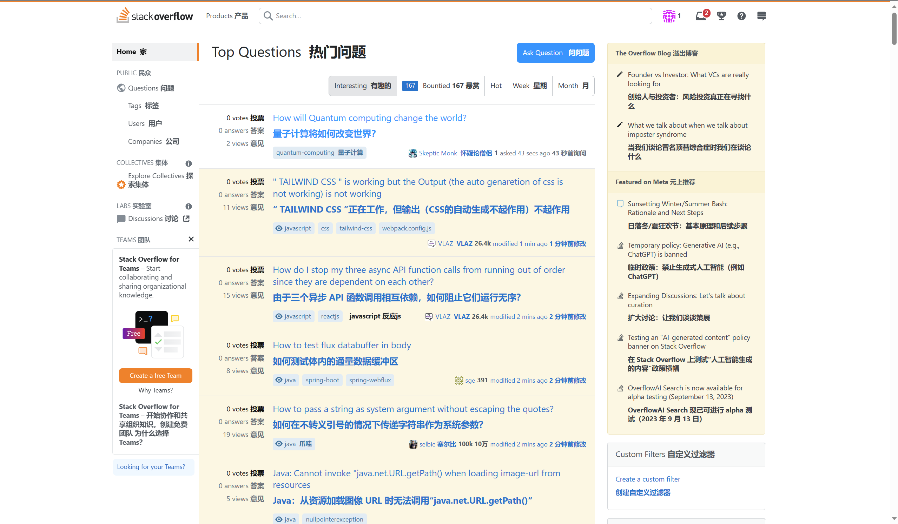
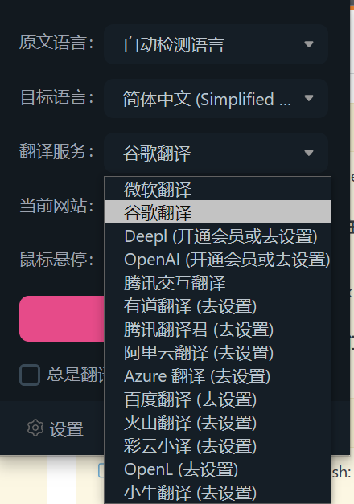
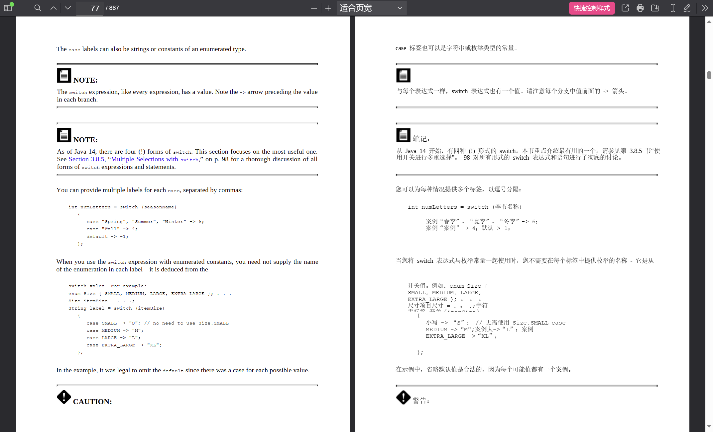

## github 星星历史图片生成

[star-history](https://github.com/star-history/star-history)

[在线体验 GitHub Star History (star-history.com)](https://star-history.com/)

## github 分享生成图片自定义

[wei/socialify (github.com)](https://github.com/wei/socialify)

[在线体验 GitHub Socialify](https://socialify.git.ci/)

## immersive-translate

浏览器沉浸式双语翻译扩展，支持 PDF

[immersive-translate/immersive-translate: 沉浸式双语网页翻译扩展 , 支持输入框翻译， 鼠标悬停翻译， PDF, Epub, 字幕文件, TXT 文件翻译 - Immersive Dual Web Page Translation Extension (github.com)](https://github.com/immersive-translate/immersive-translate)

### 支持设置多种翻译引擎

### 支持 pdf 翻译

代码块有瑕疵，毕竟 pdf 不能识别哪些是代码，但结合左边原文看代码依旧是神器

支持译文下载

