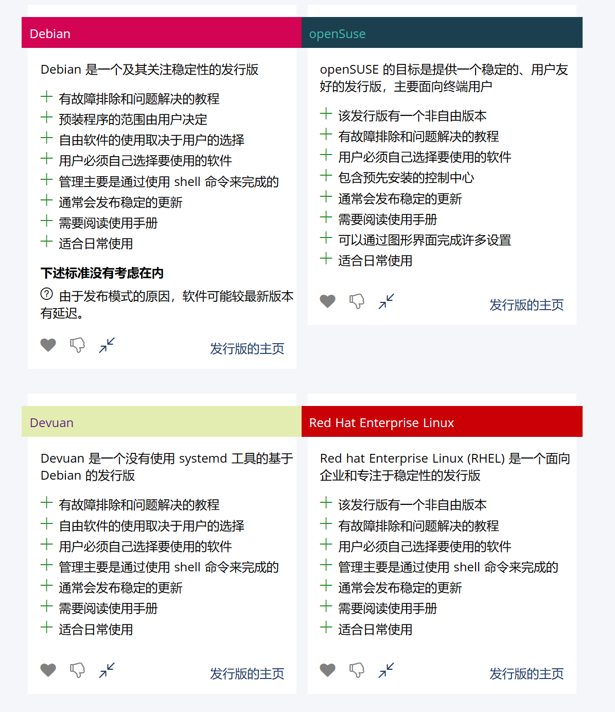
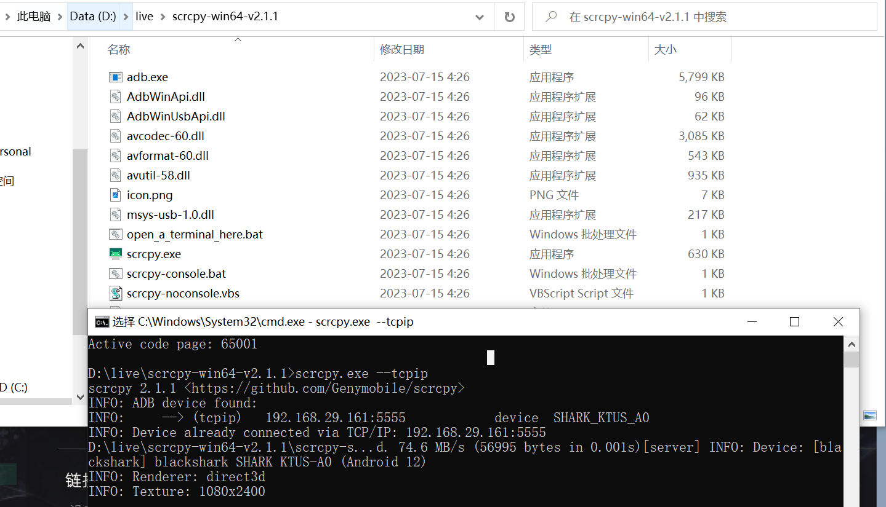

## 垃圾代码书写准则

[state-of-the-art-shitcode/README.zh-CN.md at master · trekhleb/state-of-the-art-shitcode (github.com)](https://github.com/trekhleb/state-of-the-art-shitcode/blob/master/README.zh-CN.md)

## 卸载 windows 系统自带软件

[Teraskull/PyDebloatX: Python GUI for uninstalling the default Windows 10 apps. (github.com)](https://github.com/Teraskull/PyDebloatX)

## 代码图片

[carbon/docs/README.cn.zh.md at main · carbon-app/carbon (github.com)](https://github.com/carbon-app/carbon/blob/main/docs/README.cn.zh.md)

## 位图转字符

[505e06b2/Image-to-Braille: Give it an image, and it will become unicode braille (github.com)](https://github.com/505e06b2/Image-to-Braille)
[在线体验](https://505e06b2.github.io/Image-to-Braille/)

## Magic-Copy 免费浏览器快速抠图插件

[kevmo314/magic-copy: Magic Copy is a Chrome extension that uses Meta's Segment Anything Model to extract a foreground object from an image and copy it to the clipboard. (github.com)](https://github.com/kevmo314/magic-copy)
[Magic Copy - Chrome 应用商店 (google.com)](https://chrome.google.com/webstore/detail/magic-copy/nnifclicibdhgakebbnbfmomniihfmkg)

## 速查表

[jaywcjlove/reference: 为开发人员分享快速参考备忘清单(速查表) (github.com)](https://github.com/jaywcjlove/reference)

## linux 发行版推荐

[distrochooser/distrochooser: An orientation guide for Linux newbies (github.com)](https://github.com/distrochooser/distrochooser)

[在线体验](https://distrochooser.de/)



## 一个制作可启动 U 盘的开源工具

[ventoy/Ventoy: A new bootable USB solution. (github.com)](https://github.com/ventoy/Ventoy)
[Ventoy 官网](https://www.ventoy.net/cn/index.html)
[壁纸下载](https://mylivewallpapers.com/)
[livewallp](https://livewallp.com/)
[致美化-动态壁纸](https://zhutix.com/animated/)
[来自异次元软件世界：50 个惊艳的免费动态桌面壁纸 MP4 视频合集打包下载](https://www.iplaysoft.com/50-live-wallpapers-mp4.html)

## 一款好用的壁纸软件

[rocksdanister/lively: Free and open-source software that allows users to set animated desktop wallpapers and screensavers powered by WinUI 3. (github.com)](https://github.com/rocksdanister/lively)

## pdf 工具箱

[wmjordan/PDFPatcher: PDF 补丁丁——PDF 工具箱，可以编辑书签、剪裁旋转页面、解除限制、提取或合并文档，探查文档结构，提取图片、转成图片等等 (github.com)](https://github.com/wmjordan/PDFPatcher)
[PDF 补丁丁 - 博客园 (cnblogs.com)](https://www.cnblogs.com/pdfpatcher/)

## 快剪

比格式工厂、小丸压缩更好用的视频<span style="color:#00b0f0">轻量</span>处理软件

[HaujetZhao/QuickCut: Your most handy video processing software (github.com)](https://github.com/HaujetZhao/QuickCut)

## SCRCPY

无侵入、无广告、无联网的投屏软件

- 确保手机开启了 USB 调试模式-->USB 调试
  [Genymobile/scrcpy：显示和控制您的 Android 设备 (github.com)](https://github.com/Genymobile/scrcpy)
  [下载地址](https://github.com/Genymobile/scrcpy/releases/tag/v2.1.1)
  第一次连接使用 usb 连接，cmd 命令行，执行 scrcpy.exe

使用 wifi 连接

```sh
scrcpy.exe --tcpip
scripy.exe -e
```


