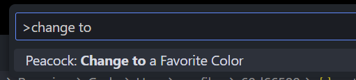

## vscode 卸载

1.控制面板卸载或者运行安装目录下的 unins000.exe

2.win+R 输入`%userprofile%`当前 C 盘用户目录,删除.vscode 文件夹

```shell
%userprofile%
```

3.win+R 输入`%appdata%`进入`AppData\Roaming`,删除 Code 文件夹

```sh
%appdata%
```

| 插件                                      | 说明                                                                                                                      |
| :---------------------------------------- | :------------------------------------------------------------------------------------------------------------------------ |
| Auto Close Tag                            | 自动闭合标签                                                                                                              |
| Auto Import&nbsp;                         | 自动导入                                                                                                                  |
| Auto Rename Tag                           | 自动重命名标签                                                                                                            |
| AutoScssStruct4Vue                        | &nbsp;根据 Vue 文件的 template 结构，自动生成对应的 scss 文件                                                             |
| Better Comments                           | 不同颜色的注释                                                                                                            |
| CodeIf                                    | 变量命名神器                                                                                                              |
| CodeSandbox                               | 在线沙盒编辑器                                                                                                            |
| Color Hightlight                          | 颜色高亮                                                                                                                  |
| CSS Snippet                               | CSS 代码片段                                                                                                              |
| Css Code Block                            | 常用 CSS 片段生成                                                                                                         |
| Code GPT                                  | chatGPT 代码智能支持                                                                                                      |
| Code Runner                               | 指定部分代码运行                                                                                                          |
| Console Ninja                             | 直接在 vscode 代码行里打印结果                                                                                            |
| carbon-now-sh                             | 代码图片                                                                                                                  |
| DotENV                                    | 环境变量                                                                                                                  |
| Draw.io Integration                       | 绘图                                                                                                                      |
| Easy Less                                 | less 转换 css                                                                                                             |
| ES7+ React/Redux/React-Native snippets    | React 代码片段                                                                                                            |
| ESLint                                    | ESLint 支持                                                                                                               |
| GitLens                                   | 最好用的 Git 管理                                                                                                         |
| GitHub Repositories                       | 远程连接 github 仓库（源码查看神器）                                                                                      |
| Highlight Matching Tag                    | 高亮标签                                                                                                                  |
| HTML CSS Support                          | HTML CSS 代码片段                                                                                                         |
| i18n Ally                                 | 国际化 i18n 支持                                                                                                          |
| Image preview                             | 图片预览                                                                                                                  |
| TypeScript Vue Plugin (Volar)             | TypeScript Vue 插件                                                                                                       |
| Turbo Console Log                         | [快速打印控制台语句](https://marketplace.visualstudio.com/items?itemName=ChakrounAnas.turbo-console-log) `ctrl`+`alt`+`L` |
| IntelliSense for CSS class names in HTML  | CSS 类名智能感知（点击类名跳转）                                                                                          |
| JavaScript (ES6) code snippets            | ES6 代码片段                                                                                                              |
| markdownlint                              | md 支持                                                                                                                   |
| open in browser                           | 浏览器打开 html                                                                                                           |
| Path Autocomplete                         | 路径自动补全                                                                                                              |
| Path Intellisense                         | 文件名自动补全                                                                                                            |
| Peacoke                                   | 多窗口设置颜色[指南](https://www.peacockcode.dev/guide/#quick-usage)                                                      |
| PHP Intelephense                          | PHP 支持                                                                                                                  |
| Prettier - Code formatter                 | 格式化代码                                                                                                                |
| px to rem &amp; rpx &amp; vw (cssrem)     | px 转换 rem 或者 vw                                                                                                       |
| Remote - SSH                              | 与远程主机建立 SSH                                                                                                        |
| Remote - SSH: Editing Configuration Files | 捆绑插件 SSH 配置文件                                                                                                     |
| Remote Explorer                           | 查看远程 SSH                                                                                                              |
| Regex Previewer                           | 正则检验                                                                                                                  |
| Tailwind CSS IntelliSense                 | Tailwind CSS 智能提示                                                                                                     |
| tree-generator                            | 快速生成文档树                                                                                                            |
| Vetur                                     | vue2 语法高亮                                                                                                             |
| VSCode Great Icons                        | 文件夹图标                                                                                                                |
| Vue 3 Snippets                            | vue3 代码片段                                                                                                             |
| Vue Language Features (Volar)             | Vue3 支持                                                                                                                 |
| Vue Peek                                  | 允许 Vue 组件跳转                                                                                                         |
| Vite                                      | Vite 在 Vscode 内置预览                                                                                                   |
| YAML                                      | yaml 支持                                                                                                                 |

## vscode 常用快捷键

`Ctrl` + `B` 侧边栏
`Ctrl` + `J` 底边栏
`Ctrl` + `Shint` +`N` 新建窗口
`Ctrl` + `R` 打开历史文件夹
`Ctrl` + `P` 文件搜索窗口
`Ctrl` + `shift` + `P` 命令行窗口
`Ctrl` + `shift` + `F` 代码搜素窗口
`Ctrl` + `,` 打开设置

## 寒舞-vscode 配置

```
# 此链接不是打开的，是用来复制到vscode里的
https://vscode.dev/profile/github/87b696055fd3dd972bc58ee605ed8be3
```


### 修改文件图标主题


### 关于注释插件的使用

- [Better Comments](https://marketplace.visualstudio.com/items?itemName=aaron-bond.better-comments)
  

### 关于翻译插件的使用

- [Comment Translate](https://marketplace.visualstudio.com/items?itemName=webxmsj.baidu-translate)
- [baidu-translate](https://marketplace.visualstudio.com/items?itemName=intellsmi.comment-translate)
  我用百度习惯了，插件本身自带支持阿里的翻译，需要去阿里开放平台进行注册
  去[百度翻译开放平台 (baidu.com)](https://fanyi-api.baidu.com/manage/developer)注册账户并进行实名认证，申请百度翻译接口，用途随便填

在开发者信息-->开发者中心获取 APP ID 和密钥


vscode 打开设置（快捷键`Ctrl` + `，`）

搜索 baidu，填入对应 ID 和 KEY


快捷键`Ctrl` + `shift`+ `P` 打开命令行输入

```sh
change translate source
```

更改翻译源


```sh
webxmsj.baidu-translate-baidu
```

写一条评论鼠标悬浮上去查看插件是否生效


### 编辑器颜色设置

- [Peacoke](https://www.peacockcode.dev/guide/#quick-usage)
  我默认设置的是每次打开一个新的文件夹自动随机颜色

自定义颜色可以在 setting.json 文件中进行设置

快捷键`win` + `alt` + `+` 颜色变亮
快捷键`win` + `alt` + `-` 颜色变暗

更多设置请参照官方文档

自定义修改颜色功能
快捷键`Ctrl` + `shift`+ `P` 打开命令行输入

```sh
change to
```




